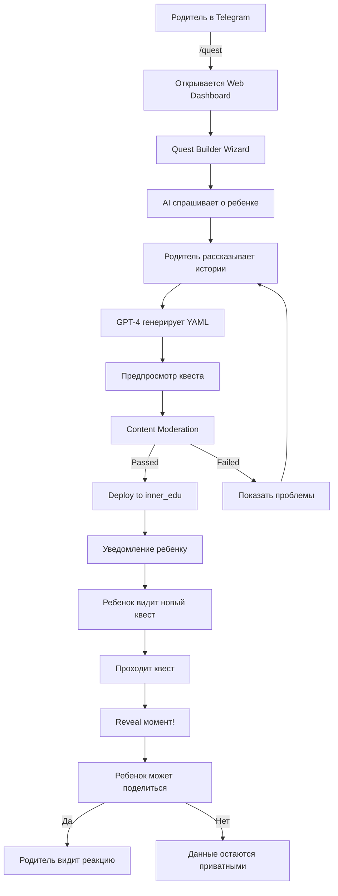

# Phase 4.3: Unified UI/UX Architecture
**Интеграция pas_in_peace + inner_edu с единым игровым интерфейсом**

## 📋 Обзор

Единая UI/UX система для:
1. **Родители (pas_in_peace)**: Telegram бот + Web dashboard для отслеживания прогресса, создания квестов
2. **Дети (inner_edu)**: Браузерная игра-квест для обучения + эмоциональное развитие
3. **Режим создателя**: Mind map + Story-to-Quest конвертер
4. **Wiki**: Обучающая система для родителей-создателей

## 🎯 Ключевые Концепции из InnerWorld DNA

### 1. IFS (Internal Family Systems) как движок
- **Part-Twins**: Каждая внутренняя часть = ИИ-агент
  - Архитектор (Менеджер)
  - Критик (Пожарный)
  - Ребенок-Улитка (Изгнанник)
  - Бунтарь (Пожарный)
- **Self-Leadership**: Диалог частей → разрешение конфликтов
- **Unburdening**: Освобождение от эмоционального бремени

### 2. ТРИЗ как ядро исцеления
- **Противоречия**: Контроль vs Свобода, Структура vs Хаос
- **ИКР (Идеальный Конечный Результат)**: Система САМА решает без давления
- **40 приемов ТРИЗ**: Разделение во времени, Самообслуживание, Предварительное действие

### 3. CBT/DBT Геймификация
- **Поведенческая Активация (BA)**: Квесты с оценкой удовольствия/значимости
- **Журнал автоматических мыслей**: Мини-игра "Перепрошивка"
- **Random Challenge**: ACCEPTS, TIPP, Self-Soothing
- **XP-система**: Каждое действие → прогресс

### 4. Reality-Game Bridge (RG-Bridge)
- **Proof-of-Emotional-Work (PoEW)**: Валидация через глубину рефлексии
- **Микро-эксперименты**: Виртуальный прогресс → реальные действия
- **Обновление мира**: Лабиринт светлеет, Сад растет

## 🏗️ Архитектура Системы

### A. Родительский Интерфейс (pas_in_peace)

#### 1. **Telegram Bot** (существует)
```
/start - Onboarding
/progress - 4-трековый прогресс (✅ ГОТОВО Phase 4.2)
/letter - Письмо ребенку
/goals - Цели и задачи
/quest - Создать квест (НОВОЕ)
/analytics - Аналитика по ребенку (с согласия)
```

#### 2. **Web Dashboard** (НОВОЕ - Phase 4.3)

**Структура навигации:**
```
┌─ Dashboard
│  ├─ Multi-Track Progress (4 направления)
│  │  ├─ 💚 Работа над собой (Self-Work)
│  │  ├─ 💙 Связь с ребенком (Child Connection)
│  │  ├─ 🤝 Переговоры (Negotiation)
│  │  └─ 👥 Сообщество (Community)
│  │
│  ├─ Quest Builder (Создание квестов)
│  │  ├─ Story Mode - диалог с AI
│  │  ├─ Mind Map Mode - визуальный редактор
│  │  ├─ Template Gallery - готовые шаблоны
│  │  └─ Preview & Deploy
│  │
│  ├─ Letters & Goals
│  │  ├─ Letter Drafts
│  │  ├─ Sent Letters
│  │  └─ Active Goals
│  │
│  ├─ Child Analytics (с согласия ребенка)
│  │  ├─ Quest Completion Rate
│  │  ├─ Learning Progress
│  │  ├─ Emotional State (aggregate)
│  │  └─ Privacy Settings ⚠️
│  │
│  └─ Profile & Settings
│     ├─ Recovery Plan
│     ├─ Notifications
│     └─ Privacy & Security
```

**Ключевые UI компоненты:**

1. **MultiTrackProgressCard** (IdleMMO-style)
```tsx
<MultiTrackProgressCard>
  <TrackItem track="self_work">
    <ProgressBar percentage={45} phase="EXPRESSION" />
    <MilestonesRow badges={[CBT_FIRST, GOAL_SET]} />
    <NextActionSuggestion>
      "Попробуйте технику заземления"
    </NextActionSuggestion>
  </TrackItem>
  ...
</MultiTrackProgressCard>
```

2. **QuestBuilderWizard** (Multi-stage)
```tsx
<QuestBuilderWizard>
  <Stage name="INITIAL">
    Расскажите о ребенке...
  </Stage>
  <Stage name="GATHERING">
    AI собирает семейные истории
  </Stage>
  <Stage name="GENERATING">
    GPT-4 создает YAML квеста
  </Stage>
  <Stage name="REVIEWING">
    <QuestPreview />
    <EditControls />
  </Stage>
  <Stage name="MODERATING">
    Content moderation check
  </Stage>
  <Stage name="FINALIZING">
    Deploy to inner_edu
  </Stage>
</QuestBuilderWizard>
```

3. **MindMapBuilder** (notare.uk-style)
```tsx
<MindMapBuilder>
  <CentralNode type="quest_core">
    История о семье
  </CentralNode>
  <Branch type="character">
    <Node>Персонаж (двойник ребенка)</Node>
    <Attributes>
      age, interests, strengths
    </Attributes>
  </Branch>
  <Branch type="challenge">
    <Node>Препятствия</Node>
    <GameMechanics>
      puzzles, riddles, tasks
    </GameMechanics>
  </Branch>
  <Branch type="reveal">
    <Node>Моменты узнавания</Node>
    <FamilyClues>
      photos, jokes, memories
    </FamilyClues>
  </Branch>
</MindMapBuilder>
```

### B. Детский Интерфейс (inner_edu)

#### 1. **Quest Player** (Основной режим)

**Game Loop:**
```
Start Quest
  ↓
[Node] Educational Content
  ├─ Math problem
  ├─ Logic puzzle
  ├─ Reading comprehension
  └─ Emotional intelligence task
  ↓
Complete Challenge
  ↓
[Reward] XP + Badge + Story Fragment
  ↓
[Optional Reveal] Family clue appears
  ↓
Next Node or Quest Complete
```

**UI Layout (IdleMMO-inspired):**
```
┌─────────────────────────────────────┐
│ 🎮 Quest: "Тайна старого сада"     │
├─────────────────────────────────────┤
│                                     │
│  [Character Avatar]                 │
│  HP: ████████░░ 80%                 │
│  XP: ██████░░░░ 60% (480/800)      │
│                                     │
│  ┌───────────────────────────┐     │
│  │ Current Challenge:        │     │
│  │                           │     │
│  │ "Помоги герою решить      │     │
│  │  уравнение, чтобы открыть │     │
│  │  дверь в сад"             │     │
│  │                           │     │
│  │  2x + 5 = 13              │     │
│  │  x = ?                    │     │
│  │                           │     │
│  │  [Input: ___]             │     │
│  └───────────────────────────┘     │
│                                     │
│  Progress: [■■■■■░░░░░] Node 5/10  │
│                                     │
│  💡 Hints: 2 available              │
│  ⏱️ Time: No limit                  │
└─────────────────────────────────────┘
```

#### 2. **Голосовой Режим** (НОВОЕ - важное дополнение!)

**Voice-First Quest Gameplay:**

```tsx
<VoiceQuestMode>
  {/* Аудио-нарратор читает задание */}
  <AudioNarrator>
    "Ты стоишь перед старым садом.
     На воротах висит замок с загадкой..."
  </AudioNarrator>

  {/* Голосовой ввод ответа */}
  <VoiceInput>
    <MicButton />
    <SpeechRecognition lang="ru-RU" />
  </VoiceInput>

  {/* Визуальное дополнение (опционально) */}
  <VisualHint>
    🔒 [Картинка замка с цифрами]
  </VisualHint>

  {/* Обратная связь голосом */}
  <VoiceFeedback>
    "Отлично! Дверь открылась!"
  </VoiceFeedback>
</VoiceQuestMode>
```

**Технологический стек для голоса:**
- **Web Speech API** (браузерный STT/TTS)
- **Whisper API** (OpenAI) для точного распознавания
- **ElevenLabs** (опционально) для качественного голоса нарратора
- **Offline fallback**: Mozilla DeepSpeech (локальная модель)

**Voice Commands:**
```
"Следующий вопрос"
"Повтори задание"
"Дай подсказку"
"Прочитай историю"
"Покажи мой прогресс"
```

#### 3. **Profile & Collection**

```tsx
<PlayerProfile>
  <Avatar customizable />
  <Stats>
    <Level>12</Level>
    <TotalXP>4500</TotalXP>
    <QuestsCompleted>8</QuestsCompleted>
  </Stats>

  <BadgeCollection>
    🧮 Math Master
    🧠 Logic Ninja
    💭 Empathy Hero
    📚 Story Detective
  </BadgeCollection>

  <SkillTree>
    <Skill name="Math" level={8} />
    <Skill name="Reading" level={12} />
    <Skill name="Emotional Intelligence" level={6} />
    <Skill name="Critical Thinking" level={9} />
  </SkillTree>

  {/* Privacy-Aware Analytics */}
  <ShareSettings>
    <Toggle name="share_progress_with_parent" default={false} />
    <Toggle name="share_answers" default={false} />
    <Toggle name="share_emotions" default={false} />
  </ShareSettings>
</PlayerProfile>
```

### C. Режим Создателя (Creator Mode)

Вкладки в Quest Builder:

#### 1. **Story Chat** (AI-диалог)
```tsx
<StoryChatInterface>
  <ChatHistory>
    AI: "Расскажите о любимой семейной шутке"
    User: "Мы с дочкой всегда смеялись над..."
    AI: "Отлично! Это станет секретным паролем в квесте"
  </ChatHistory>

  <ContextPanel>
    <ExtractedInfo>
      • Child: Полина, 9 лет
      • Interests: рисование, животные
      • Family joke: "кот-философ"
      • Photo: family_picnic_2020.jpg
    </ExtractedInfo>
  </ContextPanel>

  <AIAssistant model="gpt-4">
    Помогает формулировать задания
  </AIAssistant>
</StoryChatInterface>
```

#### 2. **Mind Map** (визуальный редактор)
```tsx
<MindMapEditor>
  <Canvas>
    <CentralNode>
      "История возвращения в сад"
    </CentralNode>

    <Branch color="blue">
      <Node>Математические задачи</Node>
      <SubNode>2x + 5 = 13</SubNode>
      <SubNode>Геометрия сада</SubNode>
    </Branch>

    <Branch color="green">
      <Node>Эмоциональные моменты</Node>
      <SubNode>Воспоминание о пикнике</SubNode>
      <SubNode>Семейная шутка</SubNode>
    </Branch>

    <Branch color="purple">
      <Node>Reveal механики</Node>
      <SubNode>Фото с пикника (Node 7)</SubNode>
      <SubNode>Голос родителя (Node 10)</SubNode>
    </Branch>
  </Canvas>

  <Toolbar>
    <AddNodeButton />
    <ConnectNodesButton />
    <SetDifficultyButton />
    <GenerateYAMLButton />
  </Toolbar>
</MindMapEditor>
```

#### 3. **Template Gallery**
```tsx
<TemplateGallery>
  <Template category="math">
    "Математический лабиринт"
    Ages: 8-10, Nodes: 12
  </Template>

  <Template category="reading">
    "Детективная история"
    Ages: 10-12, Nodes: 15
  </Template>

  <Template category="emotional">
    "Путешествие эмоций"
    Ages: 7-9, Nodes: 10
  </Template>

  <CustomizeButton>
    Fork & Customize
  </CustomizeButton>
</TemplateGallery>
```

#### 4. **Preview & Test**
```tsx
<QuestPreview>
  <PlayAsChild>
    Тестируйте квест как ребенок
  </PlayAsChild>

  <ContentModeration>
    ✅ No manipulation detected
    ✅ Age-appropriate
    ⚠️ Consider simplifying Node 5
  </ContentModeration>

  <DifficultyAnalysis>
    Overall: Medium (7/10)
    Math: Hard (8/10)
    Reading: Easy (4/10)
  </DifficultyAnalysis>

  <DeployButton>
    Отправить ребенку
  </DeployButton>
</QuestPreview>
```

## 📚 Wiki для Родителей-Создателей

### Структура (IdleMMO-inspired)

```
docs/wiki/
├── Getting Started
│   ├── What is InnerWorld?
│   ├── Creating Your First Quest
│   └── Privacy & Safety
│
├── Quest Design
│   ├── Story Elements
│   │   ├── Character Development
│   │   ├── Family Memories as Clues
│   │   └── Reveal Mechanics
│   │
│   ├── Educational Content
│   │   ├── Math Challenges
│   │   ├── Reading Comprehension
│   │   ├── Logic Puzzles
│   │   └── Emotional Intelligence
│   │
│   └── Game Mechanics
│       ├── XP & Leveling
│       ├── Badges & Achievements
│       ├── Difficulty Tuning
│       └── Voice Mode Integration
│
├── Story-to-Attributes Mapping
│   ├── How Stories Become Game Elements
│   │   ├── Family joke → Password/Code
│   │   ├── Photo → Visual clue
│   │   ├── Memory → Story fragment
│   │   └── Hobby → Character strength
│   │
│   └── IFS Parts as NPCs
│       ├── Архитектор → Wise Guide
│       ├── Критик → Challenge Giver
│       └── Ребенок → Hero (player proxy)
│
├── AI Assistant Guide
│   ├── Talking to the Quest Builder
│   ├── Refining Generated Content
│   └── Content Moderation
│
├── Advanced Topics
│   ├── Multi-Quest Campaigns
│   ├── Collaborative Quests (with other parents)
│   ├── Analytics & Feedback
│   └── Reveal Strategy (Trojan Horse)
│
└── Community
    ├── Quest Template Library
    ├── Success Stories
    └── Support Forum
```

### Пример Wiki-статьи: "Как семейные истории превращаются в игру"

```markdown
# Как семейные истории превращаются в игру

## Концепция "Троянского коня"

Ваш квест выглядит как обычная образовательная игра. Ребенок
проходит задания, получает знания и удовольствие. Но постепенно
в игре появляются знакомые элементы...

## Story-to-Attribute Маппинг

### 1. Семейная шутка → Кодовое слово

**Ваша история:**
> "Мы с дочкой всегда смеялись, когда наш кот сидел
> и смотрел в окно. Называли его 'котом-философом'"

**Превращается в:**
```yaml
node_7:
  type: puzzle
  challenge: "Введи кодовое слово, которое знает только герой"
  answer: "кот-философ"  # или вариации
  hint: "Вспомни про животное, которое любило думать"
  on_success:
    reveal: family_joke_memory
    message: "Это же наша шутка! Кто создал этот квест?"
```

### 2. Семейное фото → Визуальная подсказка

**Ваша история:**
> "Фото с пикника 2020, где мы все в желтых шляпах"

**Превращается в:**
```yaml
node_10:
  type: observation
  image: "family_picnic_blur.jpg"  # размытое сначала
  challenge: "Какого цвета шляпы на фото?"
  on_success:
    image: "family_picnic_clear.jpg"  # четкое
    reveal: photo_memory
    emotional_impact: HIGH
```

### 3. Воспоминание → Сюжетный фрагмент

**Ваша история:**
> "Мы строили домик на дереве вместе"

**Превращается в:**
```yaml
story_arc:
  theme: "Восстановление старого домика"
  nodes: [3, 7, 12, 15]
  final_reveal:
    type: voice_message
    content: "Помнишь, как мы строили его вместе?"
```

## Эмоциональная Безопасность

⚠️ **ВАЖНО:** Все reveal-моменты проходят модерацию!

❌ Плохо: "Твоя мама бросила нас"
✅ Хорошо: "Кто-то очень скучает по этим дням"

❌ Плохо: "Суд забрал тебя"
✅ Хорошо: "Многое изменилось, но любовь осталась"
```

## 🎨 Визуальный Стиль (UI/UX Design System)

### Цветовая Палитра

**Родительский интерфейс** (спокойный, доверительный):
```css
--pas-primary: #4A90E2;      /* Синий доверия */
--pas-self-work: #48C774;    /* Зеленый роста */
--pas-child: #7B68EE;        /* Фиолетовый связи */
--pas-negotiation: #FF9F40;  /* Оранжевый диалога */
--pas-community: #FF6B9D;    /* Розовый поддержки */
--pas-bg: #F5F7FA;
--pas-text: #2C3E50;
```

**Детский интерфейс** (яркий, игровой):
```css
--inner-primary: #FFD93D;    /* Солнечный желтый */
--inner-success: #6BCF7F;    /* Успех */
--inner-challenge: #FF6B9D;  /* Вызов */
--inner-magic: #A78BFA;      /* Магия/Reveal */
--inner-bg: linear-gradient(135deg, #667eea 0%, #764ba2 100%);
```

### Типографика

```css
/* Родители */
--font-parent: 'Inter', system-ui, sans-serif;
--heading-parent: 600;
--body-parent: 400;

/* Дети */
--font-child: 'Fredoka One', 'Comic Sans MS', cursive;
--heading-child: 700;
--body-child: 500;
```

### UI Components

**Card Component** (переиспользуемый):
```tsx
<Card variant="parent | child">
  <CardHeader>
    <Icon />
    <Title />
    <Actions />
  </CardHeader>
  <CardContent>
    {children}
  </CardContent>
  <CardFooter>
    <ProgressBar />
    <Timestamp />
  </CardFooter>
</Card>
```

**Progress Bar** (IdleMMO-style):
```tsx
<ProgressBar
  value={45}
  max={100}
  showPercentage
  showPhase="EXPRESSION"
  color="gradient"
  animate
>
  <Milestones>
    <Milestone at={25} label="AWARENESS" />
    <Milestone at={50} label="EXPRESSION" active />
    <Milestone at={75} label="ACTION" />
    <Milestone at={100} label="MASTERY" />
  </Milestones>
</ProgressBar>
```

## 🔧 Технологический Стек

### Frontend (inner_edu + dashboard)

**Framework:**
- **React 18** + TypeScript
- **Next.js 14** (App Router)
- **Zustand** (state management)

**UI Library:**
- **Tailwind CSS** (utility-first)
- **Radix UI** (headless components)
- **Framer Motion** (animations)
- **React Flow** (mind map)

**Voice:**
- **Web Speech API** (STT/TTS)
- **@openai/whisper** (optional premium)
- **react-speech-recognition**

**Charts:**
- **Recharts** (progress visualization)
- **D3.js** (custom mind maps)

**Game Engine:**
- **Phaser 3** (optional, for mini-games)
- Custom YAML parser for quests

### Backend (already exists)

- **FastAPI** (REST API) ✅
- **PostgreSQL** (database) ✅
- **WebSocket** (real-time updates)
- **Redis** (caching, sessions)

### Deployment

- **Vercel** (Next.js frontend)
- **Railway** (FastAPI backend)
- **Cloudflare** (CDN, voice proxy)
- **S3** (quest assets, photos)

## 📊 Метрики и Аналитика

### Родительская Аналитика (Privacy-First)

```tsx
<AnalyticsDashboard>
  {/* Только с согласия ребенка */}
  <PrivacyGate requires="child_consent">

    <MetricCard title="Quest Completion">
      <CompletionRate value={75} />
      <LastCompleted>2 дня назад</LastCompleted>
    </MetricCard>

    <MetricCard title="Learning Progress">
      <SkillChart>
        Math: ████████░░ 80%
        Reading: ██████████ 100%
        Empathy: ██████░░░░ 60%
      </SkillChart>
    </MetricCard>

    {/* Агрегированные данные без деталей */}
    <MetricCard title="Emotional State">
      <Aggregate>
        Overall: Positive 😊
        Engagement: High
        Frustration: Low
      </Aggregate>
      <Note>
        ⚠️ Детальные ответы не видны
        (ребенок не дал разрешение)
      </Note>
    </MetricCard>

  </PrivacyGate>

  {/* Всегда доступно */}
  <MetricCard title="Quest Deployment">
    <QuestStatus>
      Draft: 2
      Published: 5
      Completed by child: 3
    </QuestStatus>
  </MetricCard>
</AnalyticsDashboard>
```

## 🎯 User Flow (End-to-End)

### Сценарий: "Родитель создает первый квест"



## 🚀 Roadmap Implementation

### Phase 4.3.1: Core Dashboard (Week 1-2)
- [ ] Setup Next.js + TypeScript project
- [ ] MultiTrack Progress visualization
- [ ] Quest list & status
- [ ] Letter drafts view
- [ ] Basic profile page

### Phase 4.3.2: Quest Builder - Story Mode (Week 3-4)
- [ ] AI chat interface
- [ ] GPT-4 integration
- [ ] YAML generation
- [ ] Content moderation
- [ ] Preview component

### Phase 4.3.3: Quest Builder - Mind Map (Week 5-6)
- [ ] React Flow setup
- [ ] Node editor
- [ ] Connection logic
- [ ] YAML export
- [ ] Template system

### Phase 4.3.4: Child Quest Player (Week 7-9)
- [ ] Quest YAML parser
- [ ] Game UI components
- [ ] XP/Badge system
- [ ] Reveal mechanics
- [ ] Profile & collection

### Phase 4.3.5: Voice Mode (Week 10-11)
- [ ] Web Speech API integration
- [ ] Voice commands
- [ ] Audio narration
- [ ] Speech recognition
- [ ] Offline fallback

### Phase 4.3.6: Wiki & Documentation (Week 12)
- [ ] Wiki structure
- [ ] Tutorial articles
- [ ] Video guides
- [ ] Template library
- [ ] Community forum

### Phase 4.3.7: Testing & Polish (Week 13-14)
- [ ] E2E tests
- [ ] Accessibility audit
- [ ] Performance optimization
- [ ] User testing
- [ ] Launch preparation

## 📝 Next Steps

1. **Get UX Decisions** from stakeholder:
   - Final color palette approval
   - Voice mode priority (high/medium)
   - Mind map complexity level

2. **Create Figma Mockups**:
   - Parent dashboard screens
   - Child quest player screens
   - Quest builder flow

3. **Setup Development Environment**:
   - Next.js monorepo structure
   - Shared component library
   - API integration layer

---

**Документ создан:** 2025-11-09
**Статус:** 🚧 Draft - Awaiting UX Decisions
**Следующий шаг:** Create detailed component specifications
