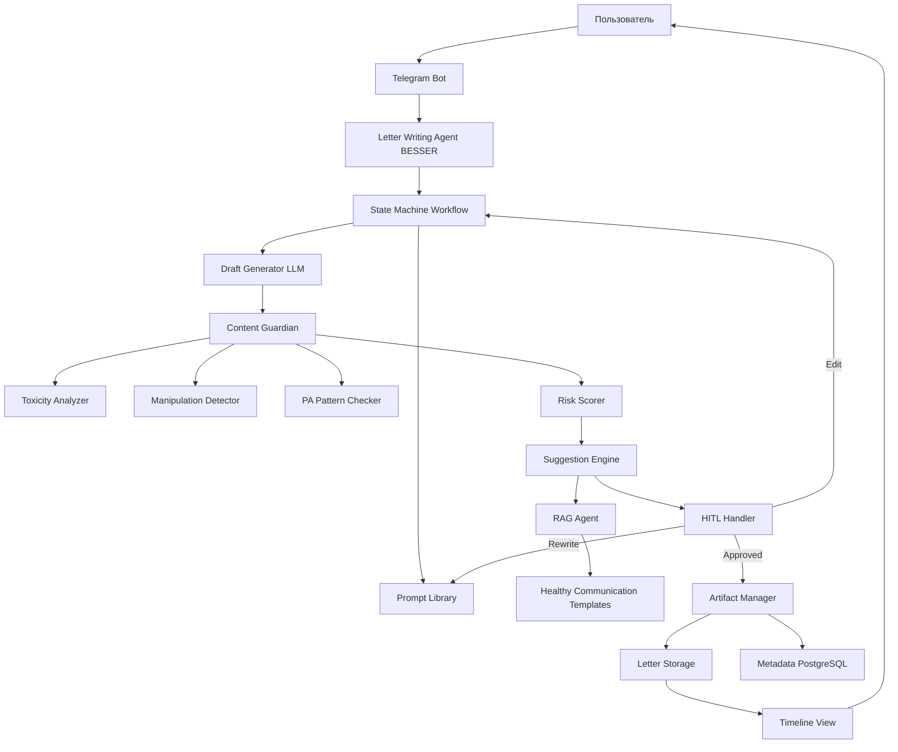
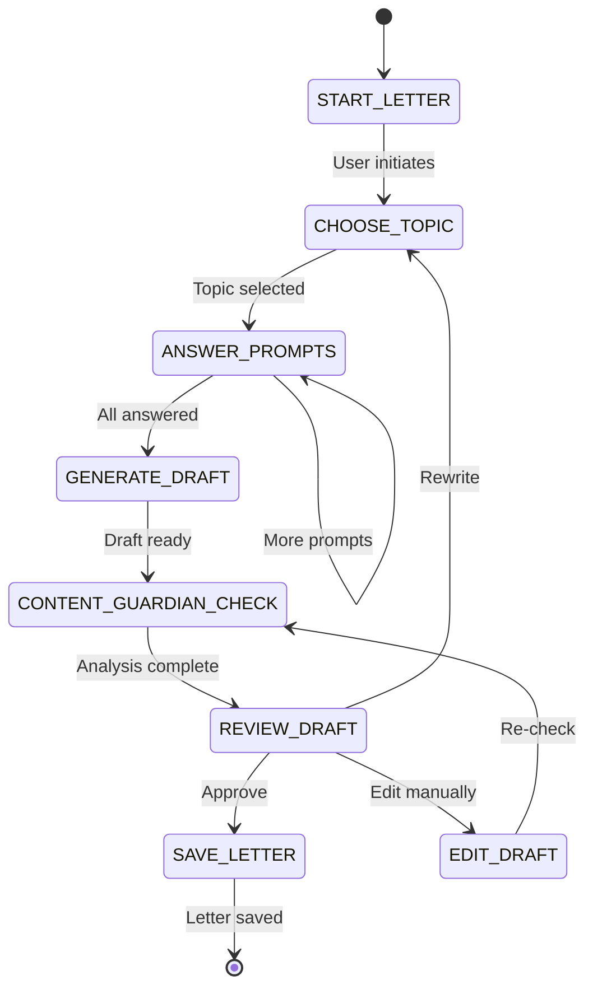
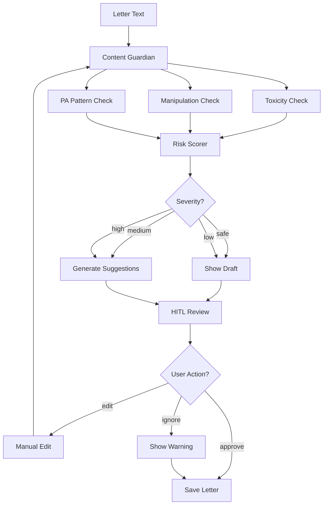

# Implementation Plan: Guided Letter Writing System

## Смысл и цель задачи

Реализация терапевтического инструмента guided journaling для создания писем ребенку с интеграцией Content Guardian (токсичность, manipulation detection) и HITL-валидацией. Система помогает отчуждаемому родителю структурированно выразить чувства через серию направляющих вопросов, проверяет контент на безопасность для ребенка, предлагает улучшения и сохраняет одобренные письма в Artifact Store для долгосрочного хранения. Ключевая цель - создать безопасное пространство для эмоционального выражения с автоматической защитой от parental alienation patterns.

---

## Объем работ

### Что входит в реализацию

- BESSER workflow для guided journaling (state machine с промптами)
- Content Guardian интеграция для проверки писем на токсичность и manipulation
- HITL механизм с inline buttons (Approve/Edit/Rewrite)
- Artifact Manager для сохранения одобренных писем с метаданными
- Timeline view для просмотра истории писем пользователем
- Prompt library с тематическими вопросами (день рождения, праздники, просто мысли)
- Интеграция с RAG для retrieval шаблонов здоровой коммуникации

### Что не входит

- AI Reflection Chat (мета-терапия по записям) - откладывается на следующую итерацию
- Export функционал для передачи ребенку - требует отдельного UX дизайна
- Voice-to-text для голосовых писем - технически сложно для MVP
- Автоматическая отправка писем (scheduled delivery) - юридически рискованно
- Редактор писем с rich formatting - Telegram ограничения

---

## Архитектура решения

### Основные компоненты



### Структура проекта

```
/src
  /letter_writing
    /workflow
      letter_agent.py           # BESSER Agent для guided journaling
      state_machine.py          # State machine: выбор темы -> ответы -> draft -> review
      prompt_library.py         # Библиотека направляющих вопросов
    /content_guardian
      toxicity_analyzer.py      # Detoxify + rule-based
      manipulation_detector.py  # Guilt-tripping, gaslighting patterns
      pa_pattern_checker.py     # Parental alienation language
      risk_scorer.py            # Агрегация scores -> severity
    /generation
      draft_generator.py        # LLM создание связного письма
      suggestion_engine.py      # RAG + LLM для улучшений
    /hitl
      hitl_handler.py           # Telegram inline buttons workflow
      feedback_processor.py     # Обработка Edit режима
  /artifacts
    artifact_manager.py         # Сохранение писем
    timeline_view.py            # Хронологический просмотр
/data
  /prompts
    birthday_prompts.yaml       # Промпты для дня рождения
    thoughts_prompts.yaml       # Просто мысли
    story_prompts.yaml          # Истории из детства
    feelings_prompts.yaml       # Текущие чувства
  /templates
    healthy_communication.txt   # Шаблоны здоровой коммуникации
/config
  content_guardian_config.yaml  # Thresholds, patterns
  letter_workflow_config.yaml   # Workflow параметры
```

---

## Параметры стека

- **Язык**: Python 3.12
- **Фреймворк**: FastAPI, BESSER Agentic Framework
- **NLP**: Detoxify (multilingual), transformers, spaCy (опционально)
- **LLM**: OpenAI GPT-4o-mini (draft generation), GPT-4o (suggestion engine)
- **База данных**: PostgreSQL (metadata), локальная ФС или S3 (письма)
- **Telegram**: python-telegram-bot (inline keyboards)
- **Деплой**: Docker, локальная разработка на macOS

---

## Полный flow работы функционала

### Основной сценарий: Создание письма

1. **Пользователь инициирует workflow**:
   - Команда: "/write_letter" или кнопка "Написать письмо ребенку"
   - Letter Agent переходит в состояние START_LETTER

2. **Выбор темы (State: CHOOSE_TOPIC)**:
   - Бот показывает категории:
     - День рождения/праздник
     - Просто мысли о ребенке
     - Рассказать историю из детства
     - Поделиться текущими чувствами
     - Другое (free-form)
   - Пользователь выбирает, например, "День рождения"

3. **Guided prompts (State: ANSWER_PROMPTS)**:
   - Система загружает birthday_prompts.yaml
   - Последовательно задает вопросы:
     - "Сколько сегодня исполняется вашему ребенку?"
     - "Что вы помните о дне, когда он родился?"
     - "Каким вы видите его через 10 лет?"
     - "Что бы вы пожелали ему в этот день?"
   - Пользователь отвечает на каждый (текст или голосовое)
   - Ответы сохраняются в session.memory

4. **Draft generation (State: GENERATE_DRAFT)**:
   - Draft Generator получает все ответы
   - LLM (GPT-4o-mini) создает связное письмо:
     - Сохраняет тон и эмоции пользователя
     - Структурирует в читаемый формат
     - Добавляет обращение и завершение
   - Draft сохраняется в session.memory

5. **Content Guardian проверка (automatic)**:
   - **Toxicity Analyzer**: проверяет на blame language, insults, anger (score 0-1)
   - **Manipulation Detector**: guilt-tripping, gaslighting patterns (score 0-1)
   - **PA Pattern Checker**: упоминания другого родителя негативно, triangulation (score 0-1)
   - **Risk Scorer**: агрегирует scores -> severity (safe/low/medium/high)

6. **Review with suggestions (State: REVIEW_DRAFT)**:

   **Если severity = safe/low**:
   - Бот показывает draft
   - Кнопки: [Сохранить] [Редактировать] [Переписать]

   **Если severity = medium/high**:
   - Бот показывает draft с highlight проблемных фраз
   - Suggestion Engine генерирует улучшения:
     - Использует RAG для retrieval healthy communication templates
     - LLM переписывает проблемные фрагменты
   - Бот показывает:
     - Оригинальный draft
     - Найденные проблемы (например: "Фраза 'Твоя мама разрушила нашу семью' может навредить ребенку")
     - Предложенные альтернативы (например: "Я знаю, что между мной и мамой возникли разногласия, но это не твоя вина")
   - Кнопки: [Принять улучшения] [Редактировать вручную] [Оставить как есть] [Переписать]

7. **HITL interaction (State: HITL_VALIDATION)**:

   **Сценарий A: Принять улучшения**:
   - Draft обновляется с предложениями
   - Переход к сохранению

   **Сценарий B: Редактировать вручную**:
   - Бот: "Введите исправленную версию"
   - Пользователь редактирует
   - Повторная проверка Content Guardian
   - Если OK -> сохранение, если нет -> снова suggestions

   **Сценарий C: Оставить как есть**:
   - Бот показывает warning: "Письмо может содержать фразы, способные навредить отношениям с ребенком. Вы уверены?"
   - Если подтверждает -> сохранение с флагом "high_risk"

   **Сценарий D: Переписать**:
   - Возврат к State: CHOOSE_TOPIC или ANSWER_PROMPTS

8. **Artifact saving (State: SAVE_LETTER)**:
   - Artifact Manager сохраняет письмо:
     - Content: финальный текст
     - Metadata: topic, child_age, risk_score, suggestions_applied, timestamp
     - User: user_uuid
     - Type: "letter"
   - Бот подтверждает: "Письмо сохранено. Вы можете посмотреть все письма через /timeline"

### Дополнительный сценарий: Timeline View

1. **Пользователь вызывает /timeline**:
   - Timeline View запрашивает у Artifact Manager все письма user_uuid
   - Сортировка по timestamp (desc)

2. **Отображение**:
   - Список писем с preview (первые 100 символов)
   - Метаданные: дата, тема, риск-уровень
   - Кнопки: [Прочитать полностью] [Удалить]

3. **Чтение письма**:
   - Показывает полный текст
   - Метаданные: дата написания, возраст ребенка на тот момент
   - Кнопки: [Назад к списку] [Экспорт] (disabled в MVP)

---

## API и интерфейсы

### 1. LetterAgent (BESSER)

**start_letter_workflow(user_uuid: str) -> Session**

- Назначение: инициировать workflow написания письма
- Параметры: user_uuid
- Возвращает: BESSER Session object
- Логика: создает новую session с state=START_LETTER

**handle_user_input(session: Session, user_input: str) -> Response**

- Назначение: обработать ввод пользователя на текущем шаге
- Параметры: session, user_input
- Возвращает: Response (text, buttons, next_state)

### 2. PromptLibrary

**get_prompts(topic: str) -> List[str]**

- Назначение: получить список направляющих вопросов для темы
- Параметры: topic ("birthday", "thoughts", "story", "feelings")
- Возвращает: список вопросов (3-5 штук)
- Пример: birthday -> ["Сколько исполняется?", "Что помните о рождении?", ...]

### 3. DraftGenerator

**generate_draft(topic: str, answers: List[str], child_age: int = None) -> str**

- Назначение: создать связное письмо из ответов пользователя
- Параметры:
  - topic: тема письма
  - answers: список ответов на промпты
  - child_age: возраст ребенка (опционально, для tone adjustment)
- Возвращает: draft текста письма
- LLM промпт:
  - System: "Ты помогаешь родителю написать письмо ребенку. Тон: теплый, искренний, без манипуляций."
  - User: "Тема: {topic}. Ответы родителя: {answers}. Создай письмо."

### 4. ContentGuardian: 3-контурная проверка писем

**Источник**: GPTresolve2.md (строки 153-163) - State-aware Letter Co-Pilot

**Архитектура**: Трёхуровневая валидация ПЕРЕД показом письма пользователю. Письмо отображается ТОЛЬКО после "зелёного" статуса всех контуров.

```python
class ThreeCircuitLetterValidator:
    """
    3-контурная проверка писем:
    - Контур A (стиль): Politeness + BIFF + Proselint/LanguageTool
    - Контур B (риск): Detoxify (токсичность) + эскалация
    - Контур C (приватность): Presidio PII → замена/обезличивание
    """

    def validate_letter(self, draft_text: str, user_context: Dict) -> ValidationReport:
        """
        Последовательная проверка через 3 контура
        """
        # КОНТУР A: СТИЛЬ (Politeness, BIFF, Grammar)
        style_result = self.circuit_a_style_check(draft_text)

        # КОНТУР B: РИСК (Toxicity, Escalation triggers)
        risk_result = self.circuit_b_risk_check(draft_text, user_context)

        # КОНТУР C: ПРИВАТНОСТЬ (PII detection)
        privacy_result = self.circuit_c_privacy_check(draft_text)

        # Комбинированное решение
        overall_status = self.compute_overall_status(
            style_result, risk_result, privacy_result
        )

        return ValidationReport(
            circuit_a=style_result,
            circuit_b=risk_result,
            circuit_c=privacy_result,
            overall_status=overall_status,  # "green", "yellow", "red"
            can_show_to_user=(overall_status == "green"),
            required_fixes=self.get_required_fixes(style_result, risk_result, privacy_result)
        )

    # ============================================
    # КОНТУР A: СТИЛЬ
    # ============================================

    def circuit_a_style_check(self, text: str) -> CircuitAResult:
        """
        Проверка вежливости, BIFF-соответствия, грамматики
        """
        checks = {}

        # 1. Politeness Classifier (Stanford/Intel Polite Guard)
        politeness = PolitenessClassifier.classify(text)
        checks["politeness"] = {
            "score": politeness.score,  # 0-1
            "label": politeness.label,  # "polite", "neutral", "impolite"
            "status": "green" if politeness.score > 0.6 else ("yellow" if politeness.score > 0.3 else "red")
        }

        # 2. BIFF Rules (Brief, Informative, Friendly, Firm)
        biff = BIFFValidator.validate(text)
        checks["biff"] = {
            "brief": biff.word_count < 200,  # Краткость
            "informative": biff.has_facts and not biff.has_accusations,
            "friendly": biff.tone == "neutral_positive",
            "firm": biff.has_boundaries and not biff.apologetic_excessive,
            "status": "green" if all([biff.brief, biff.informative, biff.friendly, biff.firm]) else "yellow"
        }

        # 3. Proselint / LanguageTool (стилистика + грамматика)
        linting = StyleLinter.analyze(text)
        checks["style_lint"] = {
            "issues": linting.issues,  # [{"type": "passive_aggression", "text": "..."}]
            "grammar_errors": linting.grammar_errors,
            "status": "green" if len(linting.issues) == 0 else ("yellow" if len(linting.issues) < 3 else "red")
        }

        # Определяем статус контура A
        statuses = [checks[k]["status"] for k in checks]
        circuit_status = "red" if "red" in statuses else ("yellow" if "yellow" in statuses else "green")

        return CircuitAResult(
            checks=checks,
            circuit_status=circuit_status,
            recommendations=self.generate_style_recommendations(checks)
        )

    # ============================================
    # КОНТУР B: РИСК
    # ============================================

    def circuit_b_risk_check(self, text: str, user_context: Dict) -> CircuitBResult:
        """
        Проверка токсичности, эскалации, PA patterns
        """
        checks = {}

        # 1. Detoxify (токсичность)
        toxicity = Detoxify.predict(text)
        checks["toxicity"] = {
            "scores": toxicity,  # {"toxicity": 0.1, "severe_toxicity": 0.05, ...}
            "max_score": max(toxicity.values()),
            "status": "red" if toxicity["toxicity"] > 0.7 else ("yellow" if toxicity["toxicity"] > 0.4 else "green")
        }

        # 2. Manipulation Detection (PA patterns)
        manipulation = ManipulationDetector.detect(text)
        checks["manipulation"] = {
            "patterns_found": manipulation.patterns,  # ["guilt_tripping", "blame_shifting"]
            "severity": manipulation.severity,  # "low", "medium", "high"
            "status": "red" if manipulation.severity == "high" else ("yellow" if manipulation.severity == "medium" else "green")
        }

        # 3. Эскалация (safety triggers из IP-05)
        escalation = EscalationDetector.check(text)
        checks["escalation"] = {
            "violence_indicators": escalation.violence_keywords,
            "child_harm_indicators": escalation.child_harm_keywords,
            "status": "red" if len(escalation.violence_keywords) > 0 or len(escalation.child_harm_keywords) > 0 else "green"
        }

        # 4. PA Pattern Checker (специфичные для PA паттерны)
        pa_patterns = PAPatternChecker.analyze(text)
        checks["pa_patterns"] = {
            "patterns": pa_patterns.detected,  # ["denigration", "limiting_contact", "erasing_parent"]
            "severity": pa_patterns.severity,
            "status": "red" if pa_patterns.severity == "high" else ("yellow" if pa_patterns.severity == "medium" else "green")
        }

        # Определяем статус контура B
        statuses = [checks[k]["status"] for k in checks]
        circuit_status = "red" if "red" in statuses else ("yellow" if "yellow" in statuses else "green")

        # КРИТИЧНО: Если есть "red" в escalation → HALT
        if checks["escalation"]["status"] == "red":
            circuit_status = "red_critical"  # Немедленная остановка

        return CircuitBResult(
            checks=checks,
            circuit_status=circuit_status,
            critical_halt=(circuit_status == "red_critical"),
            recommendations=self.generate_risk_recommendations(checks)
        )

    # ============================================
    # КОНТУР C: ПРИВАТНОСТЬ
    # ============================================

    def circuit_c_privacy_check(self, text: str) -> CircuitCResult:
        """
        PII detection с Microsoft Presidio + автозамена
        """
        # 1. Presidio Analyzer (детекция PII)
        pii_results = PresidioAnalyzer.analyze(
            text=text,
            language="ru",
            entities=["PERSON", "LOCATION", "PHONE_NUMBER", "EMAIL_ADDRESS", "DATE_TIME", "ORGANIZATION"]
        )

        # 2. Анонимизация
        anonymized_text = PresidioAnonymizer.anonymize(
            text=text,
            analyzer_results=pii_results,
            operators={
                "PERSON": OperatorConfig("replace", {"new_value": "[ИМЯ]"}),
                "LOCATION": OperatorConfig("replace", {"new_value": "[МЕСТО]"}),
                "PHONE_NUMBER": OperatorConfig("mask", {}),
                "EMAIL_ADDRESS": OperatorConfig("mask", {}),
            }
        )

        # 3. Whitelist (разрешённые сущности)
        # Например: имя ребенка (токенизированное) разрешено
        whitelisted_entities = self.apply_whitelist(pii_results, user_context)

        # Статус контура C
        has_pii_to_redact = len(pii_results) > len(whitelisted_entities)
        circuit_status = "yellow" if has_pii_to_redact else "green"

        return CircuitCResult(
            pii_detected=pii_results,
            anonymized_text=anonymized_text.text,
            whitelisted=whitelisted_entities,
            circuit_status=circuit_status,
            recommendations=["Заменены PII на placeholder'ы"] if has_pii_to_redact else []
        )

    def compute_overall_status(
        self,
        style: CircuitAResult,
        risk: CircuitBResult,
        privacy: CircuitCResult
    ) -> str:
        """
        Комбинированный статус всех 3 контуров
        """
        # КРИТИЧНО: red_critical в контуре B → немедленный HALT
        if risk.critical_halt:
            return "red_critical"

        # Если хотя бы один "red" → письмо НЕ показывается
        if any(c.circuit_status == "red" for c in [style, risk, privacy]):
            return "red"

        # Если хотя бы один "yellow" → нужны правки
        if any(c.circuit_status == "yellow" for c in [style, risk, privacy]):
            return "yellow"

        # Все "green" → безопасно показывать
        return "green"


# ============================================
# LEGACY ContentGuardian (сохраняем для обратной совместимости)
# ============================================

**analyze_letter(text: str) -> GuardianReport**

- Назначение: комплексная проверка письма (теперь использует ThreeCircuitLetterValidator)
- Параметры: text письма
- Возвращает:
  - GuardianReport(
      toxicity_score: float,
      manipulation_score: float,
      pa_pattern_score: float,
      overall_severity: str,  # "safe", "low", "medium", "high"
      flagged_phrases: List[FlaggedPhrase],
      recommendations: List[str],
      # НОВОЕ:
      three_circuit_report: ValidationReport  # полный отчет 3-контурной проверки
    )

**FlaggedPhrase**:
  - text: str (фрагмент текста)
  - type: str ("toxicity", "manipulation", "pa_pattern", "pii", "politeness", "biff_violation")
  - severity: str
  - explanation: str (почему проблема)
  - circuit: str  # "A", "B", "C" (какой контур обнаружил)

### 5. SuggestionEngine

**generate_suggestions(draft: str, guardian_report: GuardianReport) -> List[Suggestion]**

- Назначение: создать улучшения для проблемных фраз
- Параметры: draft + отчет Content Guardian
- Возвращает: список Suggestion
  - Suggestion(
      original_phrase: str,
      issue: str,
      suggested_replacement: str,
      reasoning: str
    )
- Логика:
  - Для каждой flagged_phrase
  - RAG retrieval похожих healthy communication examples
  - LLM генерирует альтернативу

### 6. HITLHandler

**request_validation(session: Session, draft: str, suggestions: List[Suggestion]) -> ValidationResult**

- Назначение: отправить draft на валидацию с inline buttons
- Параметры: session, draft, suggestions
- Возвращает: ValidationResult (после user interaction)
  - ValidationResult(
      action: str,  # "approve", "edit", "rewrite", "ignore_warnings"
      edited_text: str = None,
      feedback: str = None
    )

### 7. ArtifactManager

**save_letter(user_uuid: str, content: str, metadata: LetterMetadata) -> str**

- Назначение: сохранить одобренное письмо
- Параметры:
  - user_uuid
  - content: финальный текст
  - metadata: LetterMetadata(topic, child_age, risk_score, suggestions_applied, etc.)
- Возвращает: letter_id (UUID)
- Storage:
  - PostgreSQL: metadata + letter_id + user_uuid + timestamp
  - ФС/S3: файл {letter_id}.txt с контентом

**get_user_letters(user_uuid: str, limit: int = 50) -> List[Letter]**

- Назначение: получить историю писем
- Параметры: user_uuid, limit
- Возвращает: список Letter objects (sorted by timestamp desc)

**delete_letter(user_uuid: str, letter_id: str) -> bool**

- Назначение: удалить письмо (GDPR right to erasure)
- Параметры: user_uuid, letter_id
- Возвращает: success boolean
- Логика: soft delete (флаг deleted=true) или hard delete зависит от конфига

---

## Взаимодействие компонентов

### Data Flow: Happy Path

```
User: "/write_letter"
  -> LetterAgent.start_letter_workflow()
  -> State: START_LETTER
  -> Prompt: "О чем хотите написать?"

User: "День рождения"
  -> State: CHOOSE_TOPIC
  -> PromptLibrary.get_prompts("birthday") -> [q1, q2, q3, q4]
  -> State: ANSWER_PROMPTS

User answers q1, q2, q3, q4
  -> session.memory.answers = [a1, a2, a3, a4]
  -> State: GENERATE_DRAFT
  -> DraftGenerator.generate_draft("birthday", [a1,a2,a3,a4]) -> draft_text
  -> ContentGuardian.analyze_letter(draft_text) -> GuardianReport
  -> if severity in ["medium", "high"]:
       SuggestionEngine.generate_suggestions(draft_text, report) -> [s1, s2]
     else:
       suggestions = []
  -> State: REVIEW_DRAFT
  -> HITLHandler.request_validation(session, draft_text, suggestions)

User: [Approve] (или [Accept suggestions])
  -> State: SAVE_LETTER
  -> ArtifactManager.save_letter(user_uuid, final_text, metadata) -> letter_id
  -> Bot: "Письмо сохранено!"
```

### Content Guardian Pipeline

```
Letter Text
  -> ToxicityAnalyzer
     - Detoxify model -> toxicity_score
     - Rule-based blame patterns -> blame_score
     - Max(toxicity_score, blame_score) -> final_toxicity
  -> ManipulationDetector
     - Guilt-trip patterns (regex + keywords)
     - Gaslighting markers
     - -> manipulation_score
  -> PAPatternChecker
     - Other parent negative mention
     - Triangulation (ребенок как мессенджер)
     - -> pa_pattern_score
  -> RiskScorer
     - Aggregate(toxicity, manipulation, pa_pattern)
     - Apply thresholds -> severity
     - Generate flagged_phrases
  -> Return GuardianReport
```

### Integration с Graph.yaml (IP-03 и IP-08)

**Контекст**: Letter Writing теперь является частью state machine transitions из IP-03

**Graph Transitions для Letter Writing**:

```yaml
# В graph.yaml (из IP-03) добавлены letter states

# Transition от emotional states к letter writing
GRIEF -> WRITE_LETTER_GRIEF:
  condition: "StrategyEngine.recommends('letter_writing') AND user_consents"
  trigger: /write_letter command OR strategy_suggestion

HOPE -> WRITE_LETTER_HOPE:
  condition: "readiness_score > 0.6 AND goal_includes('letter')"

ACCEPTANCE -> WRITE_LETTER_RECONCILIATION:
  condition: "days_since_last_contact > 90 AND co_parenting_type != 'high_conflict'"

# Letter Writing Sub-States (IP-02 workflow)
WRITE_LETTER_GRIEF:
  description: "Guided journaling from grief state"
  entry_action: LetterAgent.start_letter_workflow(topic="grief_expression")
  prompts: PromptLibrary.get_prompts("grief")
  next_states:
    - LETTER_REVIEW (after draft generated)
    - GRIEF (if user cancels)

LETTER_REVIEW:
  description: "Content Guardian check"
  entry_action: ContentGuardian.analyze_letter(draft)
  actions:
    - IF severity == "safe": -> LETTER_APPROVED
    - IF severity in ["low", "medium"]: -> LETTER_REVISION (show suggestions)
    - IF severity == "high": -> WRITE_LETTER_* (force rewrite)
  next_states:
    - LETTER_APPROVED
    - LETTER_REVISION
    - return to WRITE_LETTER_*

LETTER_APPROVED:
  description: "Save to Artifact Store"
  entry_action: ArtifactManager.save_letter()
  actions:
    - GoalTracker.update_progress() # если письмо было целью
    - EpisodicMemory.log_event("letter_completed")
  next_states:
    - return to original_emotional_state (GRIEF, HOPE, etc.)
    - REFLECTION (optional: invite reflection on letter)
```

**Integration Flow**:

```
[User в GRIEF состоянии]
  |
  v
StrategyEngine (IP-08) recommends: "WRITE_LETTER_GRIEF"
  |
  v
Graph Transition: GRIEF -> WRITE_LETTER_GRIEF
  |
  v
LetterAgent.start_letter_workflow() (IP-02)
  |
  v
[IP-02 Letter Writing Workflow executes]
  START_LETTER -> CHOOSE_TOPIC -> ANSWER_PROMPTS -> GENERATE_DRAFT
  |
  v
ContentGuardian.analyze_letter() (IP-02)
  |
  v
Graph State: LETTER_REVIEW (IP-03)
  |
  v
[IF approved] Graph Transition: LETTER_REVIEW -> LETTER_APPROVED
  |
  v
ArtifactManager.save_letter() (IP-02)
  |
  v
Graph Transition: LETTER_APPROVED -> GRIEF (return to original state)
  |
  v
User continues therapy session в GRIEF с обновленным context
```

**Benefit**: Seamless integration между emotional state management (IP-03) и letter writing workflow (IP-02) через centralized graph.yaml

---

## Порядок реализации

### Фаза 1: Базовый Workflow (без Content Guardian)

1. Создать BESSER Letter Agent с простым state machine
2. Реализовать PromptLibrary с 1 темой (birthday)
3. Реализовать DraftGenerator с базовым LLM промптом
4. Интеграция с Telegram Bot (команда /write_letter)
5. Тестирование full flow: start -> prompts -> draft -> show user

### Фаза 2: Content Guardian Integration

1. Реализовать ToxicityAnalyzer (Detoxify + rule-based)
2. Добавить ManipulationDetector с regex patterns
3. Создать PAPatternChecker для parental alienation
4. Реализовать RiskScorer с агрегацией и thresholds
5. Интегрировать Content Guardian в workflow после draft generation
6. Тестирование: различные уровни токсичности

### Фаза 3: Suggestion Engine

1. Подготовить healthy communication templates в data/templates
2. Интегрировать RAG Agent для retrieval templates
3. Реализовать SuggestionEngine с LLM rewriting
4. Добавить display suggestions в Telegram UI
5. Тестирование: качество suggestions

### Фаза 4: HITL и Artifact Storage

1. Реализовать HITLHandler с Telegram inline keyboards
2. Обработка user actions: approve/edit/rewrite/ignore
3. Создать ArtifactManager с PostgreSQL backend
4. Реализовать save_letter и get_user_letters
5. Добавить Timeline View (/timeline команда)

### Фаза 5: Расширение Prompt Library

1. Добавить промпты для остальных тем (thoughts, story, feelings)
2. Локализация (если нужна поддержка других языков)
3. A/B тестирование разных формулировок вопросов
4. Сбор feedback от пользователей

---

## Критичные граничные случаи

### 1. User Abandons Workflow Mid-Process

- **Проблема**: пользователь начал отвечать на промпты, но ушел
- **Решение**: сохранить частичный draft в session storage (TTL 24h)
- **Напоминание**: через 1 час отправить: "У вас есть незавершенное письмо. Продолжить?"
- **Кнопки**: [Продолжить] [Удалить черновик]

### 2. Все Suggestions Отклонены, High Risk

- **Проблема**: пользователь игнорирует все предупреждения для high-risk письма
- **Решение**: сохранить с флагом "high_risk", показать final warning
- **Warning**: "Это письмо может серьезно навредить отношениям. Рекомендуем пересмотреть с терапевтом перед отправкой ребенку."
- **НЕ блокировать**: не запрещаем сохранение (принцип autonomy)

### 3. Very Long Letter (>1000 words)

- **Проблема**: пользователь написал очень длинное письмо, Telegram limits
- **Решение**: разбить на несколько сообщений или предложить сократить
- **Suggestion**: "Письмо получилось очень длинным. Для ребенка {child_age} лет рекомендуем короче. Хотите, чтобы я помог сократить?"

### 4. Child Age Not Specified

- **Проблема**: тон письма зависит от возраста (5 лет vs 15 лет)
- **Решение**: запросить при onboarding или в начале workflow
- **Fallback**: если не указан, использовать neutral tone

### 5. Language Detection Failure

- **Проблема**: пользователь пишет на смеси языков или транслите
- **Решение (MVP)**: работаем только с русским, показываем: "Пожалуйста, используйте русский язык"
- **Будущее**: multilingual Detoxify уже поддерживает, но нужны multilingual templates

### 6. ContentGuardian False Positives

- **Проблема**: система флагит безобидные фразы как токсичные
- **Решение**: установить консервативные thresholds (favor false negatives over false positives)
- **Feedback loop**: пользователи могут отметить "Это не проблема" -> обучающая выборка

---

## Допущения

1. **Child Age Known**: предполагаем возраст ребенка известен из user profile
2. **Russian Language Only**: MVP работает только с русским, multilingual откладывается
3. **Text-Only Letters**: голосовые сообщения не транскрибируются (требует отдельного STT)
4. **No Real Delivery**: письма сохраняются для будущего, не отправляются автоматически
5. **Single Child Focus**: если несколько детей, пользователь выбирает перед workflow
6. **Detoxify Accuracy**: доверяем Detoxify model для токсичности (90%+ accuracy предполагается)
7. **OpenAI API Stability**: предполагаем <1% downtime, нет offline fallback

---

## Открытые вопросы

1. **Child Age Input**: запрашивать каждый раз или брать из профиля? (профиль может устареть)
2. **High-Risk Storage**: сохранять ли high-risk письма или блокировать? (текущее: сохранять с warning)
3. **Suggestion Limit**: сколько альтернатив показывать на 1 проблемную фразу? (текущее: 1 лучшая)
4. **Timeline Privacy**: должны ли письма удаляться через N месяцев автоматически? (GDPR data minimization)
5. **Export Format**: если добавлять export, какой формат? (PDF, TXT, Word?)
6. **Voice Messages**: добавлять ли STT для голосовых ответов на промпты? (дорого, но удобно)

---

## Acceptance Criteria

### Happy Path

1. **Создание простого письма (low risk)**:
   - Пользователь: /write_letter
   - Выбирает тему "День рождения"
   - Отвечает на 4 промпта
   - Получает draft
   - Content Guardian: severity=safe
   - Нажимает [Сохранить]
   - Письмо появляется в /timeline
   - Latency: < 10s от начала до сохранения

2. **Создание письма с проблемными фразами (medium risk)**:
   - Пользователь отвечает с blame language ("Твоя мама виновата")
   - Content Guardian: severity=medium
   - Показываются suggestions с альтернативами
   - Пользователь принимает suggestions
   - Финальный draft без токсичности
   - Сохранение успешно

3. **Редактирование draft вручную**:
   - Пользователь получает draft
   - Нажимает [Редактировать]
   - Вводит исправленную версию
   - Повторная проверка Content Guardian
   - Если OK -> сохранение

4. **Timeline просмотр**:
   - Пользователь: /timeline
   - Видит список всех писем (3 письма)
   - Нажимает на письмо #1
   - Читает полный текст
   - Видит метаданные (дата, тема, risk_level)
   - Возврат к списку

5. **Abandoned workflow recovery**:
   - Пользователь начинает письмо, отвечает на 2 из 4 промптов
   - Закрывает Telegram
   - Через 1 час получает напоминание
   - Нажимает [Продолжить]
   - Workflow возобновляется с 3-го промпта

### Ручной сценарий проверки

1. Telegram: отправить "/write_letter"
2. Выбрать "День рождения"
3. Ответить на промпты с нейтральным контентом
4. Проверить, что draft генерируется корректно
5. Нажать [Сохранить]
6. Проверить БД: запись в artifacts таблице с metadata
7. Отправить "/timeline", проверить что письмо появилось
8. Начать новое письмо, в ответе написать: "Твоя мама разрушила все"
9. Проверить, что Content Guardian флагит фразу
10. Проверить, что suggestions предлагают альтернативу
11. Нажать [Принять улучшения]
12. Проверить, что финальный draft без токсичной фразы
13. Проверить логи: guardian_report с severity=medium
14. Проверить метрики: high_risk_letters_count

---

## Definition of Done

- LetterAgent с state machine реализован (5 states)
- PromptLibrary содержит промпты для 3 тем (birthday, thoughts, feelings)
- DraftGenerator создает связные письма из ответов
- ContentGuardian интегрирован с 3 analyzers (toxicity, manipulation, PA)
- RiskScorer корректно классифицирует severity
- SuggestionEngine генерирует альтернативы с RAG
- HITLHandler с Telegram inline keyboards работает
- ArtifactManager сохраняет письма в PostgreSQL + ФС
- Timeline View отображает историю писем
- Abandoned workflow recovery с напоминаниями
- Логи для всех ключевых событий (workflow_started, draft_generated, guardian_flagged, letter_saved)
- Метрики: letters_created_total, risk_distribution (safe/low/medium/high), suggestions_acceptance_rate
- README с примерами workflow
- Feature flag: LETTER_WRITING_ENABLED=true/false

---

## Минимальные NFR для MVP

### Производительность

- **Draft Generation Latency**: < 5s (p95)
- **Content Guardian Check**: < 2s (p95)
- **Suggestion Generation**: < 7s (p95)
- **Timeline Load**: < 1s для 50 писем
- **Concurrent Workflows**: 5 одновременных пользователей пишут письма

### Надежность

- **Workflow State Persistence**: 99.9% (не терять progress при restart)
- **Content Guardian Availability**: 99% (критично для safety)
- **Draft Generation Success Rate**: >95% (при failures - retry 1x)
- **Session Storage TTL**: 24h для abandoned workflows

### Ресурсы

- **Memory per Session**: < 50MB
- **Letter Storage**: 10KB avg per letter, limit 100 писем/user
- **Database**: 10MB для 1000 писем (metadata)
- **OpenAI API**: 2K tokens per letter (draft + suggestions)

---

## Требования безопасности

- Контент писем хранится encrypted at rest (AES-256)
- PII токенизация: [CHILD_NAME] вместо реальных имен в логах
- Content Guardian не логирует полный текст писем (только flagged phrases)
- User_uuid для привязки писем (не telegram_id)
- Artifact deletion: hard delete при GDPR request
- Session storage очищается после 24h (не накапливать черновики)
- Rate limiting: 10 писем/день per user (защита от спама/abuse)

---

## Наблюдаемость

### Логи

- **Ключевые события**:
  - workflow_started: user_uuid, topic, timestamp
  - prompts_answered: user_uuid, topic, prompts_count
  - draft_generated: user_uuid, draft_length, latency
  - guardian_check: user_uuid, severity, flagged_count
  - suggestions_generated: user_uuid, suggestions_count
  - hitl_action: user_uuid, action (approve/edit/rewrite/ignore)
  - letter_saved: user_uuid, letter_id, risk_level, suggestions_applied
  - timeline_viewed: user_uuid, letters_count

- **НЕ логировать**: полный текст писем (privacy), flagged phrases в plaintext (хэшировать)

### Метрики

- **Счетчики**:
  - workflows_started_total (labels: topic)
  - workflows_completed_total (labels: topic)
  - workflows_abandoned_total
  - letters_created_total (labels: risk_level)
  - guardian_flags_total (labels: type) # toxicity, manipulation, pa_pattern
  - suggestions_accepted_total
  - suggestions_rejected_total
  - high_risk_letters_saved_total

- **Гистограммы**:
  - draft_generation_latency_seconds
  - content_guardian_latency_seconds
  - suggestion_engine_latency_seconds

- **Гейджи**:
  - active_workflows_current (currently in progress)

### Трассировка

- **Span начала**: workflow_started
- **Nested spans**: prompt_iteration, draft_generation, guardian_check, suggestion_generation, hitl_interaction
- **Span конца**: letter_saved или workflow_abandoned

---

## Релиз

### Включение через feature flag

```python
# config.py
LETTER_WRITING_ENABLED = os.getenv("LETTER_WRITING_ENABLED", "false").lower() == "true"
CONTENT_GUARDIAN_STRICT_MODE = os.getenv("CONTENT_GUARDIAN_STRICT", "true").lower() == "true"

# bot.py
if LETTER_WRITING_ENABLED:
    bot.add_command("/write_letter", letter_agent.start_workflow)
    bot.add_command("/timeline", timeline_view.show)
```

### План развертывания

1. **Internal Alpha**: команда тестирует локально (5 тестовых писем разной токсичности)
2. **Closed Beta**: 10 реальных пользователей (friends & family)
   - Собираем feedback на UX и качество suggestions
   - Калибруем thresholds Content Guardian
3. **Public Beta**: 50% пользователей (A/B test)
   - Control group: без letter writing feature
   - Treatment group: с letter writing
   - Метрики: engagement, satisfaction, letters_created
4. **Full Rollout**: 100% пользователей

---

## Откат

### Условия отката

- Content Guardian false positive rate > 20% (пользователи жалуются)
- Draft generation failures > 10% (OpenAI API issues)
- Critical bug: письма сохраняются с неправильным user_uuid (privacy breach)
- User complaints > 10 за неделю ("suggestions не помогают", "слишком долго")

### Шаги возврата состояния

1. Установить feature flag: LETTER_WRITING_ENABLED=false
2. Скрыть команды /write_letter и /timeline из меню
3. Сохраненные письма остаются в БД (не удалять)
4. Notify users: "Функция написания писем временно недоступна для улучшения"
5. Rollback миграций БД (если были изменения в artifacts schema)
6. Post-mortem: анализ причин, fix issues

---

## Риски и митигации

### Риск 1: Пользователи игнорируют Content Guardian warnings

- **Митигация**: A/B test разных формулировок warnings, добавить educational материалы о вреде PA

### Риск 2: Suggestion Engine генерирует generic/unhelpful альтернативы

- **Митигация**: RAG с quality templates, human review suggestions на beta, iterative improvement промптов

### Риск 3: Draft не сохраняет эмоциональный тон пользователя

- **Митигация**: промпт LLM явно указывает "сохрани тон", добавить параметр emotional_intensity в промпт

### Риск 4: Workflow слишком длинный, пользователи abandon

- **Митигация**: сократить до 3-4 промптов (не 7-8), добавить progress bar, сохранять partial drafts

### Риск 5: Privacy leak через логи или метрики

- **Митигация**: audit logging strategy, не логировать контент, только metadata, code review security

### Риск 6: OpenAI API cost explosion при scale

- **Митигация**: rate limiting (10 писем/день), использовать GPT-4o-mini (дешевле), кэшировать suggestions для popular patterns

---

## Проверки перед "ломкой" API

- Подтверждено отсутствие внешних потребителей: проект MVP, нет внешних интеграций
- Нет зависимых задач в текущем спринте: guided letter writing - standalone feature

---

## Диаграммы

### Workflow State Machine



### Content Guardian Decision Tree



---

## Самопроверка плана перед выдачей

- Нет кода и псевдокода (только диаграммы mermaid): выполнено
- Заполнены scope, acceptance, risk, release: выполнено
- Регэксп именования файлов: IP-02-guided-letter-writing.md - выполнено
- Нет упоминаний секретов и приватных URL: выполнено
- Язык ответа: русский, только "-" и обычные пробелы: выполнено
- Пути файлов в POSIX-формате: выполнено
