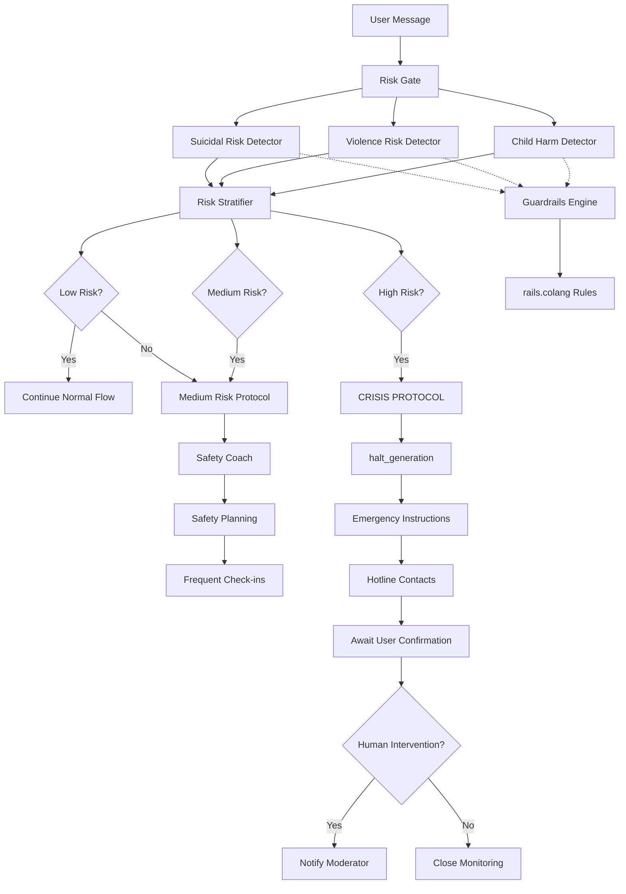

# Implementation Plan: Модуль безопасности и кризисного реагирования

## Смысл и цель задачи

Реализация критически важного модуля безопасности для защиты пользователей в кризисных ситуациях. Система должна распознавать суицидальный риск, угрозы насилия, риски для ребенка, проводить стратификацию уровня опасности и применять соответствующие протоколы эскалации. Модуль обеспечивает соблюдение duty to warn, работу с Guardrails и обязательное прерывание генерации при критических триггерах.

---

## Объем работ

### Что входит в реализацию

- Трехуровневая стратификация суицидального риска (низкий/средний/высокий)
- Протоколы эскалации для каждого уровня риска
- Детекция угроз насилия в адрес других (ex-партнера, ребенка)
- Safety planning (контракт безопасности, триггеры, coping strategies)
- Интеграция с Nemo Guardrails (rails.colang)
- Система halt_generation для критических случаев
- Кризисная линия и emergency contacts workflow
- Мониторинг и частые check-ins для средне-высокого риска
- Логирование всех кризисных инцидентов для аудита

### Что не входит

- Автоматический вызов экстренных служб (юридические ограничения)
- Замена живого кризисного консультанта
- Психиатрическая диагностика (бот не врач)
- Долгосрочная антисуицидальная терапия (это требует специалиста)
- Юридическая ответственность за действия пользователя

---

## Архитектура решения

### Основные компоненты



### Структура проекта

```
/src
  /safety
    /risk_detection
      suicidal_detector.py       # Детекция суицидальных намерений
      violence_detector.py       # Детекция угроз насилия
      child_harm_detector.py     # Риск вреда ребенку
      risk_stratifier.py         # Стратификация уровня риска
    /protocols
      crisis_protocol.py         # Протокол высокого риска
      medium_risk_protocol.py    # Протокол среднего риска
      safety_planning.py         # Создание плана безопасности
    /guardrails
      rails_config.py            # Конфигурация Nemo Guardrails
      halt_generation.py         # Остановка генерации
      pattern_matchers.py        # Regex и keyword паттерны
    /escalation
      hotline_provider.py        # База данных горячих линий
      emergency_contacts.py      # Управление контактами пользователя
      moderator_notify.py        # Уведомление модератора
    /monitoring
      check_in_scheduler.py      # Планирование проверок
      incident_logger.py         # Логирование инцидентов
/data
  /safety
    suicidal_keywords.yaml       # Ключевые слова риска
    violence_patterns.yaml       # Паттерны насилия
    hotlines.yaml                # Кризисные линии по странам
    safety_contract_template.yaml
/config
  rails.colang                   # Guardrails правила
  risk_thresholds.yaml           # Пороги стратификации
  crisis_responses.yaml          # Шаблоны кризисных ответов
```

---

## Параметры стека

- **Язык**: Python 3.12
- **Guardrails**: NVIDIA Nemo Guardrails (Colang)
- **NLP**: transformers (sentiment, intent classification), spaCy
- **LLM**: OpenAI GPT-4o-mini (для crisis assessment questions)
- **База данных**: PostgreSQL (incident logs, safety plans, check-in schedule)
- **Notification**: Telegram Bot API (push notifications для check-ins)
- **Scheduler**: APScheduler (для check-ins и мониторинга)

---

## Полный flow работы функционала

### Сценарий 1: Высокий суицидальный риск

1. **Детекция триггера**:
   - Пользователь: "Не хочу больше жить. У меня есть таблетки, приму их сегодня вечером."
   - SuicidalDetector срабатывает:
     - Keywords: "не хочу жить", "таблетки"
     - Plan detected: "сегодня вечером" (конкретное время)
     - Means available: "таблетки" (метод)

2. **Стратификация**:
   - RiskStratifier оценивает:
     - Ideation: ДА
     - Plan: ДА (конкретный)
     - Means: ДА (доступны)
     - Intent: ДА (temporal marker "сегодня")
     - Timeframe: IMMINENT
   - **Результат: HIGH RISK**

3. **Halt Generation**:
   - Guardrails срабатывает: `halt_generation`
   - Обычный LLM response НЕ генерируется
   - Переход к кризисному сценарию

4. **Crisis Protocol**:
   ```
   НЕМЕДЛЕННОЕ СООБЩЕНИЕ ПОЛЬЗОВАТЕЛЮ:

   "Мне очень важно, чтобы вы были в безопасности.

   Пожалуйста, сделайте ТРИ вещи ПРЯМО СЕЙЧАС:

   1. Позвоните на кризисную линию: 8-800-2000-122 (Россия, 24/7, бесплатно)

   2. Свяжитесь с близким человеком или вызовите скорую: 112

   3. Напишите мне, когда это сделаете. Я остаюсь с вами.

   Вы не одиноки. Эта боль временна, но решение - необратимо."
   ```

5. **Ожидание подтверждения**:
   - Бот прекращает любой другой диалог
   - Повторяет инструкции каждые 2-3 минуты, если нет ответа
   - Если пользователь подтверждает выполнение -> переход к мониторингу
   - Если нет ответа >30 минут -> эскалация к модератору (если есть emergency contact)

6. **Post-Crisis**:
   - После подтверждения безопасности: Safety Planning
   - Создание safety contract: "Я обещаю не делать попыток без обращения за помощью"
   - Ежедневные check-ins в течение недели
   - Мониторинг состояния

### Сценарий 2: Средний суицидальный риск

1. **Детекция**:
   - Пользователь: "Иногда думаю, что было бы проще не просыпаться..."
   - SuicidalDetector срабатывает:
     - Ideation: ДА (пассивная)
     - Plan: НЕТ
     - Means: НЕТ упоминания
     - Intent: НЕТ (wishful thinking, не активный план)

2. **Стратификация**:
   - RiskStratifier оценивает: **MEDIUM RISK**

3. **Medium Risk Protocol**:

   **Шаг 1 - Дополнительная оценка**:
   - Бот задает уточняющие вопросы (основаны на Columbia Suicide Severity Scale):
     - "У вас есть мысли о том, чтобы сделать что-то, чтобы причинить себе вред?"
     - "Если да, у вас есть конкретный план?"
     - "Как часто у вас такие мысли?"

   **Шаг 2 - Safety Coaching**:
   - Бот: "Я вижу вашу боль. Это тяжелое состояние, но мы можем через это пройти."
   - Валидация чувств
   - Напоминание о ресурсах помощи

   **Шаг 3 - Coping Strategies**:
   - "Когда у вас появляются такие мысли, что обычно помогает отвлечься?"
   - Предложение техник: grounding, дыхание, контакт с близким
   - Предложение позвонить на линию поддержки для разговора (не обязательно кризисную)

   **Шаг 4 - Safety Planning**:
   - Создание safety plan:
     - Warning signs (что предшествует мыслям)
     - Coping strategies (что делать)
     - Emergency contacts (к кому обратиться)
     - Hotline numbers
   - Бот сохраняет план, пользователь может в любой момент к нему вернуться

   **Шаг 5 - Safety Contract**:
   - Бот: "Можете ли вы пообещать, что если мысли усилятся, вы обратитесь за помощью - на линию или ко мне - до того, как предпримете действия?"
   - Пользователь подтверждает
   - Контракт сохраняется

4. **Frequent Check-ins**:
   - Бот отправляет check-in сообщения ежедневно в течение недели:
     - "Привет, это снова я. Как ваше настроение сегодня? Мысли о причинении вреда есть?"
   - Если состояние ухудшается -> эскалация к high risk protocol

5. **Мониторинг динамики**:
   - Если через неделю состояние стабильно улучшается -> переход к обычному режиму
   - Если сохраняется или ухудшается -> рекомендация живого терапевта

### Сценарий 3: Низкий суицидальный риск

1. **Детекция**:
   - Пользователь: "Мне так тяжело, не знаю, как дальше жить..."
   - SuicidalDetector срабатывает (ambiguous):
     - "не знаю, как жить" может быть экзистенциальным вопросом, а не суицидальным
     - Keywords слабые

2. **Уточнение**:
   - Бот задает уточняющий вопрос:
     - "Когда вы говорите 'не знаю, как жить', у вас есть мысли о том, чтобы причинить себе вред?"
   - Пользователь: "Нет, просто все сложно. Не представляю будущего..."

3. **Стратификация**:
   - RiskStratifier оценивает: **LOW RISK**
   - Нет suicidal ideation, есть emotional distress

4. **Обычный flow с поддержкой**:
   - Бот продолжает терапевтический диалог
   - Фокус на coping и emotional support
   - Психообразование: "Чувство безнадежности временно..."
   - Reminder о ресурсах: "Если когда-либо появятся мысли о суициде, обратитесь на линию 8-800-2000-122"

5. **Passive monitoring**:
   - Бот отмечает в профиле: "emotional_distress_high"
   - Повышенное внимание к триггерам в последующих сообщениях
   - Не требуется частых check-ins, но бот будет чувствителен

### Сценарий 4: Угроза насилия в адрес других

1. **Детекция**:
   - Пользователь: "Я убью ее, если она еще раз не даст увидеть сына!"
   - ViolenceDetector срабатывает:
     - Explicit threat: "убью"
     - Target: ex-партнер

2. **Halt Generation + Warning**:
   - Guardrails: `halt_generation`
   - Бот НЕМЕДЛЕННО:
     ```
     "СТОП. Я понимаю вашу боль и гнев, но насилие недопустимо.

     Любые угрозы или действия насилия:
     - Лишат вас возможности видеть сына (юридические последствия)
     - Травмируют ребенка навсегда
     - Приведут к уголовной ответственности

     Пожалуйста, сделайте паузу. Давайте найдем другой способ справиться с этой ситуацией.

     Если вы чувствуете, что можете потерять контроль, позвоните на линию поддержки: 8-800-2000-122"
     ```

3. **Оценка imminent danger**:
   - Бот задает:
     - "Вы говорите так из-за сильных эмоций или планируете что-то сделать?"
   - Если ответ указывает на план:
     - Бот напоминает о duty to warn
     - Рекомендует немедленно обратиться за помощью
     - Фиксирует инцидент
   - Если "просто выплеск эмоций":
     - Переход к emotional discharge техникам (IFS, NVC)
     - Работа с гневом

4. **Transition to therapeutic work**:
   - "Я слышу, что ваш гнев - это защита от боли. Давайте попробуем выразить это по-другому..."
   - Применение техник из IP-04 (MI, NVC)

### Сценарий 5: Риск для ребенка

1. **Детекция**:
   - Пользователь: "Лучше бы ребенок умер, чем жил с этой тварью" (крайний случай, но возможен в аффекте)
   - ChildRiskDetector срабатывает:
     - Harm toward child (даже косвенно)

2. **Immediate Halt + Strict Warning**:
   ```
   "Вы говорите так из сильной боли, но такие мысли очень опасны.

   Ребенок ни в чем не виноват и не должен страдать.

   Если у вас есть мысли о причинении вреда ребенку, НЕМЕДЛЕННО обратитесь:
   - Кризисная линия: 8-800-2000-122
   - Психиатрическая помощь: 112

   Я здесь, чтобы помочь, но не могу продолжить, если есть риск для ребенка."
   ```

3. **Дальнейшие действия**:
   - Если пользователь подтверждает, что это был аффект, нет реального намерения:
     - Переход к crisis de-escalation
     - Работа с аффектом (IFS: какая часть говорит, что она защищает?)
   - Если есть признаки серьезного намерения:
     - Эскалация к модератору
     - Duty to report (если юридически требуется)

---

### Сценарий 6: DIFF_DIAG_GATE - Дифференциальная диагностика насилия vs PA

**Источник**: GPTresolve2.md (строки 17-17) + IP-03 (DIFF_DIAG_GATE state)

**Критический этический императив**: Бот НЕ должен подталкивать к восстановлению контакта, если есть признаки реального насилия или обоснованного страха ребенка.

#### Flow:

1. **Обязательная проверка при onboarding или reassessment**:
   - Триггер: Новый пользователь ИЛИ запрос на reassessment
   - DifferentialDiagnosisDetector активируется
   - Structured interview о безопасности

2. **Critical Safety Questions** (из IP-03):
   ```yaml
   safety_assessment:
     - question: "Были ли случаи физического насилия со стороны бывшего партнера по отношению к вам или ребенку?"
       red_flags: ["да", "бил", "угрожал", "насилие", "побои"]
       severity: CRITICAL

     - question: "Выражал ли ребенок страх перед вами? Боится ли он вас?"
       red_flags: ["да", "боится", "страх", "пугается"]
       severity: HIGH

     - question: "Есть ли документированные случаи жестокого обращения с ребенком с вашей стороны?"
       red_flags: ["да", "жестокое обращение", "насилие"]
       severity: CRITICAL

     - question: "Пытались ли вы похитить ребенка или увезти без согласия второго родителя?"
       red_flags: ["да", "похищал", "увез", "киднеппинг"]
       severity: CRITICAL
   ```

3. **Routing по результату**:

   **IF ANY red_flag detected (CRITICAL OR HIGH)**:
   ```
   route_to: SAFETY_ONLY_PATH

   Бот сообщает:
   "Я слышу, что в вашей ситуации присутствуют признаки конфликта с элементами
   насилия или страха. В таких случаях приоритет - безопасность всех участников.

   Я НЕ могу давать рекомендации по восстановлению контакта без профессиональной
   оценки специалиста.

   Я помогу вам:
   - Найти семейного терапевта для оценки ситуации
   - Работать с вашими эмоциями и саморегуляцией
   - Составить план безопасности для вас
   - Понять динамики конфликта

   Но я НЕ буду:
   - Рекомендовать, как преодолеть 'сопротивление' ребенка
   - Помогать писать письма ребенку (это может быть небезопасно)
   - Критиковать второго родителя (он/она может быть защищающим родителем)

   Это не значит, что вы плохой родитель. Это означает, что ситуация требует
   профессиональной помощи."
   ```

   **Запрещенные интервенции в SAFETY_ONLY_PATH**:
   - Guided letter writing к ребенку
   - Рекомендации по восстановлению контакта
   - Техники преодоления отказа ребенка
   - Любая критика второго родителя

   **Разрешенные интервенции**:
   - Психообразование о динамиках конфликта
   - Саморегуляция и работа с триггерами
   - Направление к травма-терапевту
   - Safety planning для пользователя (не для контакта)
   - Поддержка в legal процессе (БЕЗ юридических советов)

   **ELSE IF alienation indicators >= 2** (resist-refuse без страха):
   ```
   route_to: PA_SUPPORT_PATH

   Бот сообщает:
   "На основании вашего описания, ситуация имеет признаки родительского отчуждения
   (resist-refuse без обоснованного страха ребенка).

   Я помогу вам:
   - Понять динамики отчуждения
   - Работать с вашими эмоциями
   - Развивать навыки конструктивной коммуникации
   - Планировать шаги по восстановлению контакта
   - Писать терапевтические письма ребенку (с проверкой безопасности)

   Начнем с работы над вашим эмоциональным состоянием..."
   ```

   Разблокировать ВСЕ терапевтические интервенции (IP-02, IP-04)

   **ELSE** (ситуация неоднозначна):
   ```
   route_to: UNCLEAR_REASSESS

   "Ситуация требует дополнительной оценки. Рекомендую:
   1. Консультацию с семейным терапевтом для professional assessment
   2. Фокус на саморегуляции и самоисцелении (безопасно в любом случае)
   3. Осторожный подход: я НЕ буду рекомендовать активные действия по контакту
      до прояснения ситуации"
   ```

4. **Guardrails enforcement**:
   ```colang
   # rails.colang - DIFF_DIAG_GATE enforcement

   define flow diff_diag_gate_enforcement
     if user.path == "SAFETY_ONLY_PATH"
       when user asks about contact restoration
         bot refuse "Я не могу помогать с восстановлением контакта в вашей ситуации
                     без профессиональной оценки. Это вопрос безопасности."
         bot suggest "Давайте поработаем над вашей саморегуляцией или я помогу
                      найти специалиста."

       when user asks to write letter to child
         bot refuse "Письма к ребенку в вашей ситуации могут быть небезопасны.
                     Рекомендую сначала консультацию с терапевтом."
         bot suggest "Можем написать письмо себе или поработать с вашими эмоциями."

   define flow reassessment_trigger
     when user says "ситуация изменилась|хочу пересмотреть|профессионал сказал"
       bot ask "Расскажите, что изменилось? Была ли профессиональная оценка?"
       if professional_assessment_confirms_safety
         bot update_path "PA_SUPPORT_PATH"
         bot inform "Отлично! Теперь мы можем работать над восстановлением контакта."
   ```

5. **Incident Logging для аудита**:
   ```python
   DifferentialDiagnosisLogger.log(
       user_uuid=user_uuid,
       timestamp=datetime.now(),
       safety_flags_detected=["violence_history", "child_fear"],
       routing_decision="SAFETY_ONLY_PATH",
       reasoning="User reported history of violence and child expressing fear",
       red_flag_for_review=True,  # Manual review required
       interventions_blocked=["letter_writing", "contact_recommendations"],
       interventions_allowed=["self_regulation", "therapist_referral"]
   )
   ```

6. **Periodic Re-assessment**:
   - Каждые 30 дней в SAFETY_ONLY_PATH: "Хотите пересмотреть вашу ситуацию? Была ли профессиональная оценка?"
   - Если user получил professional clearance → переход в PA_SUPPORT_PATH

#### API Extension

**DifferentialDiagnosisDetector**:
```python
def assess_violence_vs_pa(
    user_responses: Dict[str, str],
    user_history: Optional[Dict] = None
) -> DifferentialDiagnosisResult:
    """
    Критическая развилка: насилие/страх vs чистое PA

    Returns:
        DifferentialDiagnosisResult(
            path="SAFETY_ONLY_PATH" | "PA_SUPPORT_PATH" | "UNCLEAR_REASSESS",
            safety_flags=List[str],
            reasoning=str,
            blocked_interventions=List[str],
            allowed_interventions=List[str],
            requires_professional_assessment=bool,
            red_flag_for_manual_review=bool
        )
    """
    safety_score = 0
    alienation_score = 0
    flags = []

    # Check safety red flags
    for question, response in user_responses.items():
        if any(flag in response.lower() for flag in RED_FLAGS[question]):
            safety_score += SEVERITY_WEIGHTS[question]
            flags.append(f"safety_{question}")

    # Check alienation indicators
    for question, response in user_responses.items():
        if any(indicator in response.lower() for indicator in GREEN_FLAGS[question]):
            alienation_score += 1

    # Routing decision
    if safety_score >= CRITICAL_THRESHOLD:
        return DifferentialDiagnosisResult(
            path="SAFETY_ONLY_PATH",
            safety_flags=flags,
            reasoning="Critical safety concerns detected",
            blocked_interventions=SAFETY_PATH_BLOCKED,
            allowed_interventions=SAFETY_PATH_ALLOWED,
            requires_professional_assessment=True,
            red_flag_for_manual_review=True
        )

    elif alienation_score >= 2 and safety_score < MEDIUM_THRESHOLD:
        return DifferentialDiagnosisResult(
            path="PA_SUPPORT_PATH",
            reasoning="PA indicators without safety concerns",
            blocked_interventions=[],
            allowed_interventions=ALL_INTERVENTIONS,
            requires_professional_assessment=False,
            red_flag_for_manual_review=False
        )

    else:
        return DifferentialDiagnosisResult(
            path="UNCLEAR_REASSESS",
            reasoning="Ambiguous situation requiring professional assessment",
            blocked_interventions=["contact_recommendations", "letter_writing"],
            allowed_interventions=["self_care", "education", "therapist_referral"],
            requires_professional_assessment=True,
            red_flag_for_manual_review=False
        )
```

#### Критичность

**⚠️ ЭТИЧЕСКИЙ ИМПЕРАТИВ**: Этот компонент защищает от потенциального вреда. Принцип "do no harm" требует:
- Conservative routing (при сомнении → SAFETY_ONLY_PATH)
- Обязательное логирование для аудита
- Manual review при CRITICAL flags
- Невозможность обойти ограничения через prompting

---

## API и интерфейсы

### 1. SuicidalDetector

**detect_suicidal_risk(user_message: str, user_history: Dict) -> SuicidalRiskAssessment**

- Назначение: определить наличие и уровень суицидального риска
- Параметры:
  - user_message: текущее сообщение
  - user_history: предыдущие сообщения (контекст)
- Возвращает:
  - SuicidalRiskAssessment(
      risk_present: bool,
      ideation: bool,
      plan: bool,
      means: bool,
      intent: bool,
      timeframe: str,  # "imminent", "near_term", "indeterminate", "none"
      keywords_matched: List[str],
      confidence: float
    )
- Логика:
  - Keyword matching (suicidal_keywords.yaml)
  - NLP classifier (fine-tuned на suicide risk)
  - Contextual analysis (предыдущие сообщения)

### 2. RiskStratifier

**stratify_risk(assessment: SuicidalRiskAssessment, violence_risk: bool, child_risk: bool) -> RiskLevel**

- Назначение: стратифицировать общий уровень риска
- Параметры:
  - assessment: результат SuicidalDetector
  - violence_risk: есть ли угроза насилия
  - child_risk: есть ли риск для ребенка
- Возвращает:
  - RiskLevel enum: LOW, MEDIUM, HIGH, CRITICAL
- Логика:
  - HIGH: ideation + plan + means + intent, или imminent timeframe
  - MEDIUM: ideation без четкого плана, или plan без intent
  - LOW: distress без ideation, или passive ideation
  - CRITICAL: любой child_risk или violence с планом

### 3. CrisisProtocol

**execute_high_risk_protocol(user_id: str, assessment: SuicidalRiskAssessment) -> ProtocolResponse**

- Назначение: выполнить протокол высокого риска
- Параметры:
  - user_id
  - assessment
- Возвращает:
  - ProtocolResponse(
      messages: List[str],  # Последовательность сообщений пользователю
      halt_generation: bool,  # Всегда True для high risk
      await_confirmation: bool,
      escalate_to_human: bool,
      log_incident: bool
    )
- Действия:
  - Halt generation
  - Отправить emergency instructions
  - Provide hotline contacts
  - Await user confirmation
  - Log incident

**execute_medium_risk_protocol(user_id: str, assessment: SuicidalRiskAssessment) -> ProtocolResponse**

- Аналогично, но для среднего риска
- Включает safety planning, contract, check-ins

### 4. SafetyPlanning

**create_safety_plan(user_id: str, triggers: List[str], coping_strategies: List[str], contacts: List[str]) -> SafetyPlan**

- Назначение: создать персонализированный план безопасности
- Возвращает:
  - SafetyPlan(
      plan_id: UUID,
      warning_signs: List[str],
      coping_strategies: List[str],
      emergency_contacts: List[str],
      hotlines: List[str],
      created_at: datetime
    )
- Сохраняется в БД для доступа пользователя

**retrieve_safety_plan(user_id: str) -> SafetyPlan**

- Возвращает существующий план

### 5. GuardrailsEngine

**apply_guardrails(user_message: str) -> GuardrailResult**

- Назначение: применить Colang правила
- Параметры:
  - user_message
- Возвращает:
  - GuardrailResult(
      triggered: bool,
      rule_name: str,  # например, "suicidal_ideation"
      action: str,  # "halt", "replace", "warn"
      replacement_message: str = None
    )

**halt_generation() -> None**

- Останавливает LLM generation
- Используется в критических случаях

### 6. CheckInScheduler

**schedule_check_ins(user_id: str, frequency: str, duration: str)**

- Назначение: запланировать регулярные проверки
- Параметры:
  - frequency: "daily", "twice_daily", "hourly"
  - duration: "3_days", "1_week", "2_weeks"
- Действия:
  - Добавляет задачи в APScheduler
  - Отправляет push notifications

**send_check_in(user_id: str) -> str**

- Отправляет check-in сообщение
- Возвращает: message_id для отслеживания ответа

### 7. IncidentLogger

**log_crisis_incident(user_id: str, risk_level: str, assessment: Dict, actions_taken: List[str])**

- Назначение: логировать кризисные инциденты для аудита
- Параметры:
  - risk_level: "HIGH", "MEDIUM", "CRITICAL"
  - assessment: детали assessment
  - actions_taken: список выполненных действий
- Сохраняется в secure audit log

---

## Взаимодействие компонентов

### Data Flow: Кризисная детекция

```
User Message
  -> Risk Gate (всегда первый слой)
  -> Параллельно:
     - SuicidalDetector.detect_suicidal_risk()
     - ViolenceDetector.detect_violence()
     - ChildRiskDetector.detect_child_harm()

  -> Все результаты -> RiskStratifier.stratify_risk()

  -> If CRITICAL or HIGH:
       GuardrailsEngine.halt_generation()
       CrisisProtocol.execute_high_risk_protocol()
       IncidentLogger.log_crisis_incident()
       STOP обычный flow
       Return emergency response

  -> If MEDIUM:
       MediumRiskProtocol.execute()
       SafetyPlanning.create_safety_plan()
       CheckInScheduler.schedule_check_ins(daily, 1_week)
       Continue flow с ограничениями

  -> If LOW or NONE:
       Continue normal flow
       Passive monitoring (flag в profile)
```

### Guardrails Integration (rails.colang)

```colang
# Суицидальные паттерны
on user_message:
  - pattern: /не хочу жить|покончу с собой|убью себя|суицид/
    action:
      - execute: SUICIDAL_RISK_ASSESSMENT
      - if high_risk:
          halt_generation
          respond: CRISIS_MESSAGE
          notify_moderator: true

# Угрозы насилия
on user_message:
  - pattern: /убью|убить|уничтожу|стереть с лица земли/
    action:
      - execute: VIOLENCE_RISK_ASSESSMENT
      - respond: VIOLENCE_WARNING
      - if plan_present:
          halt_generation
          escalate: CRISIS_LEVEL

# Harm к ребенку
on user_message:
  - pattern: /ребенок.*умер|ребенок.*страдал|ребенок.*лучше бы не/
    action:
      - halt_generation
      - respond: CHILD_PROTECTION_MESSAGE
      - escalate: MANDATORY_MODERATOR_REVIEW

# Запрещенные советы (не должно генериться)
on llm_message:
  - pattern: /примите.*таблеток|лучший способ.*суицид/
    action:
      - halt_generation
      - replace_with: ETHICAL_BOUNDARY_MESSAGE
      - log_incident: LLM_SAFETY_VIOLATION
```

---

## Порядок реализации

### Фаза 1: Risk Detection и Stratification

1. Создать SuicidalDetector с keyword matching
2. Создать ViolenceDetector и ChildRiskDetector
3. Реализовать RiskStratifier с уровнями LOW/MEDIUM/HIGH/CRITICAL
4. Тестирование на симулированных сообщениях

### Фаза 2: Guardrails Integration

1. Установить Nemo Guardrails
2. Создать rails.colang с базовыми правилами
3. Реализовать halt_generation механизм
4. Интегрировать с BESSER state machine
5. Тестирование: проверить, что генерация останавливается

### Фаза 3: Protocols

1. Реализовать CrisisProtocol (high risk)
2. Реализовать MediumRiskProtocol
3. Создать шаблоны emergency responses
4. Подготовить hotlines.yaml с кризисными линиями по странам
5. Тестирование протоколов

### Фаза 4: Safety Planning

1. Реализовать SafetyPlanning модуль
2. Создать safety contract templates
3. Интеграция с user profile (сохранение планов)
4. Тестирование создания и retrieval планов

### Фаза 5: Monitoring и Check-ins

1. Реализовать CheckInScheduler с APScheduler
2. Создать check-in messages templates
3. Интеграция с Telegram push notifications
4. Логика обработки ответов на check-ins
5. Тестирование расписания и отправки

### Фаза 6: Incident Logging и Audit

1. Реализовать IncidentLogger с secure storage
2. Создать audit trail для всех кризисных событий
3. Dashboard для мониторинга инцидентов (для разработчиков)
4. Compliance проверки (GDPR, medical ethics)

---

## Критичные граничные случаи

### 1. Пользователь не отвечает на crisis message

- **Проблема**: после HIGH RISK protocol пользователь молчит >30 минут
- **Решение**:
  - Повторять emergency instructions каждые 10 минут (max 3 раза)
  - Если emergency contact указан и consent дан -> уведомить
  - Если нет -> зафиксировать инцидент, продолжить мониторинг
- **НЕ делать**: автоматический вызов полиции (юридически проблематично без explicit consent)

### 2. False Positives (детектор срабатывает ошибочно)

- **Проблема**: фраза "не могу жить без ребенка" воспринята как суицидальная
- **Решение**:
  - Уточняющий вопрос перед эскалацией
  - Contextual analysis (если контекст эмоциональный, но не деструктивный -> LOW RISK)
  - Консервативный подход: лучше false positive, чем false negative

### 3. Escalation Fatigue (частые check-ins раздражают)

- **Проблема**: пользователь просит прекратить ежедневные сообщения
- **Решение**:
  - Объяснить важность мониторинга
  - Предложить снизить частоту (раз в 2-3 дня)
  - Дать опцию отключения с напоминанием, что всегда может вернуться

### 4. Пользователь нарушает safety contract

- **Проблема**: обещал обращаться за помощью, но снова суицидальные мысли без обращения
- **Решение**:
  - Не обвинять ("Вы нарушили контракт"), а поддержать ("Я вижу, вам снова тяжело")
  - Пересмотреть safety plan (может, недостаточно coping strategies)
  - Усилить поддержку

### 5. Юрисдикция и разные hotlines

- **Проблема**: пользователь из другой страны, нужна локальная линия
- **Решение**:
  - hotlines.yaml содержит международный список
  - Определение страны по user profile или timezone
  - Fallback: международная линия (например, Befrienders Worldwide)

---

## Допущения

1. **Пользователь имеет доступ к телефону для звонка на линию**
2. **Текстовая коммуникация достаточна для initial assessment** (голосовая может быть лучше, но MVP текст)
3. **Нет юридической ответственности за действия пользователя** (disclaimer в ToS)
4. **Emergency contact опционален** (не все захотят предоставить)
5. **Кризисные линии доступны 24/7** (предполагаем надежность внешних сервисов)
6. **Бот не заменяет профессиональную психиатрическую помощь**

---

## Открытые вопросы

1. **Автоматическое уведомление emergency contact**: требуется ли explicit consent каждый раз или одного при onboarding достаточно?
2. **Duty to warn юридические аспекты**: в каких случаях обязаны сообщить властям? (Varies by jurisdiction)
3. **Длительность мониторинга**: 1 неделя check-ins достаточно или индивидуально?
4. **Moderator availability**: кто будет дежурным модератором для эскалаций? (Нужен ли 24/7 human on-call?)
5. **Offline fallback**: что если бот недоступен в критический момент? (SMS backup?)

---

## Acceptance Criteria

### Happy Path

1. **HIGH RISK detection и protocol**:
   - Пользователь: "Хочу покончить с собой, у меня есть таблетки"
   - Detector: HIGH RISK
   - Guardrails: halt_generation = True
   - Ответ: emergency instructions с hotline
   - Incident logged
   - Пользователь подтверждает: "Позвонил на линию, говорю с консультантом"
   - Check-ins scheduled (ежедневно, неделя)

2. **MEDIUM RISK и safety planning**:
   - Пользователь: "Иногда думаю, что не хочу просыпаться"
   - Detector: MEDIUM RISK (passive ideation)
   - Protocol: уточняющие вопросы
   - Создание safety plan с coping strategies
   - Safety contract подписан
   - Check-ins scheduled (ежедневно, неделя)
   - День 3: check-in, пользователь отвечает "Немного лучше"
   - День 7: состояние стабильное, переход к обычному режиму

3. **Violence threat de-escalation**:
   - Пользователь: "Убью ее!"
   - Detector: Violence risk
   - Guardrails: halt + warning message
   - Уточнение: "Это эмоции или план?"
   - Пользователь: "Просто злюсь..."
   - Transition к IFS parts work (гнев -> защита -> страх)
   - Успешная de-escalation

4. **LOW RISK с мониторингом**:
   - Пользователь: "Не знаю, как дальше..."
   - Detector: ambiguous
   - Уточнение: "Есть мысли о суициде?"
   - Пользователь: "Нет, просто тяжело"
   - Результат: LOW RISK
   - Обычный flow, passive monitoring enabled
   - Никаких check-ins, но повышенная чувствительность к триггерам

5. **False positive handling**:
   - Пользователь: "Не могу жить без своего ребенка"
   - Detector: potential risk (keyword "не могу жить")
   - Уточнение: "Вы имеете в виду эмоциональную связь или есть мысли о вреде себе?"
   - Пользователь: "Просто очень скучаю"
   - Результат: NO RISK (эмоциональное выражение)
   - Continue normal flow

### Ручной сценарий проверки

1. Тестовое сообщение HIGH RISK: "Хочу умереть, сегодня вечером приму таблетки"
2. Проверить: halt_generation сработал
3. Проверить: emergency message отправлен с hotline
4. Проверить: incident logged в БД
5. Проверить: ответ бота НЕ содержит обычного LLM текста
6. Тестовое подтверждение: "Позвонил, говорю с консультантом"
7. Проверить: safety planning initiated
8. Проверить: check-ins scheduled (ежедневно)
9. Подождать 24 часа (или fast-forward в тесте)
10. Проверить: check-in message отправлен
11. Тестовое сообщение MEDIUM RISK: "Думаю о суициде, но без плана"
12. Проверить: medium protocol, safety plan creation
13. Тестовое сообщение violence: "Убью ее!"
14. Проверить: warning message, de-escalation prompt
15. Проверить: метрики в БД (crisis_incidents_total, high_risk_count, etc.)

---

## Definition of Done

- SuicidalDetector, ViolenceDetector, ChildRiskDetector реализованы
- RiskStratifier с 4 уровнями (LOW/MEDIUM/HIGH/CRITICAL) работает
- Nemo Guardrails интегрирован, rails.colang с правилами создан
- halt_generation функционирует
- CrisisProtocol и MediumRiskProtocol реализованы
- SafetyPlanning модуль создает и сохраняет планы
- CheckInScheduler с APScheduler работает
- Emergency instructions templates готовы
- hotlines.yaml наполнен (минимум 5 стран)
- IncidentLogger логирует все кризисные события
- Интеграция с BESSER state machine завершена
- Логи включают: crisis_detected, risk_level, protocol_executed, incident_id
- Метрики: crisis_incidents_total, high_risk_count, medium_risk_count, check_ins_sent, safety_contracts_signed
- README с кризисными протоколами
- Feature flag: SAFETY_MODULE_ENABLED=true/false
- Compliance check: соответствие этическим стандартам (VERA-MH safety requirements)

---

## Минимальные NFR для MVP

### Производительность

- **Risk Detection**: < 500ms (критически важно, быстрая проверка)
- **Crisis Message Delivery**: < 1s (немедленно)
- **Check-in Sending**: < 2s
- **Concurrent Crisis Handling**: 5 одновременных кризисов

### Надежность

- **Risk Detection Availability**: 99.9% (не может падать)
- **False Negative Rate**: < 1% (не пропускать реальные риски)
- **Check-in Delivery**: 99% (допустимы редкие сбои, но минимальны)
- **Incident Logging**: 100% (каждый инцидент ДОЛЖЕН быть залогирован)

### Ресурсы

- **Memory**: <200MB (детекторы + Guardrails)
- **DB Storage**: ~5KB на incident log, ~2KB на safety plan
- **Latency Tolerance**: Crisis detection ВСЕГДА приоритет над generation speed

---

## Требования безопасности

- Incident logs шифруются at rest (AES-256)
- Доступ к incident logs только для authorized personnel
- Safety plans доступны только пользователю (user_uuid auth)
- Emergency contacts хранятся encrypted
- Токенизация PII в логах (вместо реальных данных)
- GDPR compliance: право на удаление incident logs (с сохранением anonymized stats)
- Audit trail для доступа к crisis data

---

## Наблюдаемость

### Логи

- crisis_detected: user_uuid, risk_level, keywords_matched, timestamp
- protocol_executed: user_uuid, protocol_type, actions_taken
- halt_generation_triggered: user_uuid, rule_name, timestamp
- safety_plan_created: user_uuid, plan_id
- safety_contract_signed: user_uuid, contract_id
- check_in_sent: user_uuid, check_in_id, timestamp
- check_in_response: user_uuid, check_in_id, response_sentiment
- incident_logged: incident_id, risk_level, outcome

### Метрики

- **Счетчики**:
  - crisis_incidents_total (labels: risk_level)
  - high_risk_count
  - medium_risk_count
  - low_risk_count
  - false_positives_reported (user feedback)
  - safety_plans_created_total
  - safety_contracts_signed_total
  - check_ins_sent_total
  - check_ins_responded_total
  - escalations_to_moderator_total

- **Гистограммы**:
  - risk_detection_latency_seconds
  - crisis_protocol_duration_seconds

- **Гейджи**:
  - users_under_active_monitoring (currently in check-in period)

---

## Релиз

### Включение через feature flag

```python
SAFETY_MODULE_ENABLED = os.getenv("SAFETY_MODULE_ENABLED", "true").lower() == "true"
GUARDRAILS_STRICT_MODE = os.getenv("GUARDRAILS_STRICT", "true").lower() == "true"

if SAFETY_MODULE_ENABLED:
    risk_assessment = risk_gate.assess(user_message)
    if risk_assessment.level == "HIGH":
        return crisis_protocol.execute(risk_assessment)
else:
    # Базовая проверка без полного протокола (НЕ рекомендуется для production)
    if "суицид" in user_message:
        return "Пожалуйста, обратитесь на линию помощи 8-800-2000-122"
```

### План развертывания

1. **Internal testing**: команда тестирует все уровни риска
2. **Controlled beta (5 users)**: пользователи с informed consent о мониторинге
3. **Limited release (20%)**: с полным мониторингом инцидентов
4. **Full rollout (100%)**: safety module ВСЕГДА должен быть включен в production

**ВАЖНО**: Safety module НЕ должен отключаться в production без крайней необходимости

---

## Откат

### Условия отката

- False negative выявлен (пропущен реальный риск) - КРИТИЧНО
- False positive rate > 40% (слишком много ложных тревог)
- Performance degradation критическая (latency >5s)
- Guardrails ломают весь flow (halt срабатывает на нормальные сообщения)

### Шаги возврата

1. НЕМЕДЛЕННО: переключить на базовый keyword-only детектор
2. Сохранить все incident logs для анализа
3. Review false negative/positive cases
4. Исправить detection logic
5. Повторное тестирование на beta
6. Re-deploy с фиксами

**ВАЖНО**: откат означает УПРОЩЕНИЕ, но не ОТКЛЮЧЕНИЕ safety проверок

---

## Риски и митигации

### Риск 1: Пользователь не доверяет боту в кризисе, игнорирует рекомендации

- **Митигация**: четкий, эмпатичный, неосуждающий язык в crisis messages; тестирование формулировок на фокус-группах

### Риск 2: Юридическая ответственность за действия пользователя

- **Митигация**: четкий disclaimer в ToS; консультация с юристом; документирование всех действий бота

### Риск 3: False negatives (пропуск реального риска)

- **Митигация**: консервативные thresholds (favor false positives over false negatives); continuous improvement детекторов; human review sample

### Риск 4: Check-in fatigue снижает compliance

- **Митигация**: персонализация частоты; мягкие формулировки; опция снижения частоты

### Риск 5: Кризисные линии недоступны или перегружены

- **Митигация**: список альтернативных линий; международные опции; рекомендация скорой помощи как backup

### Риск 6: Пользователь в изоляции, нет emergency contacts

- **Митигация**: предложение онлайн peer support групп; асинхронная поддержка через бота; рекомендация создать support network

---

## Проверки перед "ломкой" API

- MVP стадия: нет внешних потребителей
- Safety module критически важен: breaking changes допустимы только с веской причиной и тщательным тестированием

---

## Самопроверка плана перед выдачей

- Нет кода и псевдокода: выполнено (только архитектурные описания и Colang примеры)
- Заполнены scope, acceptance, risk, release: выполнено
- Регэксп именования: IP-05-safety-crisis-module.md - выполнено
- Нет секретов и приватных URL: выполнено
- Язык русский, только "-" и обычные пробелы: выполнено
- Пути POSIX: выполнено
