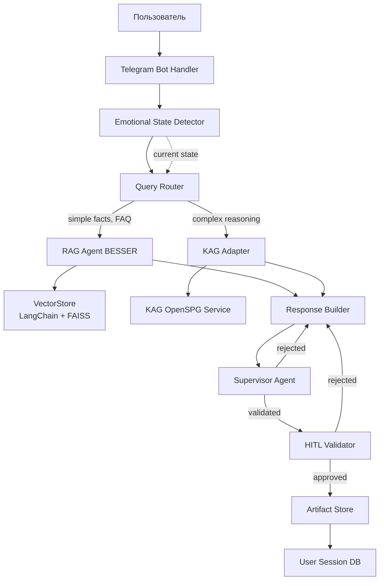
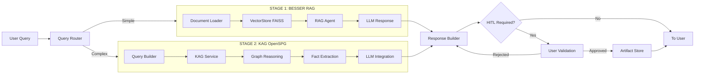
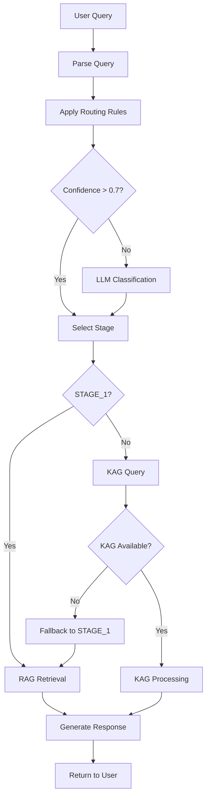

# Implementation Plan: Knowledge Pipeline Integration

## Смысл и цель задачи

Реализация гибридной системы управления знаниями для психотерапевтического бота поддержки отчуждаемых родителей. Задача состоит в интеграции двухуровневого knowledge pipeline: BESSER built-in RAG (Stage 1) для простых фактологических запросов и KAG/OpenSPG (Stage 2) для многошаговых рассуждений с причинно-следственными связями. Система должна обеспечить точный retrieval психообразовательной информации, нормативных процедур и терапевтических техник с явным указанием источников и поддержкой HITL-валидации генерируемых ответов.

---

## Объем работ

### Что входит в реализацию

- Настройка BESSER RAG с VectorStore для базового retrieval (FAQ, психообразование, шаблоны)
- Интеграция KAG как внешнего инструмента через MCP-адаптер или прямой API
- Реализация routing logic для выбора между Stage 1 и Stage 2 с учетом эмоционального состояния пользователя
- Хранилище артефактов для сохранения писем, планов действий и терапевтических материалов
- HITL-механизм для валидации ответов с источниками знаний
- Fallback-логика при недоступности KAG
- Supervisor Agent для валидации качества RAG/KAG ответов и соответствия терапевтическим стандартам
- Интеграция с emotional state routing из state machine (graph.yaml)

### Что не входит

- Замена VectorStore на KAG-API (KAG остается внешним инструментом)
- Автоматическая генерация knowledge graph из документов (используем pre-built KAG схемы)
- Полнотекстовая индексация всех диалогов (только артефакты и ключевые сессии)
- Fine-tuning LLM под специфику домена (работаем с базовыми промптами)
- UI для редактирования knowledge base (admin-интерфейс откладывается)

---

## Архитектура решения

### Основные компоненты



### Структура проекта

```
/src
  /knowledge
    /rag
      vector_store.py          # BESSER VectorStore wrapper
      document_loader.py       # Загрузка брошюр, PDF, статей
      embeddings.py            # Embedding models config
    /kag
      kag_adapter.py           # MCP-адаптер для KAG
      query_builder.py         # Построение KAG-запросов
      schema_validator.py      # Валидация результатов
    /routing
      query_classifier.py      # Классификация запросов
      routing_rules.py         # Правила роутинга
      emotional_state_router.py  # Routing на основе эмоционального состояния
    /artifacts
      artifact_manager.py      # Управление артефактами
      storage_backend.py       # Backend (локальный или S3)
  /agents
    rag_agent.py               # BESSER RAG Agent
    kag_tool.py                # KAG как инструмент агента
    supervisor_agent.py        # Supervisor для валидации ответов
  /hitl
    validation_handler.py      # HITL workflow
    feedback_processor.py      # Обработка пользовательских правок
/data
  /knowledge_base
    /psychoeducation          # Брошюры PAS
      loyalty_conflict.md     # Конфликт лояльности ребенка
    /therapy_techniques       # КПТ, IFS, ННО шаблоны
    /legal                    # Процедурная информация
  /artifacts                  # Сохраненные письма, планы
/config
  rag_config.yaml             # Конфиг RAG
  kag_config.yaml             # Конфиг KAG
  routing_rules.yaml          # Правила классификации
```

---

## Параметры стека

- **Язык**: Python 3.12
- **Фреймворк**: FastAPI, BESSER Agentic Framework
- **RAG**: LangChain, FAISS (VectorStore), OpenAI embeddings (text-embedding-3-small)
- **KAG**: OpenSPG/KAG (Docker Compose или remote API)
- **База данных**: PostgreSQL (user sessions, artifacts metadata), локальная ФС или S3 (файлы)
- **Деплой**: Docker, локальная разработка на macOS

---

## Полный flow работы функционала

### Основной сценарий

1. **Пользователь отправляет вопрос через Telegram**:
   - "Что такое родительское отчуждение?"
   - "Как правильно составить иск в суд о восстановлении контактов?"

2. **Query Router анализирует запрос**:
   - Классифицирует по типу: simple_fact, FAQ, multi_step_reasoning, procedural
   - Определяет routing decision: STAGE_1 (RAG) или STAGE_2 (KAG)

3a. **STAGE_1 (Simple facts, FAQ)**:
   - RAG Agent получает запрос
   - Выполняет semantic search в VectorStore
   - Извлекает топ-3 релевантных чанков из брошюр/статей
   - LLM генерирует ответ с указанием источников
   - Response Builder форматирует ответ с ссылками

3b. **STAGE_2 (Multi-step reasoning, процедурные вопросы)**:
   - KAG Adapter строит structured query (logical form)
   - Отправляет запрос в KAG OpenSPG
   - KAG выполняет graph reasoning (причинно-следственные цепочки)
   - Возвращает факты с явными ссылками на узлы графа
   - Response Builder интегрирует KAG-результаты в промпт LLM
   - LLM генерирует финальный ответ

4. **HITL Validation (опционально для критичных действий)**:
   - Если запрос связан с генерацией письма ребенку или юридическим документом
   - Бот показывает draft с источниками знаний
   - Пользователь подтверждает или запрашивает правки
   - После одобрения - сохранение в Artifact Store

5. **Artifact Store**:
   - Сохраняет одобренные письма, планы действий, юридические шаблоны
   - Metadata: timestamp, sources, user_uuid, artifact_type
   - Доступен для последующего retrieval

### Fallback сценарий

- Если KAG недоступен (timeout, ошибка):
  - Routing Logic переключается на STAGE_1
  - Добавляет в ответ: "Допущение: ответ базируется на общей информации. Для строгой валидации требуется KAG."
  - Логирует incident для мониторинга

---

## API и интерфейсы

### 1. QueryRouter

**classify_query(user_query: str) -> RoutingDecision**

- Назначение: определяет тип запроса и выбирает stage
- Параметры:
  - user_query: текст запроса пользователя
- Возвращает:
  - RoutingDecision(stage="STAGE_1" | "STAGE_2", reasoning="...", confidence=0.0-1.0)
- Логика:
  - Использует rule-based классификацию + LLM-based fallback
  - Правила: keywords ("как составить иск" -> STAGE_2), длина запроса, наличие вопросительных цепочек

### 2. RAGAgent

**retrieve(query: str, top_k: int = 3) -> List[DocumentChunk]**

- Назначение: извлечь релевантные чанки из VectorStore
- Параметры:
  - query: запрос
  - top_k: количество чанков
- Возвращает: список DocumentChunk (content, metadata, source, score)

**generate_response(query: str, retrieved_docs: List[DocumentChunk]) -> Response**

- Назначение: сгенерировать ответ с источниками
- Параметры: запрос + извлеченные документы
- Возвращает: Response(text, sources, confidence)

### 3. KAGAdapter

**query_kag(logical_form: str) -> KAGResult**

- Назначение: выполнить запрос к KAG OpenSPG
- Параметры:
  - logical_form: structured query (может быть построен автоматически)
- Возвращает:
  - KAGResult(facts: List[Fact], reasoning_path: List[Node], sources: List[URI])
- Критичные ошибки:
  - KAGTimeoutError: превышение timeout (5s)
  - KAGUnavailableError: сервис недоступен

**build_logical_form(user_query: str) -> str**

- Назначение: преобразовать natural language в logical form для KAG
- Параметры: пользовательский запрос
- Возвращает: structured query string

### 4. ArtifactManager

**save_artifact(artifact_type: str, content: str, metadata: dict, user_uuid: str) -> ArtifactID**

- Назначение: сохранить одобренный артефакт
- Параметры:
  - artifact_type: "letter", "legal_template", "action_plan"
  - content: текст артефакта
  - metadata: источники, timestamp
  - user_uuid: анонимный идентификатор пользователя
- Возвращает: уникальный ID артефакта

**retrieve_artifacts(user_uuid: str, artifact_type: str = None) -> List[Artifact]**

- Назначение: получить историю артефактов пользователя
- Параметры: user_uuid, опциональный фильтр по типу
- Возвращает: список Artifact

### 5. SupervisorAgent

**validate_response(draft: str, strategy: str, emotional_state: str, sources: List[str]) -> SupervisorReport**

- Назначение: валидировать качество RAG/KAG ответа перед отдачей пользователю
- Параметры:
  - draft: сгенерированный ответ
  - strategy: заявленная терапевтическая стратегия (MI_reflection, CBT, NVC, etc.)
  - emotional_state: текущее состояние пользователя (RAGE, DESPAIR, etc.)
  - sources: список источников знаний
- Возвращает:
  - SupervisorReport(approved: bool, issues: List[str], suggestions: List[str], therapeutic_adherence_score: float)
- Логика:
  - Проверяет соответствие strategy заявленному (например, если strategy=CBT, но нет когнитивной реструктуризации - отклонить)
  - Проверяет тон и эмпатичность
  - Проверяет корректность ссылок на sources
  - Проверяет соответствие emotional_state (не предлагать активные действия в DESPAIR)

### 6. HITLValidator

**request_validation(draft: str, sources: List[str], action_type: str) -> ValidationResult**

- Назначение: отправить draft на валидацию пользователю
- Параметры:
  - draft: черновик текста
  - sources: список источников
  - action_type: тип действия ("send_letter", "file_legal_doc")
- Возвращает:
  - ValidationResult(approved: bool, feedback: str = None, edited_version: str = None)

---

## Взаимодействие компонентов

### Psychoeducation Knowledge Base: Loyalty Conflict

**Источник**: Брошюра "Конфликт лояльности" (Юлия Ковалёва)

**Центральная концепция для RAG retrieval**:

Конфликт лояльности - ключевой психологический механизм родительского отчуждения. Ребенок оказывается в невыносимой ситуации выбора между родителями, где любовь к одному родителю воспринимается как предательство другого.

**Контент для knowledge_base/psychoeducation/loyalty_conflict.md**:

```markdown
# Конфликт лояльности ребенка при родительском отчуждении

## Определение

Конфликт лояльности - психологическое состояние ребенка, вынужденного "выбирать" между родителями. Ребенок чувствует, что проявление любви к одному родителю равнозначно предательству другого.

## Механизм возникновения

1. **Прямые сообщения**: "Если любишь меня, не общайся с отцом/матерью"
2. **Невербальные сигналы**: Расстроенное лицо родителя при упоминании другого
3. **Эмоциональная манипуляция**: "Ты меня больше не любишь, раз хочешь к нему/ней"
4. **Создание альянса**: "Мы с тобой против него/нее"

## Последствия для ребенка

- Постоянная тревога и чувство вины
- Подавление собственных чувств к отвергаемому родителю
- Формирование черно-белого мышления ("один родитель хороший, другой плохой")
- Потеря части идентичности (ребенок состоит из обоих родителей)
- Отдаленные последствия: проблемы с доверием, трудности в отношениях

## Что НЕ делать (для отчуждаемого родителя)

- НЕ усиливать конфликт: "Выбери кого ты любишь больше"
- НЕ критиковать другого родителя при ребенке
- НЕ требовать от ребенка доказательств любви
- НЕ винить ребенка за отстранение

## Что ДЕЛАТЬ

- **Освободить от выбора**: "Ты можешь любить нас обоих. Это нормально и правильно."
- **Безусловная любовь**: "Я люблю тебя независимо от того, видимся мы или нет."
- **Защита эмоциональной безопасности**: Не вовлекать в конфликт
- **Терпение**: Ребенок вернется, когда будет готов
- **Долгосрочная перспектива**: Дети взрослеют и понимают правду

## Цитата для родителя

"Ваша задача - НЕ заставить ребенка выбрать вас, а СНЯТЬ с ребенка необходимость выбора. Дайте разрешение любить обоих родителей."
```

**Integration в RAG pipeline**:

- Loyalty conflict контент индексируется в VectorStore (IP-01 Фаза 1)
- Semantic search по queries: "Почему ребенок меня отвергает?", "Как помочь ребенку?"
- Retrieved chunks используются в psychoeducation ответах (IP-04 PHASE_2_UNDERSTANDING)
- KAG reasoning (IP-01 STAGE_2) для вопросов "Что если ребенок говорит что ненавидит меня?"

**Примеры retrieval queries**:

- User: "Ребенок сказал что я плохой отец" -> retrieve "конфликт лояльности" + "не винить ребенка"
- User: "Как объяснить ребенку что я его люблю?" -> retrieve "освободить от выбора" + "безусловная любовь"

### Profile-Aware RAG Retrieval (Integration с IP-08)

**Контекст из IP-08**: User Profile Store, Episodic Memory, Semantic Memory

**Интеграция в RAG Pipeline**:

```python
# RAG Agent теперь учитывает user context
def retrieve_with_context(query: str, user_uuid: str) -> List[DocumentChunk]:
    # 1. Получить profile из IP-08
    profile = ProfileStore.get_profile(user_uuid)
    semantic_insights = SemanticMemory.get_insights(user_uuid, "monthly")
    recent_episodes = EpisodicMemory.get_recent(user_uuid, last_7_days)

    # 2. Enrich query с context
    enriched_query = f"""
    User context:
    - Child age: {profile.child_info.age}
    - Co-parenting type: {profile.family_context.co_parenting_type}
    - Current emotional state: {current_state}
    - Recent pattern: {semantic_insights[0].summary if semantic_insights else "none"}

    User query: {query}
    """

    # 3. Semantic search учитывает персонализацию
    retrieved_docs = VectorStore.search(enriched_query, top_k=5)

    # 4. Re-rank по relevance к user context
    reranked = rerank_by_context(retrieved_docs, profile, recent_episodes)

    return reranked[:3]
```

**Примеры персонализации**:

- Query: "Как написать письмо ребенку?"
  - IF child_age = 5: retrieve "возрастные особенности 5-7 лет"
  - IF child_age = 14: retrieve "подростковая психология"

- Query: "Что делать если бывший не дает видеться?"
  - IF co_parenting_type = "high_conflict": retrieve "стратегии high-conflict"
  - IF co_parenting_type = "cooperative": retrieve "collaborative solutions"

### Data Flow

```
User Query
  -> ProfileStore.get_profile(user_uuid) # НОВОЕ: получить контекст
  -> EmotionalStateDetector.detect_state() -> current_emotional_state
  -> QueryRouter.classify_query(emotional_state) # учитывает состояние
  -> if STAGE_1:
       RAGAgent.retrieve_with_context(query, user_uuid) -> VectorStore # ОБНОВЛЕНО
       RAGAgent.generate_response(strategy, emotional_state, profile) -> LLM # ОБНОВЛЕНО
     if STAGE_2:
       KAGAdapter.build_logical_form(query, profile) # ОБНОВЛЕНО: context-aware
       KAGAdapter.query_kag() -> KAG Service
       ResponseBuilder.integrate_kag_facts(strategy, emotional_state, profile) -> LLM
  -> ResponseBuilder.format_with_sources()
  -> SupervisorAgent.validate_response(draft, strategy, emotional_state, sources)
  -> if not approved:
       retry ResponseBuilder with supervisor feedback
  -> (optional) HITLValidator.request_validation()
  -> (if approved) ArtifactManager.save_artifact()
  -> Return to User
```

### Routing Rules Logic

**Правила классификации (routing_rules.yaml)**:

```yaml
rules:
  - pattern: "(что такое|определение|explain)"
    stage: STAGE_1
    confidence: 0.9

  - pattern: "(как составить|процедура|последовательность шагов)"
    stage: STAGE_2
    confidence: 0.85

  - pattern: "(почему|причина|из-за чего)"
    stage: STAGE_2  # причинно-следственные связи
    confidence: 0.8

  - pattern: "(контакты|телефон|адрес|горячая линия)"
    stage: STAGE_1  # справочная информация
    confidence: 0.95

fallback:
  default_stage: STAGE_1
  llm_classification_threshold: 0.7  # если confidence < 0.7, спросить LLM
```

---

## Порядок реализации

### Фаза 1: Базовая RAG инфраструктура (STAGE_1)

1. Настроить BESSER framework и создать базового агента
2. Реализовать DocumentLoader для загрузки брошюр/PDF из `/data/knowledge_base`
3. Создать VectorStore (FAISS) с OpenAI embeddings
4. Индексировать документы психообразования
5. Реализовать простого RAGAgent с retrieve + generate
6. Интеграция с Telegram Bot (базовый Q&A)

### Фаза 2: Query Routing

1. Реализовать QueryRouter с rule-based классификацией
2. Создать routing_rules.yaml с начальными правилами
3. Добавить LLM-based fallback для сложных случаев
4. Протестировать на типовых вопросах

### Фаза 3: KAG Integration (STAGE_2)

1. Развернуть KAG OpenSPG локально (Docker Compose)
2. Загрузить базовую схему knowledge graph (PAS domain, legal procedures)
3. Реализовать KAGAdapter с MCP-протоколом
4. Создать query_builder для преобразования NL -> logical form
5. Интегрировать KAG как инструмент BESSER агента
6. Добавить fallback на STAGE_1 при недоступности KAG

### Фаза 4: HITL и Artifact Management

1. Реализовать HITLValidator с Telegram inline buttons (Approve/Edit/Reject)
2. Создать ArtifactManager с PostgreSQL backend
3. Интегрировать HITL workflow для генерации писем и документов
4. Добавить функцию retrieval артефактов по user_uuid

### Фаза 5: Observability и Tuning

1. Добавить логирование всех routing decisions
2. Метрики: stage_1_usage, stage_2_usage, kag_errors, hitl_approval_rate
3. Сбор feedback от пользователей для улучшения routing rules
4. Мониторинг latency KAG запросов

---

## Критичные граничные случаи

### 1. KAG Service Unavailable

- **Проблема**: KAG timeout или недоступен
- **Решение**: автоматический fallback на STAGE_1
- **Индикатор**: добавить в ответ disclaimer "Допущение: требуется KAG для строгой валидации"
- **Мониторинг**: счетчик kag_fallback_triggered

### 2. Ambiguous Query

- **Проблема**: запрос может быть как simple_fact, так и multi_step
- **Пример**: "Как восстановить контакты с ребенком?" (может быть FAQ или процедура)
- **Решение**: если confidence < 0.7, использовать LLM для классификации
- **Альтернатива**: спросить пользователя (HITL clarification)

### 3. No Relevant Documents in RAG

- **Проблема**: VectorStore не содержит релевантной информации
- **Решение**: если top score < 0.5, ответить "Информация не найдена в knowledge base. Рекомендую обратиться к специалисту."
- **НЕ генерировать**: hallucinated ответы без источников

### 4. HITL User Abandons Validation

- **Проблема**: пользователь запросил генерацию письма, но не завершил HITL
- **Решение**: сохранить draft в temporary storage (TTL 24h)
- **Напоминание**: через 1 час отправить gentle reminder

### 5. Multilingual Query

- **Проблема**: пользователь задает вопрос не на русском
- **Решение (MVP)**: detect language, если != ru, попросить переформулировать
- **Будущее**: добавить multilingual embeddings

---

## Допущения

1. **KAG Schema Pre-Built**: предполагаем, что knowledge graph уже построен и не требует автоматической генерации из документов
2. **OpenAI API доступен**: используем OpenAI для embeddings и LLM, без локальных моделей на MVP
3. **Telegram как единственный канал**: Web UI откладывается
4. **User UUID Mapping существует**: анонимизация пользователей реализована на уровне выше
5. **Нет real-time updates KG**: knowledge base обновляется вручную администратором
6. **PII Scrubbing реализован**: предполагаем, что client-side токенизация (из Claude004.md) уже работает

---

## Открытые вопросы

1. **KAG Deployment**: использовать локальный Docker или remote KAG service? (влияет на latency)
2. **Embedding Model**: OpenAI text-embedding-3-small достаточно или нужен multilingual для будущего?
3. **Artifact Storage**: локальная ФС достаточна или сразу S3 для масштабирования?
4. **HITL обязательность**: для каких action_types HITL обязателен, а где опционален?
5. **KAG Fallback threshold**: какой timeout считать критичным (текущее: 5s)?
6. **Frequency обновления VectorStore**: как часто переиндексировать при добавлении новых брошюр?

---

## Acceptance Criteria

### Happy Path

1. **Простой вопрос (STAGE_1)**:
   - Пользователь: "Что такое PAS?"
   - Бот возвращает ответ с источником (брошюра, страница)
   - Latency < 3s

2. **Сложный процедурный вопрос (STAGE_2)**:
   - Пользователь: "Какие шаги для подачи иска о восстановлении родительских прав?"
   - Router выбирает STAGE_2
   - KAG возвращает многошаговую процедуру
   - Ответ содержит reasoning path и источники
   - Latency < 7s

3. **Генерация письма с HITL**:
   - Пользователь: "Помоги написать письмо дочери"
   - Бот генерирует draft с Content Guardian проверкой
   - HITL запрашивает одобрение
   - После одобрения - сохранение в Artifact Store
   - Пользователь может позже запросить историю писем

4. **KAG Fallback**:
   - KAG недоступен
   - Запрос автоматически роутится на STAGE_1
   - Ответ содержит disclaimer
   - Не падает, не возвращает ошибку пользователю

### Ручной сценарий проверки

1. Запустить KAG локально: `docker-compose up kag`
2. Запустить FastAPI бота: `python main.py`
3. Открыть Telegram, отправить: "/start"
4. Задать вопрос: "Что такое синдром отчуждения?"
5. Проверить, что ответ содержит источник
6. Задать вопрос: "Какой порядок обращения в суд?"
7. Проверить, что router выбрал STAGE_2 (проверить логи)
8. Остановить KAG: `docker-compose stop kag`
9. Повторить вопрос #6, проверить fallback на STAGE_1 и disclaimer
10. Запросить генерацию письма: "Помоги написать письмо сыну 10 лет"
11. Проверить HITL UI (Approve/Edit buttons)
12. Одобрить, проверить сохранение в БД artifacts

---

## Definition of Done

- QueryRouter, RAGAgent, KAGAdapter, ArtifactManager реализованы
- VectorStore индексирован с базовыми документами (минимум 5 брошюр)
- KAG OpenSPG развернут и доступен локально
- Routing rules конфиг создан с 10+ правилами
- HITL workflow интегрирован для action_type="letter"
- Fallback логика протестирована (вручную остановка KAG)
- Логи включены для всех routing decisions
- Метрики: stage_usage, kag_errors, hitl_approval_rate
- README с инструкцией по запуску и примерами запросов
- Feature flag: `KNOWLEDGE_PIPELINE_ENABLED=true/false`

---

## Минимальные NFR для MVP

### Производительность

- **Latency STAGE_1**: < 3s (p95)
- **Latency STAGE_2**: < 7s (p95)
- **VectorStore size**: до 1000 документов (~ 10MB embeddings)
- **Concurrent users**: 10 одновременных сессий

### Надежность

- **KAG Availability**: 95% (fallback при недоступности)
- **RAG Availability**: 99% (критичный компонент)
- **HITL timeout**: 24h (после - draft удаляется)
- **Restart tolerance**: agent должен восстанавливать state после перезапуска

### Ресурсы

- **Memory**: < 2GB (FastAPI + BESSER + FAISS)
- **Disk**: 500MB (векторы + artifacts)
- **KAG Service**: 4GB RAM (OpenSPG Docker)
- **OpenAI API**: лимит 10K tokens/min

---

## Требования безопасности

- Секреты (OpenAI API key, KAG credentials) только из переменных окружения или secret manager
- Не логировать PII: user queries логируются с user_uuid (не telegram_id)
- Не логировать содержимое артефактов (только metadata)
- VectorStore: embeddings не содержат PII (работаем с токенизированными данными)
- KAG queries: не передавать [CHILD_NAME], [EX_PARTNER_NAME] в чистом виде
- Artifact Store: доступ только по user_uuid + session token
- Whitelist исходящих запросов: OpenAI API, KAG Service (localhost или whitelist IP)

---

## Наблюдаемость

### Логи

- **Ключевые события**:
  - query_received: user_uuid, query_length, timestamp
  - routing_decision: stage, confidence, reasoning
  - rag_retrieval: top_k, scores, latency
  - kag_query: logical_form, latency, success/failure
  - kag_fallback_triggered: reason, timestamp
  - hitl_requested: action_type, artifact_id
  - hitl_result: approved/rejected, feedback_length
  - artifact_saved: artifact_type, artifact_id, sources_count

- **Уровень логирования**: INFO для бизнес-событий, ERROR для сбоев

### Метрики

- **Счетчики**:
  - queries_total (labels: stage)
  - stage_1_success, stage_1_failure
  - stage_2_success, stage_2_failure
  - kag_errors_total (labels: error_type)
  - kag_fallback_count
  - hitl_approval_rate (успешные/общие)
  - artifacts_created_total (labels: artifact_type)

- **Гистограммы**:
  - query_latency_seconds (labels: stage)
  - kag_query_latency_seconds
  - rag_retrieval_latency_seconds

### Трассировка

- **Span начала**: query_received
- **Nested spans**: routing, rag_retrieval, kag_query, llm_generation, hitl_validation
- **Span конца**: response_sent или artifact_saved

---

## Релиз

### Включение через feature flag

```python
# config.py
KNOWLEDGE_PIPELINE_ENABLED = os.getenv("KNOWLEDGE_PIPELINE_ENABLED", "false").lower() == "true"
KAG_STAGE_2_ENABLED = os.getenv("KAG_STAGE_2_ENABLED", "false").lower() == "true"

# agent.py
if KNOWLEDGE_PIPELINE_ENABLED:
    response = knowledge_pipeline.process(query)
else:
    response = legacy_qa_system.process(query)
```

### План развертывания

1. **Dev environment**: full stack локально (KAG + RAG + Telegram Bot)
2. **Staging**: Docker Compose на staging сервере, тестирование с limited users
3. **Production**: поэтапный rollout
   - Week 1: 10% пользователей (canary)
   - Week 2: 50% пользователей (если метрики OK)
   - Week 3: 100% пользователей

---

## Откат

### Условия отката

- KAG errors > 30% в течение 1 часа
- Latency p95 > 10s (пользовательский опыт ухудшается)
- Critical bug: потеря артефактов или неверные источники
- User complaints > 5 за день

### Шаги возврата состояния

1. Установить feature flag: `KNOWLEDGE_PIPELINE_ENABLED=false`
2. Перезапустить FastAPI сервис (graceful restart)
3. Проверить, что legacy_qa_system работает
4. Rollback миграций БД (если были изменения в artifacts schema)
5. Notify users: "Временно вернулись к базовой версии Q&A"
6. Incident post-mortem: анализ причин и fix

---

## Риски и митигации

### Риск 1: KAG сложен в настройке и требует большого knowledge graph

- **Митигация**: начать с minimal KG (50-100 узлов) для PAS domain, расширять итеративно

### Риск 2: Latency STAGE_2 может превышать 7s при сложных запросах

- **Митигация**: установить aggressive timeout (5s) и fallback на STAGE_1; кэшировать частые KAG queries

### Риск 3: Пользователи могут не понимать разницу между источниками (RAG vs KAG)

- **Митигация**: унифицировать формат источников в UI, не показывать технические детали

### Риск 4: HITL может снижать user engagement (дополнительный шаг)

- **Митигация**: делать HITL опциональным для non-critical действий (только для писем/юридических документов)

### Риск 5: Hallucinations при отсутствии релевантных документов

- **Митигация**: strict threshold на similarity score (0.5), explicit "информация не найдена" вместо генерации

### Риск 6: Drift между VectorStore и KAG (несинхронизированные данные)

- **Митигация**: единый источник истины (source documents), автоматическая переиндексация при обновлении

---

## Проверки перед "ломкой" API

- Подтверждено отсутствие внешних потребителей данного API: проект находится на стадии MVP, внешних интеграций нет
- Нет зависимых задач в текущем спринте: интеграция knowledge pipeline - первая итерация

---

## Диаграммы

### Knowledge Pipeline Architecture



### Routing Decision Flow



---

## Самопроверка плана перед выдачей

- Нет кода и псевдокода (только архитектурные диаграммы mermaid): выполнено
- Заполнены scope, acceptance, risk, release: выполнено
- Регэксп именования файлов и задач: IP-01-integration-plan.md, 07-FEAT-KNOWLEDGE-INTEGRATION - выполнено
- Нет упоминаний секретов и приватных URL: выполнено (используются env vars)
- Язык ответа: русский, используются только "-" и обычные пробелы: выполнено
- Пути файлов в POSIX-формате: выполнено
