# Implementation Plan: State Machine и Эмоциональные Состояния

## Смысл и цель задачи

Реализация core-архитектуры психотерапевтического workflow на основе state machine (graph.yaml), которая отслеживает эмоциональное состояние отчуждаемого родителя и динамически подбирает терапевтические интервенции. Система должна распознавать 11 ключевых эмоциональных состояний (от шока до стратегических действий), обеспечивать плавные переходы между ними и маппировать каждое состояние на специфические техники (MI, CBT, IFS, NVC).

---

## Объем работ

### Что входит в реализацию

- Graph.yaml с детальным описанием 11 эмоциональных состояний
- State Estimator для автоматического определения текущего состояния
- Правила переходов между состояниями (transitions)
- Rails.colang с guardrails для безопасности на каждом состоянии
- Emotional State Detector на основе sentiment analysis + keyword matching
- Интеграция с BESSER state machine framework
- Mapping состояний на therapeutic strategies
- Маркеры прогресса для каждого состояния

### Что не входит

- Детальная реализация терапевтических техник (выносится в IP-04)
- Supervisor Agent (уже описан в IP-01)
- Content Guardian для писем (описан в IP-02)
- HITL workflows (описаны в IP-01, IP-02)
- Evaluation framework (выносится в IP-06)

---

## Архитектура решения

### Основные компоненты

```mermaid
stateDiagram-v2
    [*] --> ONBOARDING
    ONBOARDING --> SHOCK_DENIAL

    SHOCK_DENIAL --> RAGE_AGGRESSION: anger_triggers
    SHOCK_DENIAL --> DESPAIR: hopelessness_high
    SHOCK_DENIAL --> ACCEPTANCE: reality_acknowledged

    RAGE_AGGRESSION --> DESPAIR: burnout
    RAGE_AGGRESSION --> GUILT: self_reflection
    RAGE_AGGRESSION --> NVC_TRAINING: calmed_down

    DESPAIR --> CRISIS: suicide_risk_high
    DESPAIR --> GUILT: self_blame_emerges
    DESPAIR --> SEEKING_HELP: hope_restored

    GUILT --> CBT_RESTRUCTURING: cognitive_work_started
    GUILT --> DESPAIR: shame_spiral

    BARGAINING --> STRATEGIC_PLANNING: reality_check
    BARGAINING --> RAGE_AGGRESSION: frustration

    OBSESSIVE_FIGHTING --> STRATEGIC_PLANNING: redirection_success
    OBSESSIVE_FIGHTING --> DESPAIR: exhaustion

    ACCEPTANCE --> SEEKING_UNDERSTANDING: curiosity_emerged
    SEEKING_UNDERSTANDING --> SELF_HEALING: insights_gained
    SELF_HEALING --> STRATEGIC_ACTION: ready_to_act
    STRATEGIC_ACTION --> LONG_TERM_COMMITMENT: sustainable_plan

    CRISIS --> DESPAIR: stabilized
    CRISIS --> [*]: escalated_to_professional

    NVC_TRAINING --> STRATEGIC_PLANNING: skills_acquired
    CBT_RESTRUCTURING --> ACCEPTANCE: beliefs_updated
```



### Структура проекта

```
/src
  /state_machine
    graph.yaml                    # Главный граф состояний
    rails.colang                  # Guardrails для безопасности
    reply.schema.json             # JSON schema для ответов
    state_estimator.py            # Определение текущего состояния
    transition_manager.py         # Управление переходами
    emotional_state_detector.py  # Анализ эмоций из текста
  /states
    /shock_denial
      markers.py                  # Признаки состояния
      strategy.py                 # Терапевтическая стратегия
    /rage_aggression
      markers.py
      strategy.py
    /despair
      markers.py
      strategy.py
    /guilt
      markers.py
      strategy.py
    /bargaining
      markers.py
      strategy.py
    /obsessive_fighting
      markers.py
      strategy.py
    /acceptance
      markers.py
      strategy.py
    /seeking_understanding
      markers.py
      strategy.py
    /self_healing
      markers.py
      strategy.py
    /strategic_action
      markers.py
      strategy.py
    /long_term_commitment
      markers.py
      strategy.py
    /crisis
      markers.py
      protocol.py                 # Кризисный протокол
/config
  emotional_markers.yaml          # Keyword patterns для состояний
  transition_rules.yaml           # Правила переходов
```

### Детальные Keyword Indicators (emotional_markers.yaml)

Расширенные keyword patterns из alienated_parent_support_bot_map.md для повышения точности state detection:

```yaml
# emotional_markers.yaml - детальная конфигурация для EmotionalStateDetector

shock_keywords:
  - "не могу поверить"
  - "это не может быть правдой"
  - "как это случилось"
  - "все случилось так быстро"
  - "я в оцепенении"
  - "не понимаю что происходит"
  - "не может быть"
  - "все само наладится"

shock_patterns:
  - "отрицание временных рамок"
  - "повторяющиеся вопросы почему"
  - "избегание конкретики"
  - "эмоциональное онемение"

rage_keywords:
  - "ненавижу"
  - "уничтожу"
  - "заплатит"
  - "накажу"
  - "монстр"
  - "злодей"
  - "преступник"
  - "за решетку"
  - "убью"
  - "тварь"
  - "урод"

rage_patterns:
  - "демонизация бывшего партнера"
  - "упоминание мести"
  - "планы наказания"
  - "агрессивная лексика"
  - "угрозы явные или скрытые"
  - "упоминание судов как оружия"

despair_keywords:
  - "безнадежно"
  - "бессмысленно"
  - "сдаюсь"
  - "больше не могу"
  - "все потеряно"
  - "нет смысла жить"
  - "навсегда потерял"
  - "не хочу жить"
  - "покончу"
  - "все кончено"

despair_patterns:
  - "выражение беспомощности"
  - "отказ от действий"
  - "катастрофизация"
  - "отсутствие будущего в нарративе"

suicidal_red_flags:  # КРИТИЧНО - требует немедленного CRISIS override
  - "не хочу жить"
  - "покончу с собой"
  - "лучше умереть"
  - "план самоубийства"
  - "прощание"
  - "суицид"
  - "повешусь"
  - "выброшусь"

guilt_keywords:
  - "моя вина"
  - "я виноват"
  - "если бы я"
  - "я плохой родитель"
  - "я все испортил"
  - "не заслуживаю"

guilt_patterns:
  - "самообвинения"
  - "перечисление своих ошибок"
  - "гиперответственность"
  - "игнорирование контекста"

bargaining_keywords:
  - "если я сделаю"
  - "если я куплю"
  - "если я заплачу"
  - "попытаюсь договориться"
  - "сделаю уступку"

obsessive_fighting_keywords:
  - "еще один суд"
  - "соберу доказательства"
  - "докажу всем"
  - "только борьба"
  - "все силы на это"

acceptance_keywords:
  - "принимаю"
  - "понимаю"
  - "это реальность"
  - "хочу измениться"
  - "готов работать"
  - "учусь"
  - "что я могу сделать"

acceptance_patterns:
  - "фокус на действиях"
  - "запрос помощи"
  - "рациональность"
  - "баланс эмоций"

understanding_keywords:
  - "хочу понять"
  - "расскажите"
  - "как это работает"
  - "ищу информацию"
  - "нужна помощь"

self_healing_keywords:
  - "работаю над собой"
  - "забочусь о себе"
  - "прощаю себя"
  - "мое благополучие важно"

strategic_action_keywords:
  - "разработал план"
  - "консультируюсь"
  - "документирую"
  - "фокус на благополучии ребенка"
  - "реалистичные ожидания"

long_term_commitment_keywords:
  - "продолжаю присутствие"
  - "терпеливо жду"
  - "полноценная жизнь"
  - "помогаю другим"
  - "трансформация"

# Violence Detection (для CRISIS override и duty to warn)
violence_keywords:
  - "убью ее"
  - "убью его"
  - "причиню вред"
  - "заплатит кровью"
  - "взорву"
  - "застрелю"

# Child Harm Detection (для CRISIS override и mandatory reporting)
child_harm_keywords:
  - "заберу ребенка силой"
  - "похищу ребенка"
  - "увезу без разрешения"
  - "киднеппинг"
```

---

## Параметры стека

- **Язык**: Python 3.12
- **State Machine**: BESSER Agentic Framework
- **Sentiment Analysis**: transformers (cardiffnlp/twitter-roberta-base-sentiment-multilingual)
- **Keyword Matching**: regex + spaCy для русского языка
- **Graph DSL**: YAML + LangGraph
- **Guardrails**: Nemo Guardrails (Colang)
- **Деплой**: Docker, локальная разработка на macOS

---

## Полный flow работы функционала

### Основной сценарий

1. **Onboarding (первичная оценка)**:
   - Пользователь впервые взаимодействует с ботом
   - Бот задает вводные вопросы: когда последний раз видел ребенка, как себя чувствует, что происходит
   - State Estimator анализирует ответы и определяет начальное состояние
   - Возможные начальные состояния: SHOCK_DENIAL (недавний разрыв), RAGE_AGGRESSION (активный конфликт), DESPAIR (длительное отчуждение)

2. **Continuous State Monitoring**:
   - При каждом сообщении пользователя:
     - Emotional State Detector анализирует sentiment (positive/negative/neutral) и intensity (0.0-1.0)
     - Keyword matcher ищет маркерные фразы ("не могу больше", "убью", "виноват", "надо действовать")
     - State Estimator сопоставляет с текущим состоянием и проверяет условия перехода
   - Пример: пользователь в RAGE, пишет "Устал злиться, все бессмысленно" -> переход в DESPAIR

3. **State-Specific Intervention**:
   - Для каждого состояния загружается соответствующая strategy:
     - SHOCK -> grounding techniques
     - RAGE -> emotional discharge + NVC
     - DESPAIR -> crisis protocol + hope restoration
     - GUILT -> CBT restructuring
     - OBSESSIVE_FIGHTING -> strategic planning redirection
   - LLM генерирует ответ с учетом strategy и emotional_state через reply.schema.json

4. **Transition Triggers**:
   - Переходы происходят по явным условиям:
     - **Временные**: после N сообщений в одном состоянии (например, 5 сессий в RAGE -> попытка перехода к NVC)
     - **Маркерные**: появление ключевых фраз ("Хочу понять что делать" в RAGE -> STRATEGIC_PLANNING)
     - **Прогрессные**: выполнение домашних заданий (например, написал NVC-письмо -> exit condition)
   - Transition Manager проверяет условия и выполняет переход с логированием

5. **Guardrails Integration**:
   - На каждом state активны специфические rails:
     - DESPAIR: усиленный suicide detection
     - RAGE: violence prevention
     - OBSESSIVE_FIGHTING: legal advice disclaimer (не советовать бесконечные суды)
   - Rails.colang прерывает обычный flow при срабатывании trigger

6. **Progress Tracking**:
   - Для каждого состояния определены success markers:
     - SHOCK: "Да, я понял, что это надолго"
     - RAGE: "Могу сформулировать без обвинений"
     - DESPAIR: "Хочу попробовать что-то сделать"
   - State Estimator отмечает достижение markers и обновляет user profile

### Пример детального flow: RAGE -> NVC_TRAINING

1. Пользователь: "Ненавижу эту тварь, она украла моего ребенка!"
2. Emotional State Detector: sentiment=very_negative, keywords=["ненавижу", "тварь"], emotion=anger, intensity=0.9
3. State Estimator: current_state=RAGE_AGGRESSION
4. Graph.yaml lookup: RAGE_AGGRESSION -> strategy=emotional_discharge+MI_reflection
5. LLM Response (strategy=MI_reflection): "Вы очень злитесь, я слышу вашу боль. Вы имеете право злиться."
6. Пользователь: "Да! Я в бешенстве! Она мне не дает видеться, все блокирует!"
7. Strategy step 2: validation + Socratic question
8. LLM: "Что обычно происходит, когда вы действуете под влиянием гнева? Это приближает к ребенку?"
9. Пользователь: "Нет... наоборот, она еще больше отгораживается..."
10. Emotional State Detector: sentiment shift to reflective, keywords=["нет", "наоборот"]
11. Transition Manager: условие "insight_acknowledged" выполнено -> check transition to NVC_TRAINING
12. Graph.yaml: RAGE_AGGRESSION -> NVC_TRAINING (edge condition: calmed_down + insight)
13. State Estimator: transition approved
14. New state: NVC_TRAINING
15. Strategy switch: NVC_request
16. LLM: "Давайте попробуем сказать о проблеме без обвинений. Попробуем формулу: Когда..., я чувствую..., потому что мне важно..."

---

## API и интерфейсы

### 1. EmotionalStateDetector

**detect_state(user_message: str, context: ConversationContext) -> EmotionalAnalysis**

- Назначение: анализировать эмоциональное содержание сообщения
- Параметры:
  - user_message: текст пользователя
  - context: история последних N сообщений для контекста
- Возвращает:
  - EmotionalAnalysis(sentiment: str, intensity: float, emotions: List[str], keywords_matched: List[str])
- Логика:
  - Sentiment model (RoBERTa multilingual) -> sentiment score
  - Keyword matcher по emotional_markers.yaml -> matched keywords
  - Emotion classifier -> primary emotions (anger, sadness, fear, hope, etc.)

### 2. StateEstimator

**estimate_current_state(emotional_analysis: EmotionalAnalysis, user_profile: UserProfile, conversation_history: List[Message]) -> StateEstimate**

- Назначение: определить текущее эмоциональное состояние пользователя
- Параметры:
  - emotional_analysis: результат детекции эмоций
  - user_profile: профиль пользователя (history of states)
  - conversation_history: последние сообщения
- Возвращает:
  - StateEstimate(state: str, confidence: float, reasoning: str)
- Логика:
  - Lookup в state_markers.yaml: какие состояния соответствуют текущим эмоциям
  - Учитывает текущий state (transitions likely from current)
  - Применяет эвристики (например, если в RAGE долго -> вероятнее DESPAIR или BARGAINING)
  - LLM-based fallback для неоднозначных случаев

### 3. TransitionManager

**check_transition(current_state: str, new_state_estimate: StateEstimate, user_progress: UserProgress) -> TransitionDecision**

- Назначение: проверить возможность и целесообразность перехода в новое состояние
- Параметры:
  - current_state: текущее состояние
  - new_state_estimate: оценка нового состояния от StateEstimator
  - user_progress: прогресс пользователя (выполненные задания, markers)
- Возвращает:
  - TransitionDecision(approved: bool, target_state: str, reasoning: str)
- Логика:
  - Проверяет наличие ребра в graph.yaml (current_state -> target_state)
  - Проверяет условия перехода (edge conditions): например, переход RAGE -> NVC_TRAINING требует "calmed_down"
  - Проверяет прогресс (не пропускать важные этапы)

**execute_transition(transition: TransitionDecision, user_profile: UserProfile) -> None**

- Назначение: выполнить переход состояния
- Параметры:
  - transition: одобренное решение о переходе
  - user_profile: профиль для обновления
- Побочные эффекты:
  - Обновляет user_profile.current_state
  - Логирует переход: state_transition event (from, to, timestamp, reason)
  - Сбрасывает context для нового состояния (например, счетчик сессий)

### 4. StrategyLoader

**load_strategy(state: str) -> Strategy**

- Назначение: загрузить терапевтическую стратегию для состояния
- Параметры:
  - state: название состояния (RAGE_AGGRESSION, etc.)
- Возвращает:
  - Strategy(techniques: List[str], steps: List[Step], exit_conditions: List[str])
- Логика:
  - Читает соответствующий модуль из /src/states/{state}/strategy.py
  - Возвращает объект с описанием техник и шагов

---

## Взаимодействие компонентов

### Data Flow: State Machine Pipeline

```
User Message
  -> EmotionalStateDetector.detect_state()
     -> sentiment, intensity, keywords
  -> StateEstimator.estimate_current_state(emotional_analysis, profile, history)
     -> state_estimate (RAGE, confidence=0.85)
  -> TransitionManager.check_transition(current=SHOCK, new_estimate=RAGE, progress)
     -> if edge exists and conditions met:
          TransitionManager.execute_transition()
          profile.current_state = RAGE_AGGRESSION
  -> StrategyLoader.load_strategy(RAGE_AGGRESSION)
     -> strategy = EmotionalDischarge + MI_reflection
  -> RAG/KAG query (with strategy context)
  -> LLM generate response (using reply.schema.json with strategy field)
  -> SupervisorAgent validate (check adherence to strategy)
  -> Return to User
```

### Graph.yaml Structure (Fragment)

```yaml
states:
  # ============================================
  # КРИТИЧЕСКАЯ РАЗВИЛКА: ДИФФЕРЕНЦИАЛЬНАЯ ДИАГНОСТИКА
  # Источник: GPTresolve2.md (строки 17-17)
  # ============================================

  DIFF_DIAG_GATE:
    description: "Обязательная оценка: resist-refuse (PA) vs обоснованный страх/насилие"
    purpose: "ЭТИЧЕСКИЙ ИМПЕРАТИВ: Бот НЕ должен подталкивать к контакту при риске насилия"
    entry_point: true  # Первое состояние после ONBOARDING
    markers:
      - pattern: "первая сессия|начало работы|расскажите о ситуации"
      - context: "new_user OR reassessment_requested"
    critical_questions:
      safety_assessment:
        - question: "Были ли случаи физического насилия со стороны бывшего партнера по отношению к вам или ребенку?"
          red_flags: ["да", "бил", "угрожал", "насилие", "побои"]
          severity: CRITICAL
        - question: "Выражал ли ребенок страх перед вами? Боится ли он вас?"
          red_flags: ["да", "боится", "страх", "пугается"]
          severity: HIGH
        - question: "Есть ли документированные случаи жестокого обращения с ребенком с вашей стороны?"
          red_flags: ["да", "жестокое обращение", "насилие"]
          severity: CRITICAL
        - question: "Пытались ли вы похитить ребенка или увезти без согласия второго родителя?"
          red_flags: ["да", "похищал", "увез", "киднеппинг"]
          severity: CRITICAL
      alienation_indicators:
        - question: "Ребенок отказывается от контакта внезапно и без объяснений?"
          green_flags: ["да", "внезапно", "без причины", "раньше все было нормально"]
        - question: "Второй родитель блокирует ваши попытки связаться с ребенком?"
          green_flags: ["да", "блокирует", "не дает", "запрещает"]
        - question: "Ребенок использует взрослые формулировки при критике вас?"
          green_flags: ["да", "говорит как взрослый", "не своими словами"]
    routing_logic:
      IF ANY safety_assessment == CRITICAL OR HIGH:
        route_to: SAFETY_ONLY_PATH
        explanation: "Обнаружены признаки возможного насилия или обоснованного страха ребенка. Приоритет - безопасность."
        actions:
          - "Направление к семейному терапевту для оценки"
          - "Рекомендация медиации с участием специалиста"
          - "Запрет на рекомендации по восстановлению контакта БЕЗ профессиональной оценки"
          - "Фокус на саморегуляции и работе с собственными триггерами"
      ELSE IF alienation_indicators >= 2:
        route_to: PA_SUPPORT_PATH
        explanation: "Признаки родительского отчуждения (resist-refuse без обоснованного страха)"
        actions:
          - "Продолжить в основной граф состояний (SHOCK/RAGE/etc.)"
          - "Применять техники восстановления контакта"
          - "Guided letter writing разрешено"
      ELSE:
        route_to: UNCLEAR_REASSESS
        explanation: "Ситуация неоднозначна, требуется дополнительная оценка"
        actions:
          - "Задать дополнительные вопросы"
          - "Рекомендовать оценку у специалиста"
          - "Осторожный подход: фокус на самоисцелении, НЕ на активных действиях"
    irrational_beliefs: []  # Диагностическое состояние, не терапевтическое
    risks:
      - "Ложноположительное определение PA при реальном насилии → подталкивание к опасному контакту"
      - "Ложноотрицательное определение насилия при PA → упущенная возможность помочь"
    strategy: differential_diagnosis
    techniques:
      - structured_interview
      - risk_assessment
      - evidence_gathering
    guardrails:
      - violence_detection: CRITICAL
      - child_safety: HIGHEST_PRIORITY
      - mandatory_specialist_referral: IF safety_risk_detected
    transitions:
      - to: SAFETY_ONLY_PATH
        condition: safety_risk_detected
      - to: SHOCK_DENIAL
        condition: PA_confirmed AND user_in_shock
      - to: RAGE_AGGRESSION
        condition: PA_confirmed AND user_in_rage
      - to: DESPAIR
        condition: PA_confirmed AND user_in_despair
      - to: SEEKING_UNDERSTANDING
        condition: unclear_situation AND user_wants_to_learn
    logging:
      - "ВСЕГДА логировать результат differential diagnosis"
      - "Включать reasoning для маршрутизации"
      - "RED FLAG для manual review при любом safety concern"

  SAFETY_ONLY_PATH:
    description: "Безопасный путь для случаев с риском насилия - ЗАПРЕТ на рекомендации контакта"
    parent_state: DIFF_DIAG_GATE
    purpose: "Harm reduction, саморегуляция, направление к специалистам"
    markers:
      - pattern: "safety_risk_detected"
      - context: "violence OR fear OR harm indicators"
    allowed_interventions:
      - "Психообразование о динамиках насилия"
      - "Саморегуляция и работа с триггерами"
      - "Направление к травма-терапевту"
      - "Помощь в составлении safety plan (для пользователя, не для контакта)"
      - "Поддержка в legal процессе (НЕ юридические советы)"
    forbidden_interventions:
      - "Guided letter writing к ребенку (риск эскалации)"
      - "Рекомендации по восстановлению контакта"
      - "Техники преодоления 'сопротивления' ребенка"
      - "Критика второго родителя (может быть protective parent)"
    strategy: harm_reduction_self_care
    techniques:
      - trauma_informed_care
      - self_regulation
      - professional_referral
      - safety_planning
    guardrails:
      - violence_detection: CRITICAL
      - child_safety: HIGHEST_PRIORITY
      - NO_CONTACT_RECOMMENDATIONS: ENFORCED
    exit_conditions:
      - "Только после профессиональной оценки специалиста"
      - "Документированное подтверждение безопасности контакта"
    transitions:
      - to: PA_SUPPORT_PATH
        condition: professional_assessment_confirms_PA AND safe_to_proceed
      - to: SELF_HEALING
        condition: user_focuses_on_self_work
    disclaimer: "⚠️ КРИТИЧНО: Этот путь защищает от потенциального вреда. Бот НЕ ставит диагноз, но принцип 'do no harm' требует осторожности."

  PA_SUPPORT_PATH:
    description: "Основной путь поддержки при подтвержденном родительском отчуждении"
    parent_state: DIFF_DIAG_GATE
    purpose: "Gate для перехода в основной граф состояний (SHOCK/RAGE/etc.)"
    entry_action: "Разблокировать все терапевтические интервенции"
    allowed_interventions:
      - "Все техники из IP-04 (MI, CBT, IFS, NVC)"
      - "Guided letter writing (IP-02)"
      - "Стратегическое планирование восстановления контакта"
      - "Goal tracking для контакта с ребенком"
    transitions:
      - to: SHOCK_DENIAL
        condition: user_emotional_state == shock
      - to: RAGE_AGGRESSION
        condition: user_emotional_state == rage
      - to: DESPAIR
        condition: user_emotional_state == despair
      - to: GUILT
        condition: user_emotional_state == guilt
      - to: SEEKING_UNDERSTANDING
        condition: user_wants_psychoeducation
    note: "После прохождения DIFF_DIAG_GATE пользователь попадает в соответствующее эмоциональное состояние"

  # ============================================
  # ОСНОВНЫЕ ЭМОЦИОНАЛЬНЫЕ СОСТОЯНИЯ
  # ============================================

  SHOCK_DENIAL:
    markers:
      - pattern: "не может быть"
      - pattern: "все само наладится"
      - emotion: numbness
    irrational_beliefs:
      - "Если я подожду, все наладится само собой"
      - "Это временная ситуация"
      - "Мой ребенок не может так ко мне относиться по-настоящему"
    risks:
      - "Бездействие, упущенное время"
      - "Углубление отчуждения"
      - "Физическое истощение"
    strategy: grounding
    techniques:
      - empathetic_reflection
      - normalization
      - psychoeducation
    exit_conditions:
      - user acknowledges problem
      - duration > 3 sessions
    transitions:
      - to: RAGE_AGGRESSION
        condition: anger_triggers
      - to: ACCEPTANCE
        condition: reality_acknowledged
      - to: DESPAIR
        condition: hopelessness_emerges

  RAGE_AGGRESSION:
    markers:
      - pattern: "ненавижу|убью|уничтожу"
      - pattern: "она тварь|он урод"
      - emotion: anger
      - intensity: "> 0.7"
    irrational_beliefs:
      - "Он/она должен заплатить за это"
      - "Суд восстановит справедливость и накажет виновного"
      - "Я имею право мстить"
      - "Если я буду агрессивнее, я верну ребенка"
    risks:
      - "Эскалация конфликта"
      - "Отталкивание ребенка"
      - "Правовые последствия (обвинения в угрозах)"
      - "Ухудшение своей позиции в суде"
    strategy: emotional_discharge_nvc
    techniques:
      - MI_reflection
      - IFS_parts
      - NVC_training
    steps:
      - id: 1
        action: validate_anger
        prompt: "Вы имеете право злиться. Я слышу вашу боль."
      - id: 2
        action: socratic_question
        prompt: "Когда вы действуете из гнева, это помогает вернуть ребенка?"
      - id: 3
        action: IFS_parts
        prompt: "Ваша ярость защищает какую-то боль. Что она пытается защитить?"
      - id: 4
        action: NVC_introduction
        prompt: "Попробуем сказать без обвинений: Когда X, я чувствую Y, потому что мне важно Z..."
    exit_conditions:
      - nvc_formulated_correctly
      - anger_intensity < 0.5
    transitions:
      - to: NVC_TRAINING
        condition: calmed_down
      - to: DESPAIR
        condition: burnout
      - to: GUILT
        condition: self_reflection_emerges

  DESPAIR:
    markers:
      - pattern: "не хочу жить|покончу|бессмысленно"
      - pattern: "все кончено|потерян навсегда"
      - emotion: sadness
      - intensity: "> 0.8"
    irrational_beliefs:
      - "Все безнадежно"
      - "Система против меня"
      - "Мой ребенок потерян навсегда"
      - "Я плохой родитель, раз это произошло"
    risks:
      - "Риск самоубийства"
      - "Полное прекращение контакта с ребенком"
      - "Потеря всех шансов на воссоединение"
      - "Клиническая депрессия"
    strategy: crisis_protocol_hope_restoration
    techniques:
      - safety_check
      - MI_hope_building
      - logotherapy
    guardrails:
      - suicide_detection: HIGH
    steps:
      - id: 1
        action: assess_suicide_risk
        prompt: "У вас есть мысли о том, чтобы навредить себе?"
      - id: 2
        action: crisis_intervention
        condition: risk_high
        protocol: SUICIDE_PROTOCOL
      - id: 3
        action: empathy_presence
        prompt: "Я вижу вашу боль. Я с вами."
      - id: 4
        action: find_life_anchors
        prompt: "Кто еще нуждается в вас? Что еще важно в вашей жизни?"
      - id: 5
        action: inject_hope
        prompt: "Дети часто возвращаются к отчужденному родителю, когда взрослеют. Ваше присутствие сейчас - это залог будущего."
    exit_conditions:
      - suicide_risk_low
      - hope_indicators_present
    transitions:
      - to: CRISIS
        condition: suicide_risk_high
      - to: SEEKING_HELP
        condition: asks_for_resources
      - to: GUILT
        condition: self_blame_emerges

  # ============================================
  # ДОПОЛНИТЕЛЬНЫЕ СОСТОЯНИЯ (GUILT, BARGAINING, OBSESSIVE_FIGHTING, etc.)
  # ============================================

  GUILT:
    markers:
      - pattern: "моя вина|я виноват|если бы я"
      - pattern: "я плохой родитель|я все испортил"
      - emotion: guilt
    irrational_beliefs:
      - "Если бы я был(а) лучшим родителем, этого бы не случилось"
      - "Все мои ошибки привели к этому"
      - "Я не заслуживаю отношений с ребенком"
    risks:
      - "Парализация действий"
      - "Манипуляция со стороны бывшего партнера"
      - "Потеря самоценности"
    strategy: cognitive_restructuring
    techniques:
      - CBT_thought_records
      - cognitive_distortion_identification
      - self_compassion
    transitions:
      - to: CBT_RESTRUCTURING
        condition: cognitive_work_started
      - to: DESPAIR
        condition: shame_spiral

  BARGAINING:
    markers:
      - pattern: "если я сделаю|если я куплю|если я заплачу"
      - pattern: "попытаюсь договориться|сделаю уступку"
      - emotion: hope_mixed_with_desperation
    irrational_beliefs:
      - "Если я сделаю X, все наладится"
      - "Если я заплачу больше алиментов, меня не будут ограничивать"
      - "Если я куплю дорогой подарок, ребенок поймет, что я его люблю"
    risks:
      - "Усиление зависимости от манипулятора"
      - "Эмоциональное выгорание"
      - "Финансовые потери"
    strategy: reality_check_boundaries
    techniques:
      - boundary_setting
      - reality_testing
      - TRIZ_contradiction_resolution
    transitions:
      - to: STRATEGIC_PLANNING
        condition: reality_check
      - to: RAGE_AGGRESSION
        condition: frustration

  OBSESSIVE_FIGHTING:
    markers:
      - pattern: "еще один суд|соберу доказательства|докажу всем"
      - pattern: "только борьба|все силы на это"
      - emotion: obsession
    irrational_beliefs:
      - "Я должен доказать всем, что прав"
      - "Еще один суд - и все изменится"
      - "Если я соберу достаточно доказательств..."
    risks:
      - "Финансовое разорение"
      - "Эмоциональное истощение"
      - "Отдаление от ребенка из-за эскалации"
    strategy: cost_benefit_analysis
    techniques:
      - strategic_pause
      - life_balance_restoration
      - redefinition_of_victory
    transitions:
      - to: STRATEGIC_PLANNING
        condition: redirection_success
      - to: DESPAIR
        condition: exhaustion

  ACCEPTANCE:
    markers:
      - pattern: "принимаю|понимаю|это реальность"
      - pattern: "хочу измениться|готов работать|учусь"
      - emotion: acceptance
    irrational_beliefs: []  # Рациональное состояние
    risks: []  # Конструктивное состояние
    strategy: action_planning
    techniques:
      - goal_setting
      - resource_mapping
      - strategic_planning
    transitions:
      - to: SEEKING_UNDERSTANDING
        condition: curiosity_emerged

  SEEKING_UNDERSTANDING:
    markers:
      - pattern: "хочу понять|расскажите|как это работает"
      - pattern: "ищу информацию|нужна помощь"
      - emotion: curiosity
    irrational_beliefs: []  # Рациональное состояние
    risks: []  # Конструктивное состояние
    strategy: psychoeducation
    techniques:
      - information_provision
      - community_connection
      - expert_consultation
    transitions:
      - to: SELF_HEALING
        condition: insights_gained

  SELF_HEALING:
    markers:
      - pattern: "работаю над собой|забочусь о себе"
      - pattern: "прощаю себя|мое благополучие важно"
      - emotion: self_compassion
    irrational_beliefs: []  # Рациональное состояние
    risks: []  # Конструктивное состояние
    strategy: self_care_therapy
    techniques:
      - self_compassion_practices
      - boundary_work
      - trauma_healing
    transitions:
      - to: STRATEGIC_ACTION
        condition: ready_to_act

  STRATEGIC_ACTION:
    markers:
      - pattern: "разработал план|консультируюсь|документирую"
      - pattern: "фокус на благополучии ребенка|реалистичные ожидания"
      - emotion: determination
    irrational_beliefs: []  # Рациональное состояние
    risks: []  # Конструктивное состояние
    strategy: strategic_execution
    techniques:
      - action_plan_implementation
      - progress_tracking
      - adaptive_adjustments
    transitions:
      - to: LONG_TERM_COMMITMENT
        condition: sustainable_plan

  LONG_TERM_COMMITMENT:
    markers:
      - pattern: "продолжаю присутствие|терпеливо жду|полноценная жизнь"
      - pattern: "помогаю другим|трансформация"
      - emotion: peace_and_hope
    irrational_beliefs: []  # Рациональное состояние - трансформация завершена
    risks: []  # Конструктивное состояние
    strategy: presence_and_growth
    techniques:
      - present_waiting
      - meaning_making
      - community_contribution
    transitions: []  # Финальное устойчивое состояние

  # ============================================
  # ИНТЕГРАЦИЯ С LETTER WRITING (IP-02)
  # ============================================

  # Letter Writing Sub-States (интеграция с IP-02)
  WRITE_LETTER_GRIEF:
    description: "Guided journaling from grief state - терапевтическое письмо из состояния горя"
    parent_emotional_state: GRIEF  # может быть DESPAIR или другое эмоциональное состояние
    markers:
      - pattern: "хочу написать|нужно выразить|написать ребенку"
      - pattern: "не могу сказать вслух"
      - emotion: sadness
      - context: StrategyEngine.recommends('letter_writing')
    strategy: guided_letter_writing_grief
    techniques:
      - therapeutic_journaling
      - emotion_expression
      - future_self_letter
    entry_action: LetterAgent.start_letter_workflow(topic="grief_expression", profile_context=ProfileStore.get_profile(user_uuid))
    prompts: PromptLibrary.get_prompts("grief")  # из IP-02
    integration:
      - uses: IP-08 ProfileStore для персонализации письма
      - uses: IP-08 EpisodicMemory для контекста событий
      - uses: IP-02 ContentGuardian для проверки
    transitions:
      - to: LETTER_REVIEW
        condition: draft_generated
      - to: GRIEF
        condition: user_cancels
      - to: DESPAIR
        condition: emotional_overwhelm

  WRITE_LETTER_HOPE:
    description: "Письмо из состояния надежды - reconnection letter"
    parent_emotional_state: ACCEPTANCE
    markers:
      - pattern: "хочу написать о хорошем|вспомнить светлое"
      - emotion: hope
      - context: readiness_score > 0.6
    strategy: guided_letter_writing_hope
    techniques:
      - gratitude_expression
      - positive_memory_recall
      - bridge_building
    entry_action: LetterAgent.start_letter_workflow(topic="hope_connection", profile_context=ProfileStore.get_profile(user_uuid))
    prompts: PromptLibrary.get_prompts("hope")
    transitions:
      - to: LETTER_REVIEW
        condition: draft_generated
      - to: ACCEPTANCE
        condition: user_cancels

  WRITE_LETTER_RECONCILIATION:
    description: "Письмо примирения - для продвинутых стадий исцеления"
    parent_emotional_state: SELF_HEALING
    markers:
      - pattern: "готов простить|хочу примириться|готов к диалогу"
      - emotion: peace
      - context: days_since_last_contact > 90 AND co_parenting_type != 'high_conflict'
    strategy: guided_letter_writing_reconciliation
    techniques:
      - NVC_letter_format
      - apology_without_self_blame
      - boundary_setting
    entry_action: LetterAgent.start_letter_workflow(topic="reconciliation", profile_context=ProfileStore.get_profile(user_uuid))
    prompts: PromptLibrary.get_prompts("reconciliation")
    transitions:
      - to: LETTER_REVIEW
        condition: draft_generated
      - to: SELF_HEALING
        condition: user_cancels

  LETTER_REVIEW:
    description: "Проверка письма Content Guardian (IP-02)"
    entry_action: ContentGuardian.analyze_letter(draft)
    integration:
      - uses: IP-02 ContentGuardian для toxicity, manipulation, PA patterns
      - uses: IP-02 RiskAssessment для severity scoring
    actions:
      - IF severity == "safe":
          -> LETTER_APPROVED
      - IF severity in ["low", "medium"]:
          -> LETTER_REVISION (с рекомендациями от Content Guardian)
      - IF severity == "high":
          -> return to WRITE_LETTER_* (принудительная перезапись)
    transitions:
      - to: LETTER_APPROVED
        condition: content_safe
      - to: LETTER_REVISION
        condition: needs_improvement
      - to: WRITE_LETTER_GRIEF
        condition: severity_high AND original_state == WRITE_LETTER_GRIEF
      - to: WRITE_LETTER_HOPE
        condition: severity_high AND original_state == WRITE_LETTER_HOPE
      - to: WRITE_LETTER_RECONCILIATION
        condition: severity_high AND original_state == WRITE_LETTER_RECONCILIATION

  LETTER_REVISION:
    description: "Редактирование письма по рекомендациям Content Guardian"
    entry_action: LetterAgent.show_revision_suggestions(guardian_feedback)
    actions:
      - Display suggestions from ContentGuardian
      - User edits draft
      - Re-submit to LETTER_REVIEW
    transitions:
      - to: LETTER_REVIEW
        condition: draft_revised
      - to: original_emotional_state
        condition: user_abandons

  LETTER_APPROVED:
    description: "Сохранение письма в Artifact Store"
    entry_action: ArtifactManager.save_letter(draft, metadata={emotional_state, timestamp, guardian_score})
    integration:
      - uses: IP-08 GoalTracker для обновления прогресса
      - uses: IP-08 EpisodicMemory для логирования события
      - uses: IP-02 ArtifactManager для сохранения
    actions:
      - Save to ArtifactStore (IP-02)
      - GoalTracker.update_progress(goal_id, action="letter_completed")
      - EpisodicMemory.log_event(event_type="letter_completed", letter_id, emotional_state)
      - Optional: запросить пользователя, хочет ли он reflection (IP-02)
    transitions:
      - to: original_emotional_state
        condition: default_return
      - to: REFLECTION
        condition: user_wants_reflection

  REFLECTION:
    description: "AI Reflection Chat (IP-02) - анализ написанного письма"
    note: "⚠️ FUTURE EXTENSION - не входит в MVP, планируется на следующую итерацию"
    entry_action: ReflectionAgent.start_session(letter_artifact_id)
    integration:
      - uses: IP-02 Reflection Chat для диалога о письме (planned for next iteration)
      - uses: IP-08 SemanticMemory для извлечения паттернов
    actions:
      - Socratic dialogue о том, что письмо выявило
      - Insight extraction
      - Pattern recognition (например, повторяющиеся темы в письмах)
    transitions:
      - to: original_emotional_state
        condition: reflection_complete

# ============================================
# TRANSITIONS FROM EMOTIONAL STATES TO LETTER WRITING
# ============================================

# Дополнительные переходы из основных эмоциональных состояний
transitions:
  # Из GRIEF можно инициировать письмо
  - from: GRIEF
    to: WRITE_LETTER_GRIEF
    condition: StrategyEngine.recommends('letter_writing') AND user_consents
    trigger: /write_letter command OR strategy_suggestion

  # Из HOPE можно написать письмо надежды
  - from: HOPE
    to: WRITE_LETTER_HOPE
    condition: readiness_score > 0.6 AND goal_includes('letter')
    trigger: /write_letter command OR strategy_suggestion

  # Из ACCEPTANCE можно попытаться письмо примирения
  - from: ACCEPTANCE
    to: WRITE_LETTER_RECONCILIATION
    condition: days_since_last_contact > 90 AND co_parenting_type != 'high_conflict'
    trigger: /write_letter command OR strategy_suggestion

  # Из SELF_HEALING тоже возможно письмо примирения
  - from: SELF_HEALING
    to: WRITE_LETTER_RECONCILIATION
    condition: readiness_score > 0.7
    trigger: /write_letter command OR strategy_suggestion

  # Возврат из letter workflow в исходное эмоциональное состояние
  - from: LETTER_APPROVED
    to: GRIEF
    condition: original_state == GRIEF AND letter_workflow_complete

  - from: LETTER_APPROVED
    to: ACCEPTANCE
    condition: original_state == ACCEPTANCE AND letter_workflow_complete

  - from: LETTER_APPROVED
    to: SELF_HEALING
    condition: original_state == SELF_HEALING AND letter_workflow_complete
```

---

## Порядок реализации

### Фаза 1: Core State Machine Infrastructure

1. Создать graph.yaml с детальным описанием 11 состояний
2. Реализовать EmotionalStateDetector с sentiment model + keyword matching
3. Настроить emotional_markers.yaml с паттернами для каждого состояния
4. Реализовать StateEstimator с rule-based логикой
5. Unit тесты: детектор правильно классифицирует тестовые фразы

### Фаза 2: Transition Management

1. Реализовать TransitionManager с проверкой условий переходов
2. Создать transition_rules.yaml с ребрами графа и условиями
3. Интеграция с BESSER state machine (если используем) или собственная реализация
4. Логирование всех переходов состояний
5. Unit тесты: переходы срабатывают по правилам

### Фаза 3: Strategy Mapping

1. Создать структуру /src/states/ с модулями для каждого состояния
2. Реализовать StrategyLoader
3. Описать базовые стратегии для 5 ключевых состояний (SHOCK, RAGE, DESPAIR, GUILT, OBSESSIVE_FIGHTING)
4. Интеграция с reply.schema.json (добавить поле strategy)
5. Тестирование: LLM генерирует ответы с учетом strategy

### Фаза 4: Guardrails Integration

1. Создать rails.colang с state-specific правилами
2. Интеграция Nemo Guardrails с state machine
3. Приоритизация rails: CRISIS и DESPAIR - высший приоритет
4. Тестирование: guardrails срабатывают в нужных состояниях

### Фаза 5: Progress Tracking & Markers

1. Определить exit conditions и success markers для каждого состояния
2. Реализовать UserProgress tracker
3. Интеграция с user profile для сохранения истории состояний
4. Dashboard для разработчиков: визуализация state transitions

---

## Критичные граничные случаи

### 1. Ambiguous State

- **Проблема**: признаки нескольких состояний одновременно (например, и RAGE и DESPAIR)
- **Решение**: StateEstimator возвращает confidence scores для всех; выбирается max; если confidence < 0.6 -> LLM clarification
- **Альтернатива**: спросить пользователя напрямую ("Вы сейчас скорее злитесь или устали и опустили руки?")

### 2. Rapid State Cycling

- **Проблема**: пользователь быстро переключается между состояниями (RAGE -> DESPAIR -> RAGE за 5 минут)
- **Решение**: введение cooldown period (минимум 3 сообщения в состоянии перед переходом), кроме CRISIS
- **Логика**: если rapid cycling detected -> возможно пограничное состояние, требует стабилизации

### 3. Stuck in Negative State

- **Проблема**: пользователь застрял в DESPAIR или OBSESSIVE_FIGHTING более 10 сессий
- **Решение**: автоматический prompt от бота: "Я вижу, вам тяжело долгое время. Рекомендую обратиться к живому специалисту."
- **Escalation**: добавление в profile флага "needs_professional_help"

### 4. Crisis Override

- **Проблема**: пользователь в STRATEGIC_ACTION (позитивное состояние), но внезапно пишет суицидальную мысль
- **Решение**: guardrails CRISIS имеют абсолютный приоритет, немедленный override любого состояния -> CRISIS protocol
- **Logging**: такие события критически логируются

### 5. False Positive State Detection

- **Проблема**: детектор ошибся (например, ирония: "Да, все прекрасно, хочется жить" -> sentiment=positive, но на самом деле DESPAIR)
- **Решение**: учет контекста (история сообщений), подтверждающие вопросы бота, LLM-based fallback для сложных случаев
- **Feedback loop**: пользователь может скорректировать ("Нет, я на самом деле серьезно подавлен")

---

## Допущения

1. **Линейность не обязательна**: пользователи могут проходить состояния нелинейно, граф это поддерживает
2. **Sentiment model accuracy**: предполагаем ~80% accuracy multilingual RoBERTa, дополняем keywords
3. **User honesty**: пользователь относительно честно описывает чувства (если скрывает - детектор может ошибаться)
4. **Session continuity**: пользователь может делать перерывы, state сохраняется в profile
5. **Professional backup exists**: для случаев CRISIS предполагаем наличие external resources (hotlines)
6. **No realtime voice**: работаем с текстом, голосовые сообщения транскрибируются отдельно (если вообще)

---

## Открытые вопросы

1. **LLM для state estimation**: использовать только rules или добавить LLM-based classifier? (trade-off: точность vs latency)
2. **Cooldown period duration**: сколько минимум сообщений в состоянии перед переходом? (текущее: 3)
3. **Multiple children**: как обрабатывать, если у пользователя несколько детей в разных ситуациях? (отдельные profiles?)
4. **State history visualization**: показывать ли пользователю его прогресс через состояния? (может быть мотивирующим)
5. **Therapist override**: должен ли живой терапевт (если подключен) иметь возможность вручную изменить state?
6. **Language mixing**: как обрабатывать, если пользователь пишет смесью русского и транслита?

---

## Acceptance Criteria

### Happy Path

1. **Onboarding -> Initial State**:
   - Новый пользователь
   - Отвечает на вводные вопросы
   - State Estimator определяет начальное состояние (например, SHOCK_DENIAL)
   - Бот начинает интервенцию с соответствующей strategy
   - Latency < 2s

2. **State Transition: RAGE -> NVC_TRAINING**:
   - Пользователь в RAGE, выражает гнев
   - Бот валидирует, задает Socratic questions
   - Пользователь показывает insight ("Да, злость не помогает")
   - TransitionManager детектирует условие перехода
   - Переход в NVC_TRAINING
   - Бот начинает обучать NVC
   - Событие залогировано в state_transitions

3. **Crisis Override**:
   - Пользователь в ACCEPTANCE (позитивное состояние)
   - Внезапно пишет: "Не хочу больше жить"
   - EmotionalStateDetector + Guardrails немедленно детектируют
   - Автоматический переход в CRISIS
   - SUICIDE_PROTOCOL активируется
   - Бот выдает crisis response
   - Latency < 1s (критично)

4. **Progress Tracking**:
   - Пользователь проходит RAGE -> NVC_TRAINING -> STRATEGIC_PLANNING
   - Каждый переход логируется
   - User profile содержит историю: [SHOCK (2 дня), RAGE (5 дней), NVC_TRAINING (3 дня), STRATEGIC_PLANNING (сейчас)]
   - Можно визуализировать прогресс

### Ручной сценарий проверки

1. Создать тестового пользователя
2. Отправить сообщение с признаками SHOCK: "Не могу поверить, что она не дает видеться с сыном"
3. Проверить логи: state=SHOCK_DENIAL
4. Проверить response: стратегия grounding, эмпатия
5. Отправить гневное сообщение: "Ненавижу ее, она украла моего ребенка!"
6. Проверить логи: transition SHOCK -> RAGE_AGGRESSION
7. Проверить response: валидация гнева + Socratic question
8. Отправить инсайт: "Наверное злиться бесполезно..."
9. Проверить логи: transition RAGE -> NVC_TRAINING
10. Проверить response: начало обучения NVC
11. Отправить суицидальную фразу: "Хочу покончить с собой"
12. Проверить логи: immediate override -> CRISIS
13. Проверить response: SUICIDE_PROTOCOL active
14. Проверить БД: state_transitions таблица содержит все переходы

---

## Definition of Done

- graph.yaml создан с описанием 11 эмоциональных состояний
- EmotionalStateDetector реализован и протестирован (accuracy > 75% на test set)
- StateEstimator корректно определяет состояния
- TransitionManager выполняет переходы по правилам
- rails.colang настроен с state-specific guardrails
- StrategyLoader загружает стратегии для состояний
- Интеграция с BESSER или собственная state machine работает
- Логирование всех state transitions
- Unit тесты: 20+ тестовых сценариев переходов
- Integration test: full workflow от ONBOARDING до STRATEGIC_ACTION
- Feature flag: STATE_MACHINE_ENABLED=true/false
- README с описанием состояний и правил переходов
- Визуализация graph.yaml (mermaid diagram) в документации

---

## Минимальные NFR для MVP

### Производительность

- **State Detection Latency**: < 500ms (анализ эмоций + state estimation)
- **Transition Check**: < 100ms (проверка условий перехода)
- **Concurrent Users**: 10 одновременных сессий с разными states
- **Graph Complexity**: до 20 состояний, до 50 ребер (edges)

### Надежность

- **State Estimation Accuracy**: > 75% на тестовом датасете
- **Crisis Detection**: 99% recall (не пропустить ни одного суицидального сигнала)
- **State Persistence**: 99.9% (не терять current_state при restart)
- **Transition Logging**: 100% (каждый переход залогирован)

### Ресурсы

- **Memory**: < 100MB (sentiment model + graph)
- **Sentiment Model Size**: < 500MB (multilingual RoBERTa)
- **Graph Load Time**: < 1s при старте приложения
- **State Storage**: 10KB на пользователя (profile + history)

---

## Требования безопасности

- Current_state не содержит PII (только state name)
- State transitions логируются с user_uuid (не telegram_id)
- Emotional analysis results не хранятся долговременно (только aggregated metrics)
- CRISIS state triggers не логируют полный текст пользователя (только metadata: suicide_risk_level)
- Guardrails имеют абсолютный приоритет (нельзя отключить для CRISIS/DESPAIR)
- State history доступна только пользователю и supervisor (с согласия)
- Export state history: только с explicit user consent

---

## Наблюдаемость

### Логи

- **Ключевые события**:
  - state_detected: user_uuid, state, confidence, sentiment, keywords
  - state_transition: user_uuid, from_state, to_state, condition, reasoning, timestamp
  - guardrail_triggered: user_uuid, state, guardrail_type, severity
  - strategy_loaded: user_uuid, state, strategy, techniques
  - transition_denied: user_uuid, from_state, to_state, reason (для debugging)

### Метрики

- **Счетчики**:
  - states_detected_total (labels: state)
  - transitions_total (labels: from_state, to_state)
  - guardrails_triggered_total (labels: guardrail_type, state)
  - crisis_overrides_total
  - stuck_in_state_total (labels: state, duration > threshold)

- **Распределения**:
  - state_duration_seconds (labels: state) - как долго пользователи в каждом состоянии
  - transition_confidence_scores - distribution of confidence для state estimation

- **Гейджи**:
  - users_by_state_current (текущее распределение пользователей по состояниям)

### Трассировка

- **Span начала**: user_message_received
- **Nested spans**: emotional_detection, state_estimation, transition_check, strategy_load
- **Span конца**: response_sent или crisis_protocol_activated

---

## Релиз

### Включение через feature flag

```python
# config.py
STATE_MACHINE_ENABLED = os.getenv("STATE_MACHINE_ENABLED", "false").lower() == "true"

# main.py
if STATE_MACHINE_ENABLED:
    from state_machine import StateManager
    state_manager = StateManager(graph_path="graph.yaml")
else:
    # Fallback: simple sentiment-based responses без state tracking
    pass
```

### План развертывания

1. **Internal Alpha**: команда тестирует с различными эмоциональными сценариями (2 недели)
2. **Closed Beta**: 10 пользователей, отслеживание state transitions и точности (1 месяц)
3. **A/B Test**: 50% пользователей с state machine, 50% без (сравнение метрик engagement, satisfaction)
4. **Full Rollout**: если метрики A/B положительные, 100% пользователей

---

## Откат

### Условия отката

- State estimation accuracy < 60% (слишком много ошибочных переходов)
- Crisis detection false negative (пропущен суицидальный сигнал)
- Latency > 2s (пользовательский опыт ухудшается)
- Critical bug: бесконечный цикл переходов или застревание в состоянии
- User complaints > 10 за неделю ("бот меня не понимает")

### Шаги возврата состояния

1. Установить feature flag: STATE_MACHINE_ENABLED=false
2. Graceful fallback: сохранить current_state в profile, но не использовать для routing
3. Legacy mode: простые sentiment-based responses без state tracking
4. Проверить, что пользователи получают ответы
5. Post-mortem: анализ логов state_transitions, определение причины отката
6. Fix issues в dev/staging
7. Повторное тестирование перед rollout

---

## Риски и митигации

### Риск 1: Sentiment model не распознает русский сленг или транслит

- **Митигация**: дополнить keyword-based detection, собрать корпус типичных фраз пользователей, fine-tune модель

### Риск 2: Слишком частые transitions создают непоследовательность

- **Митигация**: cooldown period (минимум N сообщений в состоянии), history-based smoothing

### Риск 3: Пользователи намеренно "обманывают" детектор (притворяются в другом состоянии)

- **Митигация**: не критично для MVP (цель - помощь, не контроль), LLM может уточнить у пользователя

### Риск 4: Graph.yaml становится слишком сложным (сложно поддерживать)

- **Митигация**: визуализация графа, модульная структура (каждое состояние - отдельный файл), code review изменений

### Риск 5: Crisis false positives (детектор видит кризис, где его нет)

- **Митигация**: лучше false positive, чем false negative для CRISIS; добавить confirmation question ("Вы серьезно или это образно?")

### Риск 6: State persistence при сбоях (потеря current_state)

- **Митигация**: сохранять current_state в БД после каждого перехода, recovery механизм при restart

---

## Проверки перед "ломкой" API

- Подтверждено отсутствие внешних потребителей: проект MVP, нет внешних интеграций
- Нет зависимых задач в текущем спринте: state machine - foundational component

---

## Диаграммы

### Complete State Graph


---

## Самопроверка плана перед выдачей

- Нет кода и псевдокода (только YAML примеры и mermaid диаграммы): выполнено
- Заполнены scope, acceptance, risk, release: выполнено
- Регэксп именования файлов: IP-03-state-machine-emotional-states.md - выполнено
- Нет упоминаний секретов и приватных URL: выполнено
- Язык ответа: русский, только "-" и обычные пробелы: выполнено
- Пути файлов в POSIX-формате: выполнено
