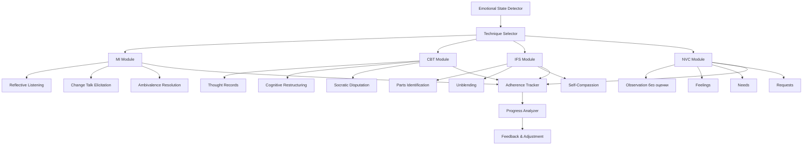

# Implementation Plan: Терапевтические техники и микро-интервенции

## Смысл и цель задачи

Реализация модуля терапевтических техник для персонализированной психологической помощи отчуждаемым родителям. Система должна подбирать и применять специализированные микро-интервенции (MI, CBT, IFS, NVC) в зависимости от текущего эмоционального состояния пользователя, отслеживать маркеры адгезии к техникам и обеспечивать постепенный переход пользователя от деструктивных паттернов к конструктивным стратегиям восстановления отношений с ребенком.

---

## Объем работ

### Что входит в реализацию

- Библиотека терапевтических техник: MI (Мотивационное интервьюирование), CBT (Когнитивно-поведенческая терапия), IFS (Терапия внутренних семейных систем), NVC (Ненасильственное общение)
- Картирование состояний на техники с детальными сценариями применения
- Система отслеживания маркеров адгезии к техникам (adherence markers)
- Упражнения и интерактивные практики для каждой техники
- Интеграция с emotional state machine для автоматического выбора техники
- Механизм оценки прогресса пользователя в освоении техник

### Что не входит

- Замена живого терапевта (бот не ставит диагнозы и не проводит полноценную терапию)
- Глубокая травма-терапия (EMDR, prolonged exposure) - требует специалиста
- Семейная терапия с участием обоих родителей и ребенка
- Медикаментозное лечение и рекомендации по психотропным препаратам
- Долгосрочная психодинамическая терапия

---

## Архитектура решения

### Основные компоненты



### Структура проекта

```
/src
  /therapeutic_techniques
    /mi
      reflective_listening.py    # Рефлексивное слушание
      change_talk.py             # Выявление речи изменений
      ambivalence.py             # Работа с амбивалентностью
    /cbt
      thought_records.py         # Дневник мыслей
      cognitive_restructure.py   # Когнитивная реструктуризация
      disputation.py             # Сократический диспут
    /ifs
      parts_work.py              # Работа с частями
      unblending.py              # Разотождествление
      self_energy.py             # Доступ к Self-энергии
    /nvc
      four_components.py         # 4 компонента ННО
      empathy_guessing.py        # Эмпатическое угадывание
      nvc_trainer.py             # Тренировка формулировок
    /adherence
      markers_detector.py        # Детекция маркеров адгезии
      progress_tracker.py        # Отслеживание прогресса
    technique_selector.py        # Выбор техники под состояние
    exercise_library.py          # Библиотека упражнений
/data
  /techniques
    mi_reflections_templates.yaml
    cbt_distortions_catalog.yaml
    ifs_parts_archetypes.yaml
    nvc_feelings_needs_lists.yaml
  /exercises
    grounding_exercises.yaml
    cognitive_exercises.yaml
    parts_dialogue_scripts.yaml
    nvc_practice_scenarios.yaml
/config
  technique_mapping.yaml         # Маппинг состояний -> техник
  adherence_criteria.yaml        # Критерии адгезии
```

---

## Параметры стека

- **Язык**: Python 3.12
- **Фреймворк**: BESSER Agentic Framework (state machine)
- **NLP**: spaCy (для анализа речи), transformers (классификация эмоций)
- **LLM**: OpenAI GPT-4o (генерация интервенций), GPT-4o-mini (быстрые проверки)
- **База данных**: PostgreSQL (user progress, adherence metrics)
- **Конфиг**: YAML (техники, маппинги, шаблоны)

---

## Полный flow работы функционала

### Основной сценарий: Применение техники

1. **Определение текущего состояния**:
   - Emotional State Detector определяет состояние (RAGE, DESPAIR, GUILT и т.д.)
   - Передает в Technique Selector

2. **Выбор техники**:
   - Technique Selector читает technique_mapping.yaml
   - Для состояния RAGE рекомендованы техники: MI_reflection + NVC
   - Для GUILT: CBT_restructuring + IFS_parts
   - Выбирается primary техника исходя из priority и предыдущего опыта пользователя

3. **Применение техники** (пример: MI для RAGE):

   **Шаг 1 - Reflective Listening**:
   - Бот: "Я слышу, как вы разгневаны. Похоже, вы чувствуете, что с вами поступили несправедливо и это вызывает у вас сильную боль. Правильно ли я понял?"
   - Пользователь: "Да! Она украла у меня сына!"
   - Маркер адгезии: пользователь подтверждает понимание

   **Шаг 2 - Emotional Discharge (безопасное пространство)**:
   - Бот: "Расскажите мне больше о том, что вы чувствуете. Я здесь, чтобы выслушать."
   - Пользователь выплескивает эмоции
   - Система не прерывает, валидирует

   **Шаг 3 - Change Talk Elicitation**:
   - Бот (сократический вопрос): "Когда вы действуете под влиянием этого гнева - кричите или пишете гневные сообщения - это приближает вас к сыну или отдаляет?"
   - Пользователь: "Наверное, отдаляет..."
   - Маркер адгезии: признание последствий (change talk)

   **Шаг 4 - Ambivalence Resolution**:
   - Бот: "С одной стороны, вам хочется выразить свою боль и гнев. С другой - вы хотите восстановить связь с сыном. Как вы думаете, что для вас важнее в долгосрочной перспективе?"
   - Пользователь: "Конечно, связь с сыном..."
   - Маркер адгезии: articulation of values (высказывание ценностей)

   **Шаг 5 - Transition to NVC**:
   - Бот: "Давайте попробуем выразить ваши чувства и потребности без обвинений. Вместо 'Она украла сына' - 'Когда я не могу видеться с сыном (факт), я чувствую отчаяние (чувство), потому что мне важна наша связь (потребность)'. Попробуете сформулировать?"
   - Пользователь формулирует
   - Маркер адгезии: использование NVC-формата

4. **Отслеживание адгезии**:
   - Adherence Tracker фиксирует:
     - Подтвердил ли понимание (reflective listening)
     - Появилась ли change talk
     - Смог ли сформулировать по NVC
   - Записывает в progress metrics

5. **Упражнение для закрепления**:
   - Бот предлагает домашнее задание: "В течение недели, когда почувствуете гнев, запишите его в формате NVC. Можно в дневник или мне прислать."
   - Пользователь может выполнить или пропустить

### Дополнительный сценарий: CBT для когнитивных искажений (состояние GUILT)

1. **Выявление автоматических мыслей**:
   - Пользователь: "Я плохой отец, иначе ребенок не отвернулся бы от меня"
   - Бот распознает когнитивное искажение (персонализация + черно-белое мышление)

2. **Thought Record (Дневник мыслей)**:
   - Бот: "Давайте разберем эту мысль. Ситуация: ребенок не отвечает на звонки. Ваша мысль: 'Я плохой отец'. Чувство?"
   - Пользователь: "Вина, стыд"
   - Бот: "Оцените интенсивность от 1 до 10?"
   - Пользователь: "9"

3. **Разбор доказательств (Disputation)**:
   - Бот: "Какие есть объективные доказательства, что вы 'плохой отец'?"
   - Пользователь: "Ну... ребенок не хочет общаться..."
   - Бот: "Это факт или интерпретация? Может ли быть другое объяснение, почему ребенок не отвечает?"
   - Пользователь: "Возможно, мама запрещает..."
   - Бот: "Хорошо. А есть доказательства, что вы заботились о ребенке раньше? Проводили время, помогали?"
   - Пользователь: "Да, мы были близки..."
   - Маркер адгезии: нахождение контр-доказательств

4. **Выявление искажения**:
   - Бот: "В вашей мысли я вижу несколько когнитивных ловушек: (1) Персонализация - вы берете всю ответственность на себя. (2) Черно-белое мышление - либо идеальный, либо плохой. Видите это?"
   - Пользователь: "Да, наверное..."
   - Маркер адгезии: recognition of distortion

5. **Альтернативная мысль**:
   - Бот: "Можете сформулировать более сбалансированную мысль?"
   - Пользователь: "Я не идеальный отец, но я делал лучшее, что мог. Ситуация сложная, не только от меня зависит."
   - Маркер адгезии: balanced thought formulation
   - Бот: "Отлично. Теперь оцените интенсивность вины при этой новой мысли?"
   - Пользователь: "Может, 5"
   - Прогресс: снижение интенсивности эмоции

### Сценарий IFS для работы с частями (состояние RAGE/GUILT)

1. **Идентификация части**:
   - Пользователь: "Я ненавижу ее, хочу чтобы она страдала"
   - Бот: "Звучит так, будто во вас говорит часть, которая очень разгневана. Можете сфокусироваться на этой части? Где в теле вы ее чувствуете?"
   - Пользователь: "В груди, жжет"

2. **Unblending (Разотождествление)**:
   - Бот: "Это не вся вы. Это часть вас. Попробуйте посмотреть на эту разгневанную часть со стороны, как наблюдатель. Можете?"
   - Пользователь: "Попробую... да, вижу"
   - Маркер адгезии: ability to observe part

3. **Curiosity (Любопытство к части)**:
   - Бот: "Как вы относитесь к этой разгневанной части?"
   - Пользователь: "Боюсь ее, она страшная"
   - Бот: "Можете спросить у нее, чего она боится? Что она пытается защитить?"
   - Пользователь: "Наверное... боится, что я останусь один, потеряю сына навсегда"
   - Маркер адгезии: insight into part's protective role

4. **Self-энергия (Сострадание)**:
   - Бот: "Что вы чувствуете к этой части сейчас, когда понимаете, что она пытается вас защитить?"
   - Пользователь: "Жалость... благодарность, наверное"
   - Маркер адгезии: compassion toward part
   - Бот: "Можете мысленно поблагодарить эту часть за защиту и сказать, что вы теперь справитесь по-другому, без разрушительного гнева?"

5. **Integration**:
   - После работы с частью пользователь чувствует снижение интенсивности гнева
   - Бот фиксирует прогресс: IFS_session_completed, insight_achieved

---

## API и интерфейсы

### 1. TechniqueSelector

**select_technique(emotional_state: str, user_history: Dict) -> str**

- Назначение: выбрать оптимальную технику для текущего состояния
- Параметры:
  - emotional_state: текущее состояние (RAGE, DESPAIR, GUILT и т.д.)
  - user_history: история применения техник, adherence scores
- Возвращает: technique_id ("MI_reflection", "CBT_restructuring", "IFS_parts", "NVC_training")
- Логика:
  - Читает technique_mapping.yaml для базовой рекомендации
  - Учитывает предыдущий опыт пользователя (если уже показал адгезию к CBT, приоритет CBT)
  - Если техника не сработала ранее, пробует альтернативную

### 2. MIModule (Мотивационное интервьюирование)

**reflective_listening(user_message: str) -> str**

- Назначение: генерировать рефлексию на высказывание пользователя
- Параметры: user_message
- Возвращает: reflective response
- Логика:
  - Извлекает эмоцию и содержание
  - Формулирует в формате "Вы чувствуете X, потому что Y. Правильно?"

**elicit_change_talk(context: str) -> str**

- Назначение: задать вопрос, провоцирующий change talk
- Параметры: context диалога
- Возвращает: сократический вопрос
- Примеры: "Что случится, если вы продолжите так же?", "Что вы хотите изменить?"

**detect_change_talk(user_message: str) -> bool**

- Назначение: определить, является ли высказывание change talk
- Возвращает: True если пользователь говорит о желании/необходимости изменений
- Маркеры: "хочу перестать", "нужно попробовать по-другому", "это не работает"

### 3. CBTModule (Когнитивно-поведенческая терапия)

**identify_distortions(user_thought: str) -> List[str]**

- Назначение: выявить когнитивные искажения
- Параметры: мысль пользователя
- Возвращает: список distortion_types
- Типы: "personalization", "catastrophizing", "black_white", "overgeneralization", "should_statements"

**generate_disputation_questions(thought: str, distortions: List[str]) -> List[str]**

- Назначение: создать вопросы для оспаривания мысли
- Параметры: мысль + искажения
- Возвращает: список сократических вопросов
- Пример: "Какие есть доказательства этому?", "Что бы вы сказали другу с такой мыслью?"

**create_thought_record(situation: str, thought: str, emotion: str, intensity: int) -> ThoughtRecord**

- Назначение: структурировать запись в дневник мыслей
- Возвращает: объект ThoughtRecord для последующей работы

**evaluate_alternative_thought(original: str, alternative: str) -> float**

- Назначение: оценить, насколько альтернативная мысль сбалансирована
- Возвращает: score 0-1 (качество реструктуризации)

### 4. IFSModule (Терапия внутренних семейных систем)

**identify_part(user_message: str) -> PartDescription**

- Назначение: распознать, какая часть говорит
- Возвращает: PartDescription(name, emotion, location_in_body, role)
- Пример: PartDescription("Angry Protector", "rage", "chest", "защита от боли")

**guide_unblending() -> str**

- Назначение: дать инструкцию по разотождествлению
- Возвращает: guided prompt
- "Попробуйте посмотреть на эту часть со стороны. Вы - не эта часть, вы - наблюдатель..."

**facilitate_parts_dialogue(part_a: str, part_b: str) -> str**

- Назначение: помочь диалогу между частями (например, между гневом и страхом)
- Возвращает: facilitation prompt

**assess_self_energy(user_response: str) -> bool**

- Назначение: определить, находится ли пользователь в Self-энергии (сострадание, любопытство)
- Маркеры: "благодарен", "понимаю", "жалко", "любопытно"
- Возвращает: True если доступ к Self есть

### 5. NVCModule (Ненасильственное общение)

**parse_nvc_components(user_statement: str) -> NVCStatement**

- Назначение: разобрать высказывание на 4 компонента ННО
- Возвращает: NVCStatement(observation, feeling, need, request)
- Если компоненты отсутствуют, возвращает None в соответствующих полях

**generate_nvc_template(raw_message: str) -> str**

- Назначение: преобразовать обвинительное сообщение в ННО формат
- Параметры: исходное сообщение ("Она монстр, не дает видеться!")
- Возвращает: ННО версию ("Когда мне мешают видеться с дочерью, я чувствую отчаяние, потому что для меня важна связь с ребенком. Я бы хотел обсудить расписание встреч.")

**validate_nvc_formulation(user_nvc: str) -> ValidationReport**

- Назначение: проверить, правильно ли пользователь сформулировал по ННО
- Возвращает: ValidationReport(correct: bool, missing_components: List[str], suggestions: str)

**get_feelings_list() -> List[str]**

- Возвращает список чувств для справки

**get_needs_list() -> List[str]**

- Возвращает список потребностей для справки

### 6. AdherenceTracker

**track_marker(user_id: str, technique: str, marker: str, achieved: bool)**

- Назначение: записать маркер адгезии
- Параметры:
  - technique: "MI", "CBT", "IFS", "NVC"
  - marker: конкретный маркер (например, "change_talk_detected", "balanced_thought_created")
  - achieved: успешно ли

**get_adherence_score(user_id: str, technique: str) -> float**

- Назначение: получить общий score адгезии к технике
- Возвращает: 0-1 (доля успешных маркеров)

**detect_marker_from_text(text: str, technique: str) -> List[str]**

- Назначение: автоматически определить маркеры из текста пользователя
- Использует NLP для поиска паттернов (change talk keywords, NVC components и т.д.)

---

## Взаимодействие компонентов

### Data Flow: От состояния к технике

```
Emotional State (RAGE)
  -> TechniqueSelector.select_technique(RAGE, user_history)
  -> technique_mapping.yaml: RAGE -> [MI_reflection, NVC_training]
  -> Проверка user_history: был ли опыт с MI? Adherence score?
  -> Выбор: MI_reflection (primary)

  -> MIModule.reflective_listening(user_message)
  -> Генерация рефлексии
  -> User responds

  -> MIModule.detect_change_talk(user_response)
  -> If change_talk detected:
       AdherenceTracker.track_marker(user_id, "MI", "change_talk", True)

  -> MIModule.elicit_change_talk()
  -> ...

  -> Transition to NVC:
       NVCModule.generate_nvc_template(raw_complaint)
       User tries NVC formulation
       NVCModule.validate_nvc_formulation(user_nvc)
       If valid:
         AdherenceTracker.track_marker(user_id, "NVC", "correct_formulation", True)

  -> ProgressTracker updates metrics
  -> Next session: TechniqueSelector knows user has good MI/NVC adherence
```

### Mapping состояний -> техник (technique_mapping.yaml)

```yaml
emotional_states:
  SHOCK_DENIAL:
    primary: grounding
    secondary: psychoeducation
    techniques:
      - grounding_exercises
      - info_provision

  RAGE_AGGRESSION:
    primary: MI_reflection
    secondary: NVC_training
    techniques:
      - MI_reflection
      - emotional_discharge
      - IFS_parts  # если гнев защищает страх
      - NVC_training

  DESPAIR_HELPLESSNESS:
    primary: crisis_protocol
    secondary: hope_building
    techniques:
      - suicide_risk_assessment
      - safety_planning
      - logotherapy_meaning  # поиск смысла
      - behavioral_activation  # малые шаги

  GUILT_SELF_BLAME:
    primary: CBT_restructuring
    secondary: IFS_self_compassion
    techniques:
      - CBT_thought_records
      - CBT_disputation
      - IFS_parts  # работа с критиком
      - self_compassion_exercises

  BARGAINING:
    primary: MI_ambivalence
    secondary: reality_testing
    techniques:
      - MI_decisional_balance
      - reality_vs_fantasy
      - goal_setting_realistic

  OBSESSIVE_FIGHTING:
    primary: strategic_reframing
    secondary: goal_alignment
    techniques:
      - cost_benefit_analysis
      - SMART_goal_setting
      - value_clarification

  REALITY_ACCEPTANCE:
    primary: ACT_acceptance  # Acceptance Commitment Therapy
    secondary: grief_processing
    techniques:
      - acceptance_exercises
      - defusion
      - values_work

  SEEKING_UNDERSTANDING:
    primary: psychoeducation
    secondary: perspective_taking
    techniques:
      - info_on_PA_dynamics
      - child_development_psych
      - empathy_for_child
      - loyalty_conflict_education  # НОВОЕ: центральная концепция

  SELF_HEALING:
    primary: self_care
    secondary: resilience_building
    techniques:
      - mindfulness
      - self_compassion
      - boundary_setting

  STRATEGIC_ACTION:
    primary: action_planning
    secondary: communication_skills
    techniques:
      - SMART_goals
      - NVC_practice
      - mediation_prep
      - BIFF_communication

  LONG_TERM_COMMITMENT:
    primary: maintenance
    secondary: relapse_prevention
    techniques:
      - ongoing_contact_rituals
      - trigger_management
      - community_support
```

---

## State-Specific Dialogue Scripts и Homework Assignments

Детальные пошаговые скрипты для каждого эмоционального состояния из alienated_parent_support_bot_map.md. Эти скрипты обеспечивают конкретные промпты для LLM и критерии успешного выполнения каждого шага.

### SHOCK_DENIAL: Gentle Reality Grounding

**Цель**: Валидировать чувства, мягко заземлить в реальность, начать движение к действию

**Пошаговый сценарий**:
1. **Эмпатическое отражение**: "Я слышу, как это тяжело для вас. Шок - это естественная реакция на такую ситуацию."
2. **Нормализация**: "То, что вы чувствуете оцепенение - это нормально. Ваша психика защищает вас."
3. **Заземляющие вопросы**: "Как давно это началось? Когда вы в последний раз видели ребенка?"
4. **Психообразование**: "Это называется родительское отчуждение. Тысячи родителей через это прошли."
5. **Микродействие**: "Сегодня просто отправьте ребенку сообщение: 'Я тебя люблю'. Только это."
6. **Направление к специалисту**: "Рекомендую поговорить с психологом, специализирующимся на таких ситуациях."

**Правила**:
- НЕ давить на активность
- НЕ требовать немедленных действий
- Короткие сессии, давать время

**Homework**: НЕТ (слишком ранняя стадия)

---

### RAGE_AGGRESSION: Emotional Discharge to NVC

**Цель**: Дать безопасно выразить гнев, осознать деструктивность, научить конструктивной коммуникации

**Пошаговый сценарий**:
1. **Безопасное пространство**: "Расскажите, что вы чувствуете. Здесь безопасно." → "Я слышу вашу боль и ярость."
2. **Валидация + переформулирование**: "Вы чувствуете: несправедливость, беспомощность, страх потерять ребенка. Так?"
3. **Сократические вопросы**: "Когда вы злитесь, как реагирует бывший партнер? Становится ли легче контакт с ребенком?"
4. **IFS - боль под гневом**: "Гнев защищает более глубокую боль. Что под яростью? Чего вы боитесь?"
5. **Введение в NVC**: "Вместо 'Она монстр!' скажите: 'Когда мне запрещают видеться (наблюдение), я чувствую отчаяние (чувство), мне важна связь с ребенком (потребность). Прошу обсудить график (просьба).'"
6. **Практика NVC**: "Попробуйте переформулировать одну ситуацию по формуле."
7. **Стратегический выбор**: "Что важнее: наказать бывшего или восстановить отношения с ребенком?"

**Правила**:
- НИКОГДА "Вы не должны злиться"
- Сначала разгрузка, потом работа
- Конкретные техники

**Homework**:
- **Письмо гнева (не отправлять)**: Написать все, что хочется сказать бывшему партнеру, потом удалить
- **NVC-дневник**: 3 ситуации в неделю переформулировать по NVC
- **Pause practice**: Перед реакцией на триггер - 10 глубоких вдохов

---

### DESPAIR_HELPLESSNESS: Crisis to Hope Building

**Цель**: Оценить суицидальный риск, создать безопасность, вернуть надежду

**Пошаговый сценарий**:
1. **РИСК-АССЕСМЕНТ** (критично!): "Есть ли мысли навредить себе? План? Можете это сделать сейчас?"
   - Если высокий риск: "Позвоните 8-800-2000-122. Я здесь, но нужно, чтобы вы были в безопасности."
2. **Эмпатия + присутствие**: "Я вижу вашу боль. Вы не одиноки. Я здесь."
3. **Микрошаги**: "Давайте пройдем следующий час. Ели сегодня? Съешьте яблоко. Выйдите на 5 минут."
4. **Контр-нарратив**: "Вы ВСЕ ЕЩЕ родитель. Ваша любовь существует. Дети взрослеют и возвращаются."
5. **Истории надежды**: "Расскажу про отца, 7 лет не видевшего дочь, которые восстановили контакт."
6. **Logotherapy - смысл**: "Кроме ребенка, что важно? Кто еще нуждается в вас? Что давало радость?"
7. **Сообщество**: "Есть онлайн-группа поддержки завтра в 19:00. Придете послушать?"
8. **Safety contract**: "Обещаете, что позвоните на горячую линию, если появятся мысли о самоубийстве?"

**Правила**:
- ВСЕГДА проверять суицид
- Ежедневные check-ins
- Не оставлять одного
- Фокус на микрошагах

**Homework**:
- **Ежедневный safety check**: "Я в безопасности сегодня" (да/нет)
- **3 якоря жизни**: Записать 3 причины остаться
- **Gratitude micro-list**: Каждый вечер 1 маленькая вещь, за которую благодарен

---

### GUILT_SELF_BLAME: Cognitive Restructuring

**Цель**: Идентифицировать иррациональные убеждения, оспорить искажения, развить самосострадание

**Пошаговый сценарий**:
1. **Идентификация**: "Закончите: Я виноват в... Если бы я не... Я плохой родитель, потому что..."
2. **Thought Record**: "Это факт или интерпретация? Доказательства ЗА? ПРОТИВ? Что сказали бы другу?"
3. **Искажения**: "Вижу персонализацию (вина за действия другого), катастрофизацию ('все потеряно'), черно-белое мышление."
4. **Контекст**: "Какая была ситуация? Ресурсы? Информация? Делали лучшее В ТОТ МОМЕНТ?"
5. **Распределение ответственности**: "Вы 30%, бывший партнер 40%, система 20%, вне контроля 10%."
6. **Альтернативные мысли**: "Вместо 'Я все испортил' → 'Я делал лучшее. Сейчас могу по-другому.'"
7. **Самосострадание**: "Что сказали бы другу? Теперь скажите СЕБЕ."
8. **Письмо себе**: "Напишите от мудрого Я: 'Дорогой [имя], я вижу, как ты страдаешь...'"

**Правила**:
- Не торопить процесс
- Повторять до усвоения

**Homework**:
- **Thought Record дневник**: Событие → Мысль → Чувство → Альтернативная мысль (ежедневно)
- **Self-compassion break**: 3 раза в день говорить себе доброе слово
- **"Good parent" список**: 10 вещей, которые сделал хорошо как родитель

---

### STRATEGIC_ACTION: Action Planning

**Цель**: Создать реалистичный план, приоритеты, начать действия

**Пошаговый сценарий**:
1. **SMART-цели**: "Что через 1 месяц, 6 месяцев, 2 года? Конкретно, измеримо, достижимо."
2. **Ресурсы**: "Финансы? Время? Поддержка? Специалисты? Сильные стороны?"
3. **Препятствия**: "Что помешает? Как преодолеть? План Б?"
4. **Eisenhower матрица**: "Срочно + важно → делать. Важно, не срочно → планировать."
5. **Разбивка**: "Цель → Шаг 1 (эта неделя), Шаг 2 (след. неделя)..."
6. **Decision criterion**: "Приближает к цели (ребенок)? Да → делать. Нет → не делать."
7. **Weekly tracking**: "Что сделаете за неделю?"

**Homework**:
- **Weekly action review**: Что сделал, результат, корректировки
- **Decision journal**: Почему принял решение, последствия
- **WOOP exercise** (Wish, Outcome, Obstacle, Plan) для каждой цели

---

### SEEKING_UNDERSTANDING: Psychoeducation о конфликте лояльности

**Источник**: Брошюра "Конфликт лояльности" (Юлия Ковалёва)

**Цель**: Помочь родителю понять психологический механизм отчуждения ребенка, снять с себя вину, научить защищать ребенка от конфликта лояльности

**Пошаговый сценарий**:

1. **Введение концепции**:
   "Ребенок в ситуации PA переживает то, что называется конфликт лояльности. Это когда он чувствует, что любить одного родителя - значит предавать другого."

2. **Механизм объяснения**:
   "Представьте: ребенок любит вас обоих. Но он видит, что когда упоминает вас, мама/папа расстраивается. Или слышит: 'Если любишь меня, не общайся с ним/ней'. Ребенок оказывается в ловушке."

3. **Нормализация чувств ребенка**:
   "Ребенок НЕ виноват. Он не 'выбрал' другого родителя. Он защищается от невыносимого чувства вины и страха."

4. **Эмпатия к ребенку**:
   "Попробуйте почувствовать: каково это - подавлять любовь к родителю, потому что 'нельзя'? Это огромная психологическая травма."

5. **Что НЕ делать (критично!)**:
   - "НЕ усиливайте конфликт. Не говорите ребенку: 'Выбери кого любишь больше'"
   - "НЕ критикуйте другого родителя при ребенке - это УСИЛИВАЕТ конфликт"
   - "НЕ требуйте доказательств любви ('Если любишь, почему не звонишь?')"
   - "НЕ вините ребенка. Он в ловушке, не по своей воле."

6. **Что ДЕЛАТЬ**:
   - **Освободить от выбора**: "Ты можешь любить нас обоих. Это нормально. Я даю тебе разрешение."
   - **Безусловная любовь**: "Я люблю тебя независимо от того, видимся ли мы. Моя любовь не зависит от твоего поведения."
   - **Не вовлекать в конфликт**: "Я никогда не буду просить тебя выбирать или передавать сообщения другому родителю."
   - **Терпение и долгосрочная перспектива**: "Дети взрослеют и начинают понимать. Я буду ждать, когда ты будешь готов."

7. **Переформулирование восприятия**:
   - ОТ: "Ребенок меня ненавидит" -> К: "Ребенок в конфликте лояльности и защищается"
   - ОТ: "Он предатель, выбрал другого" -> К: "Его заставили 'выбрать', он жертва манипуляции"
   - ОТ: "Надо бороться за ребенка" -> К: "Надо СНЯТЬ с ребенка необходимость выбора"

8. **Практическое упражнение - Письмо освобождения**:
   "Напишите ребенку (не отправлять сразу, сначала проработаем):

   'Дорогой [имя],

   Я хочу сказать тебе важное: ты можешь любить нас обоих - и меня, и маму/папу. Это правильно и естественно. Ты не должен выбирать. Моя любовь к тебе не зависит от того, как часто мы видимся. Я всегда буду твоим отцом/матерью, и я тебя люблю.

   Когда будешь готов - я здесь.

   С любовью, [имя]'"

9. **Контр-нарратив вины**:
   "Вы НЕ виноваты в том, что ребенок в конфликте лояльности. Это создал другой родитель (или система). Ваша задача - НЕ усугублять, а помогать ребенку освободиться."

10. **Долгосрочная надежда**:
    "Исследования показывают: когда дети взрослеют, они возвращаются к отвергнутому родителю в 80% случаев. Они понимают, что произошло. Ваша задача - быть готовым принять их, когда придет время."

**Правила**:
- Давать конкретные примеры (не абстрактно)
- Использовать язык ребенка (с учетом возраста из profile)
- Связывать с конкретной ситуацией пользователя

**Homework**:
- **Журнал конфликта лояльности**: Записать 3 ситуации, где ребенок мог быть в конфликте лояльности (что говорил, как вел себя)
- **Рефрейминг упражнение**: Переформулировать 5 "негативных" действий ребенка через призму конфликта лояльности
  - Пример: "Ребенок не ответил на звонок" -> "Ребенок боялся расстроить маму, которая рядом"
- **Письмо освобождения** (draft): Написать письмо ребенку, дающее разрешение любить обоих родителей (проверить с Content Guardian перед отправкой)

**Integration с другими техниками**:
- **CBT**: Когнитивная реструктуризация ("Ребенок меня ненавидит" -> "Ребенок в ловушке")
- **IFS**: Работа с частью родителя, которая чувствует себя отвергнутой (сострадание к этой части)
- **NVC**: Формулирование потребностей ребенка ("Ребенку нужна безопасность, не конфликт")

**Ключевые метафоры**:
- "Ребенок как канатоходец между двумя башнями (родителями) - любое движение к одной стороне кажется падением с другой"
- "Конфликт лояльности - это психологическая пытка для ребенка, он не может 'выиграть'"

**Markers успешного усвоения**:
- User correctly identifies loyalty conflict in child's behavior
- User stops blaming child
- User reframes rejection as protection mechanism
- User demonstrates empathy toward child's impossible position
- User commits to "liberation" approach vs "fighting" approach

---

## Общие принципы домашних заданий

**Структура homework assignments**:
1. **Дневники** (journaling): Thought records, emotion logs, gratitude lists
2. **Практики** (practices): Self-compassion breaks, NVC reformulations, mindfulness
3. **Действия** (actions): Micro-contacts с ребенком, community participation
4. **Рефлексия** (reflection): Weekly reviews, decision journals

**Проверка homework**:
- Бот спрашивает в начале сессии: "Как прошло упражнение?"
- AdherenceTracker логирует выполнение
- Если не выполнено 2 раза подряд → пересмотр difficulty или relevance
- Празднование успехов: "Отлично, что сделали! Что заметили?"

---

## Порядок реализации

### Фаза 1: Базовые модули техник

1. Реализовать MIModule с reflective_listening и change_talk detection
2. Реализовать CBTModule с distortion identification и thought records
3. Реализовать IFSModule с parts identification и unblending
4. Реализовать NVCModule с 4-component parsing и validation
5. Создать technique_mapping.yaml с маппингом состояний

### Фаза 2: TechniqueSelector и интеграция

1. Реализовать TechniqueSelector с логикой выбора
2. Интегрировать с Emotional State Machine из IP-03
3. Тестирование: проверить, что для каждого состояния выбирается правильная техника

### Фаза 3: AdherenceTracker

1. Определить маркеры адгезии для каждой техники
2. Реализовать AdherenceTracker с записью в БД
3. Создать NLP-детекторы для автоматического определения маркеров
4. Тестирование: симуляция диалогов с проверкой детекции маркеров

### Фаза 4: Библиотека упражнений

1. Наполнить exercise_library упражнениями для каждой техники
2. Создать guided prompts для упражнений
3. Добавить домашние задания (homework assignments)
4. Интеграция с reminder system для follow-up

### Фаза 5: Progress Tracking и Feedback

1. Реализовать ProgressAnalyzer для визуализации прогресса
2. Создать отчеты для пользователя (какие техники освоены, где сложности)
3. Feedback loop: если техника не работает, предложить альтернативную
4. Dashboard для разработчиков: adherence metrics, успешность техник

---

## Критичные граничные случаи

### 1. Техника не работает для пользователя

- **Проблема**: пользователь пробует CBT, но не может найти альтернативные мысли, фрустрируется
- **Решение**: TechniqueSelector переключается на IFS или NVC как альтернативу
- **Индикатор**: низкий adherence score (<0.3) после 3 попыток

### 2. Пользователь сопротивляется всем техникам

- **Проблема**: "Это все ерунда, мне ничего не помогает"
- **Решение**: MI для работы с сопротивлением:
  - "Я слышу ваше разочарование. Что бы могло быть полезно для вас?"
  - Валидация, а не настаивание
  - Предложение простейших шагов (baby steps)

### 3. Смешение техник создает путаницу

- **Проблема**: пользователь путается, когда бот применяет несколько техник подряд
- **Решение**: четкое объяснение "Сейчас мы попробуем подход X. Это означает..."
- **Ограничение**: не более 2 техник за одну сессию

### 4. Пользователь "застревает" на одной технике

- **Проблема**: слишком увлечен CBT thought records, делает их компульсивно
- **Решение**: мягкое переключение "Вы отлично освоили дневник мыслей. Давайте попробуем что-то новое..."

### 5. Культурные различия в восприятии техник

- **Проблема**: NVC может восприниматься как "слабость" в некоторых культурах
- **Решение**: адаптация языка под культурный контекст
- **Будущее**: культурно-чувствительные версии техник

---

## Допущения

1. **Пользователи владеют русским языком**: техники требуют точности формулировок
2. **Базовая рефлексивная способность**: пользователь может наблюдать свои мысли и эмоции
3. **Нет острого психоза**: техники не подходят при психотических состояниях
4. **Мотивация к изменениям**: хотя бы минимальная готовность пробовать
5. **Текстовый формат достаточен**: голосовые упражнения откладываются
6. **Одна доминирующая эмоция за раз**: техника подбирается под primary state

---

## Открытые вопросы

1. **Последовательность техник**: всегда ли начинать с MI или можно сразу CBT?
2. **Длительность работы с техникой**: сколько сессий до перехода к следующей?
3. **Homework compliance**: как повысить выполнение домашних заданий?
4. **Адаптация для детей**: если пользователь хочет учить ребенка НН���, как адаптировать?
5. **Групповая поддержка**: интегрировать ли peer support для практики техник?

---

## Acceptance Criteria

### Happy Path

1. **MI для гнева**:
   - Пользователь в состоянии RAGE
   - Бот применяет reflective listening
   - Пользователь подтверждает понимание
   - Бот задает вопрос, провоцирующий change talk
   - Пользователь высказывает желание измениться
   - Adherence marker "change_talk" фиксируется
   - Переход к NVC

2. **CBT для вины**:
   - Пользователь в состоянии GUILT
   - Выявляется автоматическая мысль "Я плохой отец"
   - Создается thought record
   - Проводится disputation
   - Пользователь формулирует альтернативную мысль
   - Интенсивность эмоции снижается с 9 до 5
   - Adherence marker "balanced_thought" фиксируется

3. **NVC формулировка**:
   - Пользователь говорит обвинительно: "Она тварь!"
   - Бот предлагает NVC шаблон
   - Пользователь пробует: "Когда мне не дают видеться, я чувствую отчаяние..."
   - Бот валидирует: все 4 компонента есть
   - Adherence marker "nvc_correct_formulation" фиксируется

4. **IFS parts work**:
   - Пользователь выражает гнев
   - Бот помогает идентифицировать часть
   - Пользователь видит часть "со стороны" (unblending)
   - Обнаруживает, что часть защищает страх
   - Появляется сострадание к части
   - Adherence marker "self_energy_accessed" фиксируется

5. **Progress tracking**:
   - Через 4 недели пользователь имеет:
     - MI adherence: 0.8
     - CBT adherence: 0.6
     - NVC adherence: 0.7
     - IFS adherence: 0.5
   - Система показывает график прогресса
   - Пользователь видит, какие техники ему подходят лучше

### Ручной сценарий проверки

1. Симулировать состояние RAGE: ввести гневное сообщение
2. Проверить, что выбрана техника MI_reflection
3. Проверить, что бот генерирует рефлексию
4. Ввести подтверждение пользователя
5. Проверить, что задается change talk вопрос
6. Ввести change talk ответ ("хочу попробовать по-другому")
7. Проверить, что маркер зафиксирован в БД
8. Проверить переход к NVC
9. Ввести NVC формулировку
10. Проверить валидацию и фиксацию маркера
11. Проверить adherence score в БД (должен вырасти)
12. Повторить для других состояний и техник

---

## Definition of Done

- Реализованы 4 модуля техник: MI, CBT, IFS, NVC
- TechniqueSelector работает с technique_mapping.yaml
- AdherenceTracker фиксирует маркеры для всех техник
- NLP-детекторы распознают change talk, cognitive distortions, NVC components
- Exercise library содержит минимум 3 упражнения на технику
- Интеграция с Emotional State Machine (IP-03)
- Progress dashboard показывает adherence scores
- Логи включают technique_applied, marker_detected, adherence_score
- Метрики: technique_success_rate, adherence_by_technique, user_progress
- README с описанием каждой техники и примерами
- Feature flag: THERAPEUTIC_TECHNIQUES_ENABLED=true/false

---

## Минимальные NFR для MVP

### Производительность

- **Technique Selection**: < 200ms (чтение конфига + быстрая логика)
- **Marker Detection**: < 500ms (NLP анализ)
- **Exercise Retrieval**: < 300ms (DB query)
- **Concurrent Users**: 10 одновременных техник-сессий

### Надежность

- **Technique Application Success**: >95% (техника должна всегда применяться)
- **Marker Detection Accuracy**: >80% (для автоматических детекторов)
- **Fallback**: если primary техника не подходит, всегда есть secondary

### Ресурсы

- **Memory**: <100MB дополнительно на модули техник
- **DB Storage**: ~1KB на маркер, ~10KB на thought record
- **NLP Models**: spaCy medium model (~50MB)

---

## Требования безопасности

- Thought records и parts work содержат чувствительную информацию - шифрование
- Не хранить полные тексты автоматических мыслей (только metadata + embeddings)
- Маркеры адгезии - статистика без PII
- Exercise responses могут содержать личное - токенизация
- Право на удаление всех записей техник (GDPR)

---

## Наблюдаемость

### Логи

- technique_selected: user_uuid, state, technique, timestamp
- technique_applied: user_uuid, technique, step, success
- marker_detected: user_uuid, technique, marker, value
- exercise_assigned: user_uuid, exercise_id
- exercise_completed: user_uuid, exercise_id, quality_score
- adherence_updated: user_uuid, technique, new_score

### Метрики

- **Счетчики**:
  - techniques_applied_total (labels: technique)
  - markers_detected_total (labels: technique, marker)
  - exercises_assigned_total
  - exercises_completed_total
  - technique_switches_total (когда меняли технику из-за низкой адгезии)

- **Гистограммы**:
  - adherence_scores (distribution по техникам)
  - technique_duration_seconds (сколько работали с техникой)

- **Гейджи**:
  - current_adherence_score_by_technique

---

## Релиз

### Включение через feature flag

```python
THERAPEUTIC_TECHNIQUES_ENABLED = os.getenv("THERAPEUTIC_TECHNIQUES_ENABLED", "false").lower() == "true"

if THERAPEUTIC_TECHNIQUES_ENABLED:
    technique = technique_selector.select(emotional_state)
    response = technique_module.apply(technique, context)
else:
    response = simple_empathy_response(context)
```

### План развертывания

1. **Alpha (internal)**: тестирование всех 4 техник с командой
2. **Beta (10 users)**: сбор feedback на adherence и полезность
3. **Limited release (30%)**: A/B test с включенными техниками vs базовая эмпатия
4. **Full rollout (100%)**: если метрики показывают улучшение emotional outcomes

---

## Откат

### Условия отката

- Adherence detection accuracy < 50% (слишком много false positives)
- User complaints > 15% ("техники сбивают с толку")
- Technique selection errors > 10% (выбор неподходящей техники)
- Performance degradation (latency >2s)

### Шаги возврата

1. THERAPEUTIC_TECHNIQUES_ENABLED=false
2. Fallback на simple empathetic responses
3. Сохранить накопленные данные адгезии для анализа
4. Review логов: какие техники проблемные
5. Исправить и повторный beta test

---

## Риски и митигации

### Риск 1: Техники слишком сложны для самостоятельного применения без терапевта

- **Митигация**: максимально упростить язык, больше примеров, guided step-by-step

### Риск 2: Пользователи не понимают разницу между техниками

- **Митигация**: четкие объяснения "Сейчас мы используем подход X, который помогает Y"

### Риск 3: Низкая homework compliance

- **Митигация**: gamification (badges за выполнение), reminders, минимизация effort

### Риск 4: Одна техника не подходит, пользователь разочаровывается

- **Митигация**: быстрое переключение на альтернативу, валидация "это нормально, не всем подходит"

### Риск 5: Marker detection дает false positives

- **Митигация**: human validation на beta, улучшение NLP моделей, conservative thresholds

---

## Проверки перед "ломкой" API

- MVP стадия: внешних потребителей нет
- Модуль автономный: не ломает существующие компоненты

---

## Самопроверка плана перед выдачей

- Нет кода и псевдокода: выполнено (только YAML примеры и архитектурные описания)
- Заполнены scope, acceptance, risk, release: выполнено
- Регэксп именования: IP-04-therapeutic-techniques.md - выполнено
- Нет секретов и приватных URL: выполнено
- Язык русский, только "-" и обычные пробелы: выполнено
- Пути POSIX: выполнено
