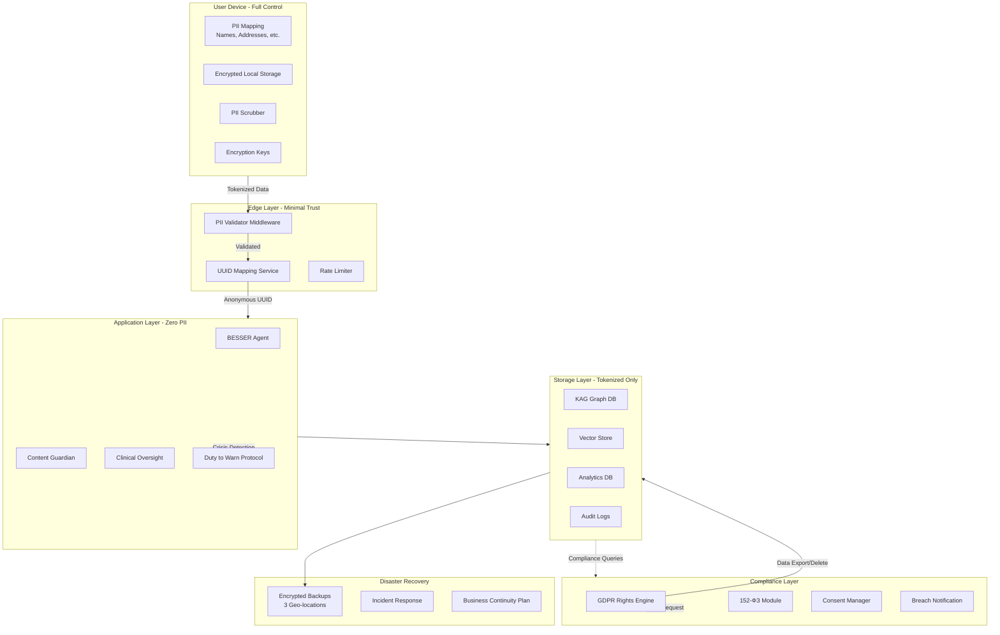

# IP-07: Privacy-First Architecture, Compliance & Legal Framework

## Смысл и цель задачи

Реализация комплексной системы защиты персональных данных, юридического соответствия (GDPR, 152-ФЗ) и клинических обязательств для терапевтического чат-бота. Цель - обеспечить максимальную приватность пользователей через client-side PII scrubbing, соблюдение международных стандартов защиты данных, выполнение клинических юридических обязательств (duty to warn, mandatory reporting), создание прозрачной системы управления согласиями и правами пользователей. Результат - production-ready система, защищающая sensitive mental health data и минимизирующая юридические риски при работе с отчуждаемыми родителями в кризисных состояниях.

## Объем работ

### Что входит в реализацию

- **Client-Side PII Scrubbing**: токенизация персональных данных на устройстве пользователя перед отправкой на сервер
- **User UUID Mapping Service**: изолированный микросервис для анонимизации пользователей
- **Zero PII Policy**: server-side валидация отсутствия PII в запросах
- **GDPR Compliance Module**: реализация прав доступа, удаления, портируемости данных
- **152-ФЗ Compliance**: соответствие российскому законодательству о персональных данных
- **Clinical Legal Obligations**: duty to warn, mandatory reporting, informed consent
- **Consent Management System**: гранулярное управление согласиями пользователей
- **Data Retention & Deletion**: автоматизированные политики хранения и удаления
- **Clinical Oversight Pipeline**: human therapist review для критичных случаев
- **Disaster Recovery & Incident Response**: планы реагирования на утечки и сбои
- **Terms of Service & Legal Disclaimers**: юридическая защита оператора сервиса
- **Audit Logging**: tamper-proof логи всех операций с данными

### Что не входит

- Сертификация как медицинского изделия (требует отдельного процесса)
- Professional Liability Insurance (покупается отдельно, но требования описаны)
- Интеграция с внешними EHR системами
- Юридическая консультация (требуется привлечение внешних юристов)
- IRB approval process (описаны требования, но процесс внешний)
- Локализация серверов в каждой юрисдикции (описан подход для РФ)
- Культурная адаптация контента (только требования, не реализация)

## Архитектура решения

### Основные компоненты

```
src/
├── privacy/
│   ├── client_side/
│   │   ├── __init__.py
│   │   ├── pii_scrubber.js              # Client-side токенизация PII
│   │   ├── local_storage_manager.js     # Encrypted local storage
│   │   ├── pii_patterns.yaml            # Паттерны PII для детекции
│   │   └── encryption_utils.js          # AES-GCM шифрование
│   ├── server_side/
│   │   ├── __init__.py
│   │   ├── pii_validator.py             # Валидация отсутствия PII
│   │   ├── uuid_mapper.py               # User UUID mapping service
│   │   ├── zero_pii_middleware.py       # FastAPI middleware
│   │   └── anonymization.py             # Дополнительная анонимизация
│   └── models/
│       ├── pii_mapping.py               # Pydantic модели для PII
│       └── token_schemas.yaml           # Схемы токенов
├── compliance/
│   ├── gdpr/
│   │   ├── __init__.py
│   │   ├── right_to_access.py           # Article 15: Data export
│   │   ├── right_to_erasure.py          # Article 17: Deletion
│   │   ├── right_to_portability.py      # Article 20: Data portability
│   │   ├── consent_manager.py           # Article 7: Consent management
│   │   ├── breach_notification.py       # Article 33: Breach reporting
│   │   └── dpo_tools.py                 # Data Protection Officer tools
│   ├── russia_152fz/
│   │   ├── __init__.py
│   │   ├── data_classification.py       # Категории ПДн
│   │   ├── localization_check.py        # Проверка локализации данных
│   │   ├── roskomnadzor_notify.py       # Уведомление РКН
│   │   └── special_categories.py        # Особые категории (здоровье)
│   ├── hipaa/
│   │   ├── __init__.py
│   │   ├── phi_protection.py            # Protected Health Information
│   │   └── breach_notification.py       # HIPAA breach rules
│   └── consent/
│       ├── __init__.py
│       ├── consent_database.py          # Хранение согласий
│       ├── consent_withdrawal.py        # Отзыв согласий
│       └── consent_versioning.py        # Версионирование T&C
├── clinical_legal/
│   ├── __init__.py
│   ├── duty_to_warn.py                  # Tarasoff Rule implementation
│   ├── mandatory_reporting.py           # Child abuse reporting
│   ├── informed_consent.py              # Clinical informed consent
│   ├── escalation_to_human.py           # Передача человеку-терапевту
│   ├── clinical_oversight.py            # Human therapist review
│   └── liability_disclaimers.py         # Legal disclaimers
├── data_lifecycle/
│   ├── __init__.py
│   ├── retention_policy.py              # Политики хранения
│   ├── automated_deletion.py            # Автоудаление по срокам
│   ├── backup_manager.py                # Encrypted backups
│   └── archive_service.py               # Архивирование старых данных
├── security/
│   ├── __init__.py
│   ├── encryption_at_rest.py            # AES-256 encryption
│   ├── encryption_in_transit.py         # TLS 1.3 enforcement
│   ├── access_control.py                # RBAC + MFA
│   ├── audit_logger.py                  # Tamper-proof audit logs
│   └── incident_response.py             # Security incident handling
├── disaster_recovery/
│   ├── __init__.py
│   ├── backup_strategy.py               # 3-2-1 backup rule
│   ├── restore_procedures.py            # Restoration workflows
│   ├── business_continuity.py           # Service continuity plan
│   └── incident_playbooks/              # Runbooks для инцидентов
│       ├── data_breach.md
│       ├── service_outage.md
│       └── ransomware.md
├── legal/
│   ├── templates/
│   │   ├── terms_of_service.md          # ToS шаблон
│   │   ├── privacy_policy.md            # Privacy Policy
│   │   ├── informed_consent.md          # Clinical consent
│   │   └── data_processing_agreement.md # DPA для vendors
│   └── liability/
│       ├── disclaimers.py               # Legal disclaimers
│       └── insurance_requirements.yaml  # Страхование
└── config/
    ├── privacy_config.yaml              # Конфигурация privacy
    ├── compliance_config.yaml           # Конфигурация compliance
    └── jurisdictions.yaml               # Настройки по юрисдикциям
```

### Диаграмма архитектуры



## Параметры стека

- **Язык**: Python 3.12 (backend), JavaScript/TypeScript (client-side)
- **Фреймворк**: FastAPI для compliance APIs, Telegram Mini App для client-side
- **База данных**:
  - PostgreSQL для UUID mapping (encrypted)
  - TimescaleDB для audit logs (append-only)
  - Redis для consent cache
- **Encryption**:
  - AES-256-GCM для data at rest
  - TLS 1.3 для data in transit
  - Fernet (Python cryptography library) для field-level encryption
- **Access Control**: OAuth 2.0 + RBAC, MFA для admin доступа
- **Audit**: Structured logging (JSON) + tamper-proof signatures
- **Backup**: Restic для encrypted incremental backups
- **Monitoring**: Prometheus для метрик compliance, Grafana для dashboards
- **Целевая платформа**: Docker/Kubernetes, geo-distributed deployment

## Полный flow работы функционала

### 1. Онбординг и сбор согласий

**User journey при первом запуске:**

```
1. Пользователь запускает бота /start
2. БОТ показывает welcome screen с кратким описанием
3. БОТ запрашивает Informed Consent
   - Объясняет что бот НЕ замена терапевту
   - Предупреждает о duty to warn (при угрозе жизни - обязан уведомить власти)
   - Объясняет ограничения AI
4. Пользователь соглашается или отказывается
   IF отказывается -> завершить онбординг
   IF соглашается -> переход к шагу 5
5. БОТ показывает Privacy Policy
   - Объясняет client-side PII scrubbing
   - Объясняет что сервер НЕ видит реальные имена
   - Описывает права GDPR/152-ФЗ
6. БОТ запрашивает granular consent:
   - [REQUIRED] Обработка данных для терапевтической поддержки
   - [OPTIONAL] Анонимный анализ эффективности терапии
   - [OPTIONAL] Использование анонимных данных для исследований
7. Пользователь выбирает согласия
8. БОТ инициирует PII mapping setup через Mini App
   - Telegram открывает Mini App (WebView)
   - Mini App запрашивает у пользователя:
     - Имя ребенка -> создает токен [CHILD_NAME]
     - Имя бывшего партнера -> [EX_PARTNER_NAME]
     - Город -> [CITY]
     - И т.д.
   - Mini App генерирует encryption key из пароля пользователя
   - Mini App сохраняет PII mapping локально (encrypted)
9. UUID Mapping Service создает anonymous UUID для telegram_id
10. Consent Manager сохраняет согласия с timestamp
11. Audit Logger логирует событие onboarding_completed
```

### 2. Real-time PII Scrubbing при отправке сообщения

**Flow каждого сообщения от пользователя:**

```
[USER DEVICE]
1. Пользователь вводит: "Моя дочь Маша, 8 лет, живет с матерью Еленой в Москве"
2. PIIScrubber.scrubOutgoing() обрабатывает текст:
   - "Маша" -> [CHILD_NAME]
   - "Еленой" -> [EX_PARTNER_NAME]
   - "Москве" -> [CITY]
3. Scrubbed text: "Моя дочь [CHILD_NAME], 8 лет, живет с матерью [EX_PARTNER_NAME] в [CITY]"
4. Отправка на сервер через HTTPS (TLS 1.3)

[EDGE LAYER]
5. PIIValidatorMiddleware.validate_request():
   - Проверяет отсутствие email patterns
   - Проверяет отсутствие phone patterns
   - Проверяет отсутствие passport numbers
   - Проверяет отсутствие addresses
   IF обнаружен PII:
     - Reject request (400 Bad Request)
     - Log critical alert: PII_DETECTED
     - НЕ логировать сам PII!
   ELSE:
     - Proceed to next layer
6. UUIDMapper.get_uuid(telegram_id):
   - Получить anonymous UUID из encrypted mapping DB
   - Заменить telegram_id на UUID в request context

[APPLICATION LAYER]
7. BESSERAgent обрабатывает сообщение с токенами
8. LLM генерирует ответ (тоже с токенами):
   "Я понимаю вашу боль. [CHILD_NAME] важен для вас.
    Даже если сейчас [EX_PARTNER_NAME] не дает видеться..."

[STORAGE LAYER]
9. KAG сохраняет диалог:
   - user_uuid: "550e8400-e29b-41d4-a716-446655440000"
   - message: "Моя дочь [CHILD_NAME], 8 лет..."
   - response: "Я понимаю вашу боль. [CHILD_NAME] важен..."
   - НЕТ РЕАЛЬНЫХ ИМЕН!

[BACK TO USER]
10. Ответ возвращается на устройство
11. PIIScrubber.descrubIncoming():
    - [CHILD_NAME] -> "Маша"
    - [EX_PARTNER_NAME] -> "Елена"
12. Пользователь видит персонализированный ответ с реальными именами
```

### 3. GDPR Right to Access (Экспорт данных)

**Flow запроса пользователем своих данных:**

```
1. Пользователь: /my_data
2. БОТ объясняет право на доступ (GDPR Article 15)
3. БОТ запрашивает подтверждение
4. RightToAccessHandler.export_user_data(user_uuid):
   a. Собрать profile data
   b. Собрать все letters из KAG
   c. Собрать conversation history
   d. Собрать analytics (emotional trajectories, therapy progress)
   e. Собрать consent history
   f. Собрать audit logs (кто и когда обращался к данным)
5. DataExporter.create_export_package():
   - Формат: JSON (machine-readable)
   - Включить metadata: export_date, schema_version
   - Добавить human-readable summary
6. Encrypt export package с паролем пользователя
7. Upload в temporary storage (expires in 7 days)
8. Отправить пользователю download link
9. Audit Logger: data_export_request completed
10. Notification Roskomnadzor (если требуется по 152-ФЗ)
```

### 4. GDPR Right to Erasure (Удаление данных)

**Flow "right to be forgotten":**

```
1. Пользователь: /delete_my_data
2. БОТ показывает WARNING:
   "⚠️ ЭТО УДАЛИТ ВСЕ ВАШИ ДАННЫЕ НАВСЕГДА
   - Все письма ребенку
   - История диалогов
   - Прогресс терапии
   - Восстановление невозможно

   Вы уверены? Напишите 'УДАЛИТЬ НАВСЕГДА'"
3. IF пользователь подтверждает:
4. RightToErasureHandler.delete_user_data(user_uuid):
   a. Delete from KAG (все nodes с user_uuid)
   b. Delete from Vector Store (embeddings)
   c. Delete from Analytics DB
   d. Delete from Profile Store
   e. Delete from UUID Mapping DB (разрыв связи telegram_id <-> UUID)
   f. Mark audit logs as "user_deleted" (сами логи остаются для compliance)
   g. Schedule backup erasure (удалить из backups в течение 30 дней)
5. ConsentManager.revoke_all_consents(user_uuid)
6. Send confirmation: "✅ Все ваши данные удалены"
7. Audit Logger: right_to_erasure_executed
8. Notification Roskomnadzor (если требуется)
9. Blacklist telegram_id временно (prevent immediate re-registration with same ID)
```

### 5. Duty to Warn Protocol (Клинические обязательства)

**Flow при обнаружении угрозы жизни:**

```
[DETECTION PHASE]
1. User message: "Не хочу больше жить. Покончу с собой сегодня вечером."
2. SuicidalDetector (из IP-05) определяет HIGH RISK
3. DutyToWarnProtocol.assess_imminent_danger():
   - Imminent: TRUE (сегодня вечером)
   - Plan: TRUE
   - Means: UNKNOWN
   - Intent: HIGH
   Result: CRITICAL RISK

[IMMEDIATE INTERVENTION]
4. БОТ немедленно отвечает:
   "🚨 МНЕ ОЧЕНЬ ВАЖНО, ЧТОБЫ ВЫ БЫЛИ В БЕЗОПАСНОСТИ.

   ПРЯМО СЕЙЧАС позвоните:
   📞 112 (экстренные службы)
   📞 8-800-2000-122 (психологическая помощь 24/7)

   Я остаюсь с вами. Напишите мне после звонка."

[LEGAL OBLIGATION PHASE]
5. DutyToWarnProtocol.check_legal_obligations():
   IF jurisdiction == "USA":
     - Tarasoff Rule applies
     - MUST warn authorities if threat to others
   IF jurisdiction == "Russia":
     - Сложнее, нужна консультация юриста
     - Возможно уведомление экстренных служб

6. IF imminent_danger AND (threat_to_self OR threat_to_others):
   - Log critical incident (encrypted)
   - Escalate to ClinicalOversightTeam
   - IF threat_to_others:
       - De-anonymize user (UUID -> telegram_id) ONLY for this purpose
       - Notify authorities (через ClinicalOversightTeam, не автоматически)
   - IF threat_to_self:
       - Schedule immediate human follow-up
       - Activate check-in protocol (every 2 hours)

[HUMAN OVERSIGHT]
7. ClinicalOversightTeam receives alert:
   - Licensed therapist reviews situation
   - Decides on escalation to authorities
   - Contacts user directly (if possible)
   - Documents decision in audit log

[AUDIT]
8. AuditLogger.log_duty_to_warn_event(
     user_uuid,
     risk_level,
     action_taken,
     therapist_id,
     outcome
   )
```

### 6. Mandatory Reporting (Насилие над детьми)

**Flow при подозрении на child abuse:**

```
[DETECTION]
1. User message содержит индикаторы насилия над ребенком
2. ChildAbuseDetector.analyze(message):
   - Physical abuse indicators
   - Sexual abuse indicators
   - Neglect indicators
   - Severity: HIGH/MEDIUM/LOW

[LEGAL OBLIGATION]
3. MandatoryReportingProtocol.check_requirements():
   IF severity == HIGH:
     - MUST report to Child Protective Services
     - Legal obligation в большинстве юрисдикций

4. Escalate to ClinicalOversightTeam (human decision)
5. Licensed therapist reviews:
   - Assess credibility of indicators
   - Determine if mandatory reporting threshold met
   - IF YES:
       - De-anonymize user
       - File report with CPS/Органы опеки
       - Document in audit log
       - Notify user (post-factum)

[NOTIFICATION TO USER]
6. БОТ уведомляет пользователя:
   "В соответствии с законом, я обязан сообщить о подозрении
   на насилие над ребенком в органы опеки. Это сделано для
   защиты безопасности ребенка."

[AUDIT]
7. AuditLogger.log_mandatory_reporting(
     user_uuid,
     report_date,
     agency_notified,
     therapist_id
   )
```

### 7. Security Incident Response (Утечка данных)

**Flow при обнаружении data breach:**

```
[DETECTION]
1. Monitoring system detects anomaly:
   - Unusual data access patterns
   - Failed authentication attempts spike
   - Unauthorized database query
2. IncidentResponseSystem.trigger_alert(severity=CRITICAL)

[CONTAINMENT]
3. AutomatedContainment.execute():
   - Isolate affected systems
   - Revoke compromised credentials
   - Block suspicious IPs
   - Enable extra logging
4. Notify Security Team (on-call rotation)

[INVESTIGATION]
5. SecurityTeam investigates:
   - Scope of breach (which data accessed?)
   - Attack vector (how did it happen?)
   - Duration (when did it start?)
   - Data exfiltrated? (yes/no)
6. Document findings in incident report

[NOTIFICATION - GDPR Article 33]
7. IF personal data compromised:
   BreachNotificationEngine.notify_authorities():
   - Notify DPA (Data Protection Authority) within 72 hours
   - Russia: Notify Roskomnadzor within 24 hours
   - Document: nature of breach, data affected, measures taken

[USER NOTIFICATION - GDPR Article 34]
8. IF high risk to users:
   BreachNotificationEngine.notify_users():
   - Email/Telegram message to affected users within 72 hours
   - Describe: what happened, what data, what we're doing
   - Offer: credit monitoring (if financial data), support

[RECOVERY]
9. RestoreFromBackup.execute():
   - Restore systems from clean backups
   - Patch vulnerabilities
   - Reset all credentials
   - Enable additional security measures

[POST-MORTEM]
10. PublicIncidentReport.publish():
    - Anonymized summary of incident
    - Lessons learned
    - Improvements implemented
11. AuditLogger.log_security_incident(full details)
```

### 8. Consent Withdrawal (Отзыв согласия)

**Flow отзыва согласия на обработку:**

```
1. Пользователь: /settings -> Manage Consents
2. БОТ показывает текущие consent statuses:
   ✅ Терапевтическая поддержка (обязательно)
   ✅ Анонимный анализ эффективности
   ❌ Исследования (не дано)
3. Пользователь выбирает отозвать "Анонимный анализ"
4. ConsentManager.withdraw_consent(
     user_uuid,
     purpose="analytics"
   ):
   - Update consent_database
   - Timestamp withdrawal
   - Version consent (для audit)
5. DataProcessor.stop_processing(user_uuid, "analytics"):
   - Exclude user data from analytics aggregations
   - Mark existing analytics as "consent_withdrawn"
6. Audit Logger: consent_withdrawn
7. БОТ подтверждает:
   "✅ Согласие на анонимный анализ отозвано.
   Ваши данные больше не будут использоваться для этой цели."
```

## API и интерфейсы

### PIIScrubber (Client-Side JavaScript)

**initialize()**
- Назначение: инициализация PII mapping при онбординге
- Параметры: нет
- Возвращает: Promise<void>
- Процесс: запрашивает у пользователя PII, создает токены, сохраняет encrypted mapping локально

**scrubOutgoing(text: string)**
- Назначение: замена PII на токены перед отправкой на сервер
- Параметры:
  - `text` - исходный текст пользователя с PII
- Возвращает: string (tokenized text)
- Логика: применяет regex replacements для всех known PII + auto-detection

**descrubIncoming(text: string)**
- Назначение: восстановление PII в ответе от сервера
- Параметры:
  - `text` - текст с токенами от сервера
- Возвращает: string (personalized text)
- Логика: обратная замена токенов на реальные значения из mapping

**autoDetectPII(text: string)**
- Назначение: автоматическая детекция PII паттернов (email, phone, addresses)
- Параметры:
  - `text` - текст для анализа
- Возвращает: Array<PIIMatch> (detected PII with positions)

### PIIValidator (Server-Side Python)

**validate_request(request_body: dict)**
- Назначение: server-side валидация отсутствия PII
- Параметры:
  - `request_body` - тело запроса от клиента
- Возвращает: ValidationResult (valid: bool, issues: List[str])
- Критичные ошибки: если PII обнаружен - reject request

**detect_pii_patterns(text: str)**
- Назначение: детекция forbidden patterns (имена, email, телефоны, паспорта)
- Параметры:
  - `text` - текст для проверки
- Возвращает: List[PIIDetection]

### UUIDMapper

**get_or_create_uuid(telegram_id: int)**
- Назначение: получить anonymous UUID для telegram_id
- Параметры:
  - `telegram_id` - ID пользователя в Telegram
- Возвращает: str (UUID)
- Логика: проверяет existing mapping, если нет - создает новый UUID

**deanonymize(user_uuid: str, reason: str, authorized_by: str)**
- Назначение: де-анонимизация ТОЛЬКО для legal obligations
- Параметры:
  - `user_uuid` - анонимный UUID
  - `reason` - причина (duty_to_warn, mandatory_reporting, court_order)
  - `authorized_by` - кто авторизовал (therapist_id, admin_id)
- Возвращает: int (telegram_id)
- Критичные ошибки: доступ только для authorized roles, логируется в audit

### RightToAccessHandler

**export_user_data(user_uuid: str)**
- Назначение: экспорт всех данных пользователя (GDPR Article 15)
- Параметры:
  - `user_uuid` - идентификатор пользователя
- Возвращает: ExportPackage (JSON + metadata)
- Логика: собирает данные из всех хранилищ, форматирует в machine-readable JSON

### RightToErasureHandler

**delete_user_data(user_uuid: str)**
- Назначение: полное удаление данных пользователя (GDPR Article 17)
- Параметры:
  - `user_uuid` - идентификатор пользователя
- Возвращает: DeletionReport (что удалено, timestamp)
- Логика: удаляет из всех БД, schedules backup erasure, revokes consents

### ConsentManager

**record_consent(user_uuid: str, purposes: List[str], version: str)**
- Назначение: запись согласия пользователя
- Параметры:
  - `user_uuid` - идентификатор пользователя
  - `purposes` - список целей обработки (therapy_support, analytics, research)
  - `version` - версия T&C/Privacy Policy
- Возвращает: consent_id

**withdraw_consent(user_uuid: str, purpose: str)**
- Назначение: отзыв согласия на конкретную цель
- Параметры:
  - `user_uuid` - идентификатор
  - `purpose` - цель для отзыва
- Возвращает: success: bool

**check_consent(user_uuid: str, purpose: str)**
- Назначение: проверка наличия согласия перед обработкой
- Параметры:
  - `user_uuid` - идентификатор
  - `purpose` - цель обработки
- Возвращает: bool (consented or not)

### DutyToWarnProtocol

**assess_imminent_danger(message: str, context: dict)**
- Назначение: оценка непосредственной угрозы жизни
- Параметры:
  - `message` - сообщение пользователя
  - `context` - история диалога, risk scores
- Возвращает: DangerAssessment (imminent: bool, threat_type: str, severity: float)

**execute_protocol(user_uuid: str, assessment: DangerAssessment)**
- Назначение: выполнение duty to warn обязательств
- Параметры:
  - `user_uuid` - идентификатор пользователя
  - `assessment` - результат оценки опасности
- Возвращает: ProtocolResult (actions_taken: List[str])
- Критичные ошибки: может требовать де-анонимизации, логируется в audit

### MandatoryReportingProtocol

**assess_child_abuse_indicators(message: str)**
- Назначение: оценка индикаторов насилия над ребенком
- Параметры:
  - `message` - сообщение пользователя
- Возвращает: AbuseAssessment (indicators: List[str], severity: str)

**file_report(user_uuid: str, assessment: AbuseAssessment, therapist_id: str)**
- Назначение: подача сообщения в органы опеки (выполняется human oversight)
- Параметры:
  - `user_uuid` - идентификатор пользователя
  - `assessment` - оценка индикаторов
  - `therapist_id` - ID терапевта, принявшего решение
- Возвращает: ReportConfirmation (report_id, agency, timestamp)

### BreachNotificationEngine

**notify_authorities(incident: SecurityIncident)**
- Назначение: уведомление регуляторов о утечке (GDPR/152-ФЗ)
- Параметры:
  - `incident` - детали инцидента
- Возвращает: NotificationStatus (sent_to: List[str], timestamps: dict)
- Критичные ошибки: MUST complete within 72h (GDPR) / 24h (152-ФЗ)

**notify_affected_users(incident: SecurityIncident, affected_uuids: List[str])**
- Назначение: уведомление затронутых пользователей
- Параметры:
  - `incident` - детали инцидента
  - `affected_uuids` - список затронутых пользователей
- Возвращает: UserNotificationReport

### AuditLogger

**log_event(event_type: str, user_uuid: str, details: dict, actor: str)**
- Назначение: tamper-proof логирование всех критичных операций
- Параметры:
  - `event_type` - тип события (data_access, consent_change, deletion, etc.)
  - `user_uuid` - идентификатор пользователя
  - `details` - дополнительные детали (JSON)
  - `actor` - кто выполнил (system, admin_id, therapist_id)
- Возвращает: log_id
- Логика: append-only, cryptographic signatures для tamper detection

**query_audit_trail(user_uuid: str, start_date: datetime, end_date: datetime)**
- Назначение: получение audit trail для пользователя
- Параметры:
  - `user_uuid` - идентификатор
  - `start_date` - начало периода
  - `end_date` - конец периода
- Возвращает: List[AuditEvent]

## Взаимодействие компонентов

### Privacy Flow (Message Send/Receive)

```
User writes message with PII
  |
  v
PIIScrubber.scrubOutgoing() [CLIENT]
  |
  v
HTTPS POST to /api/chat [TRANSPORT]
  |
  v
PIIValidator.validate_request() [EDGE]
  |
  +---> IF PII detected: REJECT (400)
  |
  +---> IF valid: proceed
  |
  v
UUIDMapper.get_uuid(telegram_id) [EDGE]
  |
  v
BESSERAgent.process(message, user_uuid) [APP]
  |
  v
KAG.store(conversation, user_uuid) [STORAGE]
  |
  v
Response with tokens
  |
  v
PIIScrubber.descrubIncoming() [CLIENT]
  |
  v
User sees personalized response
```

### GDPR Rights Flow (Data Export)

```
User requests /my_data
  |
  v
ConsentManager.check_consent(user_uuid, "data_access")
  |
  +---> IF not consented: explain rights
  |
  +---> IF consented: proceed
  |
  v
RightToAccessHandler.export_user_data(user_uuid)
  |
  +---> Query KAG for letters
  +---> Query VectorDB for embeddings
  +---> Query AnalyticsDB for insights
  +---> Query ConsentDB for consent history
  +---> Query AuditLog for access history
  |
  v
DataExporter.create_package(all_data)
  |
  v
Encrypt with user password
  |
  v
Upload to temporary storage
  |
  v
Send download link to user
  |
  v
AuditLogger.log_event("data_export_completed")
```

### Duty to Warn Flow

```
User sends high-risk message
  |
  v
SuicidalDetector.detect() [from IP-05]
  |
  v
DutyToWarnProtocol.assess_imminent_danger()
  |
  +---> IF CRITICAL:
        |
        +---> Immediate crisis response message
        +---> Escalate to ClinicalOversightTeam
        +---> IF threat_to_others:
              |
              +---> UUIDMapper.deanonymize(user_uuid, "duty_to_warn", therapist_id)
              +---> Human therapist reviews
              +---> IF confirmed: notify authorities
        |
        +---> AuditLogger.log_event("duty_to_warn_executed")
```

### Security Incident Flow

```
Monitoring detects anomaly
  |
  v
IncidentResponseSystem.trigger_alert()
  |
  v
AutomatedContainment.isolate_systems()
  |
  v
SecurityTeam investigates
  |
  v
IF personal_data_compromised:
  |
  +---> BreachNotificationEngine.notify_authorities() [within 72h]
  +---> BreachNotificationEngine.notify_users() [if high risk]
  |
  v
RestoreFromBackup.execute()
  |
  v
PostMortem.publish_report()
  |
  v
AuditLogger.log_event("security_incident", details)
```

## Порядок реализации

### Этап 1: Client-Side Privacy Foundation

1. **PII Scrubber (JavaScript)**
   - Реализовать базовые regex patterns для имен, адресов, телефонов
   - Local storage с AES-GCM encryption
   - scrubOutgoing/descrubIncoming функции

2. **Telegram Mini App для PII Setup**
   - UI для сбора PII при онбординге
   - Генерация токенов
   - Encrypted storage в Telegram Storage API

3. **Auto-detection PII**
   - Email patterns
   - Phone patterns (Russian format)
   - Address patterns

### Этап 2: Server-Side Zero PII Enforcement

4. **PIIValidator Middleware**
   - FastAPI middleware для проверки всех requests
   - Forbidden patterns detection
   - Reject logic + critical logging

5. **UUID Mapping Service**
   - Отдельный микросервис (isolated database)
   - Encrypted PostgreSQL для mapping
   - get_or_create_uuid API
   - RBAC для доступа

6. **Integration с существующими агентами**
   - Замена telegram_id на user_uuid во всех API
   - Update KAG queries для работы с UUID

### Этап 3: GDPR Compliance

7. **ConsentManager**
   - Consent database schema
   - record_consent / withdraw_consent
   - Versioning consent (для audit)

8. **Right to Access**
   - Data export функция
   - JSON formatting
   - Encryption экспорта

9. **Right to Erasure**
   - Cascade deletion из всех БД
   - Backup erasure scheduling
   - Audit trail preservation

10. **Right to Portability**
    - Machine-readable формат (JSON)
    - Schema documentation

### Этап 4: Clinical Legal Obligations

11. **Duty to Warn Protocol**
    - Integration с SuicidalDetector (IP-05)
    - Escalation to human workflow
    - De-anonymization для emergencies
    - Audit logging

12. **Mandatory Reporting**
    - Child abuse indicators detection
    - Human oversight pipeline
    - Reporting workflow (manual approval)

13. **Informed Consent UI**
    - Onboarding consent flow
    - Disclaimers (not a therapist, AI limitations)
    - Crisis protocol explanation

### Этап 5: Security & Compliance

14. **AuditLogger**
    - Append-only TimescaleDB
    - Cryptographic signatures
    - Tamper detection

15. **Encryption at Rest**
    - Field-level encryption для sensitive fields
    - Key rotation mechanism

16. **Access Control**
    - RBAC implementation
    - MFA for admin access
    - Session management

### Этап 6: Disaster Recovery

17. **Backup System**
    - Automated encrypted backups (Restic)
    - 3 geo-distributed locations
    - Monthly restore drills

18. **Incident Response Playbooks**
    - Data breach runbook
    - Service outage runbook
    - Ransomware runbook

19. **Breach Notification Engine**
    - Template messages для authorities
    - Template messages для users
    - Deadline tracking (72h GDPR, 24h 152-ФЗ)

### Этап 7: Legal Documentation

20. **Terms of Service**
    - Disclaimers (not professional therapy)
    - Limitation of liability
    - Duty to warn disclosure

21. **Privacy Policy**
    - GDPR/152-ФЗ compliant
    - Plain language explanation
    - User rights enumeration

22. **Data Processing Agreements**
    - Templates для vendors (LLM providers, hosting)

## Критичные граничные случаи

### 1. PII Leak через LLM Context

**Ситуация**: LLM случайно генерирует реальное имя вместо токена

**Обработка**:
- PIIValidator на response тоже
- If LLM output содержит potential PII -> regenerate with stronger prompt
- Log incident для review
- Re-train с примерами корректных токенизированных ответов

### 2. User Forgets Encryption Password

**Ситуация**: Пользователь забыл пароль для расшифровки локального PII mapping

**Обработка**:
- НЕТ RECOVERY (by design - privacy-first)
- Предложить создать новое PII mapping
- Старые данные на сервере остаются с токенами (не могут быть де-токенизированы)
- Это feature, not bug - даже мы не можем восстановить PII

### 3. Conflict между Duty to Warn и Privacy

**Ситуация**: Duty to warn требует де-анонимизации, но пользователь отозвал согласие

**Обработка**:
- Legal obligation перевешивает consent
- De-anonymize для duty to warn
- Log в audit с обоснованием (legal_obligation override)
- Notify user post-factum
- Seek legal counsel для jurisdiction-specific guidance

### 4. GDPR Right to Erasure vs Audit Logs

**Ситуация**: Пользователь запрашивает удаление, но audit logs требуются по закону

**Обработка**:
- Delete all operational data (letters, conversations, analytics)
- Retain minimal audit logs (only what required by law):
  - Pseudonymized (user_uuid, но без возможности de-anonymization)
  - Limited retention (6 years max)
  - Mark as "user_deleted" в audit log
- Legal basis: GDPR Article 17(3)(b) - legal obligation to retain

### 5. Breach Notification Deadline Missed

**Ситуация**: Не уложились в 72h для GDPR notification

**Обработка**:
- Notify DPA immediately с объяснением задержки
- Document reasons для delay
- Mitigating actions taken
- Expect regulatory inquiry
- Potential fines (up to 2% global revenue under GDPR)

### 6. Multi-Jurisdiction Compliance Conflict

**Ситуация**: GDPR требует одно, 152-ФЗ требует другое

**Обработка**:
- Apply strictest standard (GDPR обычно строже)
- Document compliance с обоими
- Seek legal counsel для specific conflicts
- If unsolvable: geo-fence features by jurisdiction

### 7. False Positive Mandatory Reporting

**Ситуация**: Система ошибочно детектирует child abuse где его нет

**Обработка**:
- ALWAYS human oversight перед reporting
- Licensed therapist reviews context
- Document decision (report or not) в audit
- If false alarm: update detection model, add to training examples
- Apologize to user если вызвано unnecessary stress

## Допущения

1. **Юрисдикция**: Начинаем с России + возможность расширения на EU/US. Compliance архитектура построена для multi-jurisdiction.
2. **Legal Counsel**: Привлечение внешних юристов для review ToS, Privacy Policy, DPA шаблонов.
3. **Licensed Therapist**: Наличие минимум 1 лицензированного терапевта для clinical oversight и duty to warn decisions.
4. **Hosting**: Для РФ пользователей - primary storage в РФ (152-ФЗ localization requirement).
5. **Insurance**: Professional Liability Insurance будет получена перед production launch (описаны requirements).
6. **User Compliance**: Пользователи честно предоставляют PII для mapping (если врут - их выбор, мы токенизируем что они дали).
7. **Telegram Storage API**: Используем Telegram Cloud Storage для encrypted PII mapping (альтернатива - localStorage в Mini App).
8. **Backup Encryption**: Restic с AES-256 для backups, keys в отдельном key management system.

## Открытые вопросы

1. **Локализация серверов**: Нужны ли dedicated серверы в РФ для 152-ФЗ compliance или достаточно geo-replicated backups?
2. **Duty to Warn в РФ**: Точная юридическая интерпретация обязательств при угрозе жизни в российской юрисдикции (требует консультации юриста).
3. **Mandatory Reporting threshold**: Какой уровень уверенности требуется для filing report в органы опеки?
4. **HIPAA applicability**: Если предоставляем услуги в США, считается ли это healthcare service под HIPAA? (вероятно нет, т.к. не diagnosis/treatment, но нужно подтверждение).
5. **IRB approval**: Нужен ли IRB для production системы или только для research/A/B testing?
6. **Insurance coverage amount**: Достаточно ли $1-5M Professional Liability или нужно больше?
7. **Retention periods**: Точные сроки хранения audit logs для разных юрисдикций (6 лет - базовое допущение).
8. **Court orders**: Процедура обработки court orders для де-анонимизации пользователей.

## Acceptance Criteria

### Happy Path

1. **PII Scrubbing работает корректно**:
   - Пользователь вводит "Моя дочь Маша" -> сервер получает "Моя дочь [CHILD_NAME]"
   - Ответ сервера с токенами -> пользователь видит персонализированный ответ с именем "Маша"
   - PIIValidator reject запросы с обнаруженным PII

2. **GDPR Rights реализованы**:
   - Пользователь запрашивает /my_data -> получает полный JSON export в течение 24h
   - Пользователь запрашивает /delete_my_data -> все данные удалены из всех БД
   - Пользователь отзывает consent на analytics -> данные больше не используются

3. **Consent Management функционален**:
   - При онбординге пользователь видит granular consent options
   - Согласия сохраняются с timestamp и version
   - Пользователь может withdraw consent в любой момент через /settings

4. **Duty to Warn работает**:
   - HIGH RISK suicidal message -> немедленная crisis response + escalation
   - Licensed therapist получает alert для review
   - Audit log содержит полную цепочку событий

5. **Security Incident Response готов**:
   - Simulated data breach -> authorities notified within 72h (GDPR)
   - Affected users notified with clear communication
   - Systems restored from backups

6. **Audit Logging функционален**:
   - Все критичные операции логируются (data access, consent changes, deletions)
   - Logs tamper-proof (cryptographic signatures)
   - Logs queryable для compliance audits

### Ручной сценарий проверки

**Сценарий 1: PII Scrubbing End-to-End**

1. Запустить Telegram Mini App
2. Пройти онбординг, создать PII mapping ("Маша", "Елена", "Москва")
3. Отправить сообщение: "Моя дочь Маша живет с Еленой в Москве"
4. Проверить server logs: должно быть "[CHILD_NAME]", "[EX_PARTNER_NAME]", "[CITY]"
5. Проверить response: пользователь видит "Маша", "Елена", "Москва"
6. Проверить KAG storage: нет реальных имен

**Сценарий 2: GDPR Data Export**

1. Пользователь отправляет /my_data
2. Подтверждает запрос
3. Проверить: получен download link в течение 24h
4. Download и verify JSON structure
5. Проверить: все letters, conversations, analytics included
6. Проверить audit log: data_export_request logged

**Сценарий 3: Right to Erasure**

1. Пользователь отправляет /delete_my_data
2. Подтверждает "УДАЛИТЬ НАВСЕГДА"
3. Проверить: данные удалены из KAG, VectorDB, Analytics, ProfileDB
4. Проверить: UUID mapping удален
5. Проверить audit log: right_to_erasure_executed (log retained)
6. Попытка повторного /start: должна создать новый user_uuid

**Сценарий 4: Duty to Warn**

1. Simulate HIGH RISK message: "Покончу с собой сегодня вечером"
2. Проверить: immediate crisis response message sent
3. Проверить: ClinicalOversightTeam получил alert
4. Licensed therapist reviews и documents decision
5. Проверить audit log: duty_to_warn_executed with full context

**Сценарий 5: PII Validation Rejection**

1. Попытаться отправить request с PII напрямую (bypass client scrubber)
2. POST /api/chat с body: {"message": "Мой email test@example.com"}
3. Проверить: request rejected (400 Bad Request)
4. Проверить logs: PII_DETECTED critical alert
5. Проверить: email НЕ залогирован в plaintext

## Definition of Done

- [x] Client-side PIIScrubber реализован (JavaScript)
- [x] Telegram Mini App для PII setup создан
- [x] Server-side PIIValidator middleware активен
- [x] UUID Mapping Service deployed (isolated microservice)
- [x] Zero PII policy enforced на всех endpoints
- [x] ConsentManager реализован (record, withdraw, check)
- [x] RightToAccessHandler - data export функционален
- [x] RightToErasureHandler - deletion работает
- [x] RightToPortability - machine-readable export
- [x] DutyToWarnProtocol интегрирован с SuicidalDetector
- [x] MandatoryReportingProtocol для child abuse
- [x] InformedConsent UI в онбординге
- [x] AuditLogger с tamper-proof signatures
- [x] Encryption at rest (AES-256) для sensitive data
- [x] Encryption in transit (TLS 1.3) enforced
- [x] RBAC + MFA для admin доступа
- [x] Automated encrypted backups (3 geo-locations)
- [x] Incident response playbooks созданы
- [x] BreachNotificationEngine реализован
- [x] Terms of Service drafted и reviewed юристом
- [x] Privacy Policy GDPR/152-ФЗ compliant
- [x] Data Processing Agreements шаблоны готовы
- [x] Professional Liability Insurance obtained
- [x] Monthly backup restore drills scheduled
- [x] README для compliance team
- [x] Feature flags: PRIVACY_SCRUBBING_ENABLED, GDPR_ENABLED, DUTY_TO_WARN_ENABLED

## Минимальные NFR для MVP

### Производительность

- **PII Scrubbing latency**: <= 50ms на client-side (не блокирует UX)
- **PIIValidator latency**: <= 100ms на server-side
- **UUID mapping lookup**: <= 10ms (Redis cache)
- **Data export generation**: <= 5 минут для 1000+ conversations
- **Data deletion execution**: <= 10 минут полного удаления

### Надежность

- **Backup success rate**: 99.9% (daily backups не должны fail)
- **Encryption failure rate**: 0% (критично)
- **Audit log loss**: 0% (append-only, replicated)
- **Breach notification SLA**: 100% within 72h (GDPR requirement)
- **Duty to warn response time**: <= 5 minutes для human escalation

### Ограничения по ресурсам

- **Encrypted storage overhead**: +30% для encrypted data vs plaintext
- **Backup storage**: 3x production data size (3 geo-locations)
- **Audit log retention**: 90 days online, 6 years archived (compressed)
- **UUID mapping DB**: isolated, <= 100MB для 100k users

## Требования безопасности

- **Client-side encryption keys**: НИКОГДА не покидают устройство пользователя
- **Server-side PII**: ZERO tolerance - любой PII leak = critical incident
- **UUID mapping access**: ТОЛЬКО через authenticated API, MFA required для de-anonymization
- **Audit logs**: Cryptographic signatures для tamper detection, append-only storage
- **Backup encryption**: AES-256, keys в отдельном KMS (не в backups)
- **TLS enforcement**: TLS 1.3 minimum, certificate pinning в client
- **Secrets management**: Vault/AWS Secrets Manager, NO secrets в code/config
- **De-anonymization**: ТОЛЬКО для legal obligations (duty to warn, court orders), requires two-person authorization
- **Data retention**: GDPR-compliant retention periods, automated deletion
- **Incident response**: 24/7 on-call rotation, <1h response time для critical breaches

## Наблюдаемость

### Логи

- **Privacy events**: pii_scrubbing_applied, pii_detected_and_rejected, uuid_mapping_created
- **GDPR events**: data_export_requested, data_export_completed, right_to_erasure_executed, consent_withdrawn
- **Clinical legal events**: duty_to_warn_triggered, mandatory_reporting_filed, informed_consent_obtained
- **Security events**: encryption_failure, unauthorized_access_attempt, audit_log_tamper_detected
- **Compliance events**: breach_notification_sent, dpa_notified, user_notified
- **Все логи**: structured JSON, включают user_uuid (NOT telegram_id), timestamp, actor, details

### Метрики

- **privacy_scrubbing_latency_ms**: histogram времени PII scrubbing
- **pii_validation_rejections_total**: счетчик rejected requests с PII
- **uuid_mappings_total**: счетчик созданных mappings
- **data_exports_total**: счетчик GDPR data exports
- **data_deletions_total**: счетчик right to erasure requests
- **consents_withdrawn_total**: счетчик consent withdrawals
- **duty_to_warn_triggers_total**: счетчик duty to warn events
- **mandatory_reports_filed_total**: счетчик child abuse reports
- **security_incidents_total**: счетчик security incidents по severity
- **breach_notifications_sent_total**: счетчик breach notifications
- **backup_success_rate**: процент успешных backups
- **audit_log_integrity_checks**: результаты tamper detection
- **encryption_operations_total**: счетчик encrypt/decrypt operations
- **gdpr_deadline_compliance**: процент notifications within SLA

### Трассировка

- **Span start**: request entry (with user_uuid, NOT telegram_id)
- **Child spans**:
  - pii_validation
  - uuid_mapping_lookup
  - consent_check
  - data_access
  - encryption/decryption
- **Span end**: response sent
- **Trace ID**: propagate через все microservices
- **Sensitive data**: NEVER include PII в traces (use tokens)

## Релиз

### Включение через feature flag

```yaml
PRIVACY_SCRUBBING_ENABLED: true
ZERO_PII_VALIDATION: true
UUID_MAPPING_ENABLED: true
GDPR_RIGHTS_ENABLED: true
RUSSIA_152FZ_ENABLED: true
DUTY_TO_WARN_ENABLED: true
MANDATORY_REPORTING_ENABLED: true
AUDIT_LOGGING_ENABLED: true
BREACH_NOTIFICATION_ENABLED: true
```

### План развертывания

1. **Legal Review (до deployment)**:
   - ToS reviewed и approved юристом
   - Privacy Policy reviewed (GDPR + 152-ФЗ expert)
   - DPA templates validated
   - Insurance obtained

2. **Security Audit (до deployment)**:
   - Penetration testing encryption
   - PII leak testing (red team)
   - Audit log tamper testing
   - Backup restore drill

3. **Staging (2 недели)**:
   - Deploy full privacy stack
   - Simulate GDPR requests (export, delete)
   - Simulate duty to warn scenarios
   - Test breach notification workflow

4. **Production Phased Rollout**:
   - **Фаза 1 (неделя 1)**: Internal beta (команда разработки)
     - PRIVACY_SCRUBBING_ENABLED=true
     - Test PII scrubbing в реальных условиях
   - **Фаза 2 (неделя 2)**: Closed beta (50 пользователей)
     - Все compliance features enabled
     - Monitor для PII leaks
     - Collect feedback на consent flow
   - **Фаза 3 (неделя 3)**: Open beta (500 пользователей)
     - Full compliance stack active
     - Licensed therapist on-call для duty to warn
   - **Фаза 4 (неделя 4)**: General availability
     - 100% users
     - 24/7 compliance monitoring
     - Legal team on standby

## Откат

### Условия отката

- PII leak detected (ANY real PII на server-side)
- Encryption failure (data stored unencrypted)
- Audit log corruption/loss
- Breach notification deadline missed
- Duty to warn protocol failure (missed critical case)
- GDPR rights execution failure (cannot delete data when requested)

### Шаги возврата состояния

1. **Немедленный откат**:
   - Set PRIVACY_SCRUBBING_ENABLED=false (block new requests)
   - Notify all users: service temporarily unavailable
   - Isolate affected systems

2. **Incident investigation**:
   - Determine scope of PII leak (if applicable)
   - Identify root cause
   - Document timeline

3. **Data remediation**:
   - IF PII leaked:
     - Delete leaked PII from logs/storage
     - Assess breach notification requirements
     - File notifications if needed
   - Restore from clean backup if necessary

4. **Fix и validation**:
   - Fix root cause
   - Test extensively в staging
   - Security audit фикса
   - Legal review если изменились policies

5. **Re-deployment**:
   - Gradual rollout (repeat Фаза 1-4)
   - Enhanced monitoring
   - Post-mortem публикация

6. **User communication**:
   - Transparent incident report
   - Explanation что исправлено
   - Assurance мер безопасности

## Риски и митигации

### Риск 1: PII Leak через client-side bypass

**Описание**: Злоумышленник или баг bypass client-side scrubbing, отправляет PII напрямую на сервер

**Митигация**:
- Server-side PIIValidator как второй уровень защиты
- Reject любые requests с detected PII
- Critical alerts при PII detection
- Rate limiting для предотвращения mass PII probing
- Regular penetration testing

### Риск 2: Conflict между Privacy и Legal Obligations

**Описание**: Duty to warn требует де-анонимизации, но это нарушает privacy promise

**Митигация**:
- Transparent disclosure в Informed Consent (пользователи знают о duty to warn)
- De-anonymization ТОЛЬКО для legal obligations
- Human oversight (licensed therapist) перед де-анонимизацией
- Audit trail всех де-анонимизаций
- Minimize data retention (меньше данных = меньше риск)

### Риск 3: GDPR/152-ФЗ Non-Compliance Fines

**Описание**: Штрафы за нарушение (до 4% global revenue GDPR, до 6% 152-ФЗ)

**Митигация**:
- Proactive compliance audit (quarterly)
- Legal counsel review перед launch
- DPO (Data Protection Officer) назначен
- Documentation всех compliance measures
- Regular staff training на GDPR/152-ФЗ
- Cyber insurance coverage

### Риск 4: False Positive в Duty to Warn

**Описание**: Система ошибочно эскалирует non-crisis как crisis

**Митигация**:
- ALWAYS human oversight перед authorities notification
- Licensed therapist reviews каждый duty to warn trigger
- False positive tracking для улучшения detection
- User notification + apology если false alarm
- Regular model retraining с feedback

### Риск 5: Encryption Key Loss

**Описание**: Loss of encryption keys = permanent data loss

**Митигация**:
- Key backup в отдельном secure KMS
- Multi-region key replication
- Key rotation protocol (ежегодно)
- Disaster recovery drills для key restoration
- Documentation процедур key recovery

### Риск 6: Insider Threat (Admin Abuse)

**Описание**: Admin/employee неправомерно де-анонимизирует пользователей или exfiltrates data

**Митигация**:
- RBAC с principle of least privilege
- MFA для всех admin operations
- Two-person authorization для де-анонимизации
- Comprehensive audit logging (кто, что, когда)
- Background checks для employees с data access
- Regular access reviews (quarterly)
- Anomaly detection на admin actions

### Риск 7: Third-Party Vendor Compliance

**Описание**: LLM provider (OpenAI) или hosting provider не GDPR-compliant

**Митигация**:
- Data Processing Agreements со всеми vendors
- Vendor compliance audit (request SOC2, ISO27001 certs)
- Contractual clauses для GDPR compliance
- Data minimization (send только tokenized data к LLM)
- Regular vendor reviews (annual)
- Backup vendors (diversity для critical services)

### Риск 8: Cross-Border Data Transfer Issues

**Описание**: Передача данных из EU/Russia в non-adequate countries

**Митигация**:
- Primary storage в jurisdiction пользователя (EU users -> EU servers)
- Standard Contractual Clauses для transfers
- Encryption в transit для всех transfers
- Pseudonymization (UUID) минимизирует risk
- Legal review transfer mechanisms регулярно

## Самопроверка плана

- [x] Нет кода и псевдокода (только архитектура и описание)
- [x] Заполнены scope, acceptance criteria, risks, release plan
- [x] Файл именован согласно формату IP-07-privacy-compliance-legal.md
- [x] Нет упоминаний секретов и приватных URL
- [x] Покрыты все компоненты из Claude004.md (Privacy-First Architecture, GDPR, 152-ФЗ, Clinical Legal, Disaster Recovery)
- [x] Интеграция с предыдущими IP (IP-05 SuicidalDetector для Duty to Warn, IP-02 для Content Guardian)
- [x] Mermaid диаграммы для визуализации архитектуры
- [x] Детальный flow работы от онбординга до incident response
- [x] Критичные граничные случаи (PII leak, consent conflicts, deadline misses)
- [x] NFR, безопасность, observability, release, откат, риски - все секции заполнены
- [x] Specific для mental health context (duty to warn, mandatory reporting, informed consent)
