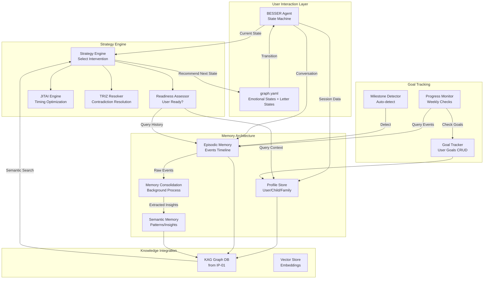

# IP-08: Memory Architecture, User Profile & Strategy Engine

## Смысл и цель задачи

Реализация комплексной системы памяти, профилирования пользователя и стратегического движка для персонализации терапевтического пути отчуждаемого родителя. Цель - создать multi-layered memory architecture (profile store, episodic memory, semantic memory), strategy engine для adaptive interventions (JITAI-based), goal tracking system для мониторинга прогресса, интеграцию letter writing в emotional state graph. Результат - чат-бот с долговременной памятью о пользователе, его ребенке, целях терапии, истории взаимодействий; система способная адаптивно выбирать стратегии (письмо vs действие vs ожидание) на основе readiness assessment, персонализированные интервенции учитывающие контекст всей истории отношений родителя с ребенком.

## Объем работ

### Что входит в реализацию

- **User Profile Store**: структурированное хранилище данных о пользователе, ребенке, семье
- **Episodic Memory**: хроника событий, conversations, milestones с temporal ordering
- **Semantic Memory**: извлеченные паттерны, insights, learnings из episodic memory
- **Memory Integration с KAG**: связывание memory nodes в knowledge graph
- **Strategy Engine**: rule-based + ML механизм выбора терапевтической стратегии
- **User Readiness Assessment**: оценка готовности родителя к конкретным действиям
- **Goal Tracking System**: user-defined goals с weekly progress monitoring
- **Letter Writing Integration в Graph**: добавление WRITE_LETTER_* states в graph.yaml
- **JITAI (Just-In-Time Adaptive Interventions)**: адаптивные интервенции в правильный момент
- **Trauma-Aware Dialogue Policies**: учет триггеров в graph transitions
- **Progress Metrics Dashboard**: визуализация прогресса пользователя
- **Memory Consolidation**: periodic background process для semantic extraction

### Что не входит

- Автоматическое создание goals (только user-defined через диалог)
- Predictive analytics для прогнозирования исходов (оставляем для будущего)
- Integration с внешними CRM системами
- Биометрический анализ (voice/face recognition для эмоций)
- Social network graph ребенка (слишком сложно для MVP)
- Automated goal achievement detection (требует human validation)

## Архитектура решения

### Основные компоненты

```
src/
├── memory/
│   ├── __init__.py
│   ├── profile_store.py              # User/Child/Family profiles
│   ├── episodic_memory.py            # Chronological event log
│   ├── semantic_memory.py            # Extracted patterns/insights
│   ├── memory_consolidation.py       # Background semantic extraction
│   ├── memory_retrieval.py           # Context-aware memory queries
│   └── models/
│       ├── user_profile.py           # Pydantic models
│       ├── episode.py                # Event/conversation models
│       └── semantic_unit.py          # Insight/pattern models
├── strategy/
│   ├── __init__.py
│   ├── strategy_engine.py            # Main strategy selector
│   ├── readiness_assessor.py         # User readiness evaluation
│   ├── jitai_engine.py               # Just-In-Time interventions
│   ├── strategy_policies/
│   │   ├── letter_writing_policy.py  # Когда предлагать письма
│   │   ├── action_policy.py          # Когда push к действиям
│   │   ├── waiting_policy.py         # Когда рекомендовать ожидание
│   │   └── escalation_policy.py      # Когда эскалировать (юрист, школа)
│   └── triz_resolver.py              # TRIZ-based contradiction resolution
├── goals/
│   ├── __init__.py
│   ├── goal_tracker.py               # Goal CRUD + tracking
│   ├── progress_monitor.py           # Weekly progress checks
│   ├── milestone_detector.py         # Auto-detect milestones
│   └── goal_templates.yaml           # Pre-defined goal templates
├── graph_extensions/
│   ├── __init__.py
│   ├── letter_states.py              # WRITE_LETTER_* state definitions
│   ├── graph_yaml_generator.py       # Dynamic graph.yaml extension
│   └── trauma_aware_transitions.py   # Trauma-aware transition logic
├── integration/
│   ├── __init__.py
│   ├── kag_memory_connector.py       # KAG <-> Memory integration
│   ├── besser_memory_bridge.py       # BESSER session <-> Profile
│   └── state_machine_memory_sync.py  # Sync state с memory updates
└── config/
    ├── memory_config.yaml            # Memory retention policies
    ├── strategy_config.yaml          # Strategy selection rules
    └── goal_templates.yaml           # Goal library
```

### Диаграмма архитектуры



## Параметры стека

- **Язык**: Python 3.12
- **Фреймворк**: FastAPI, BESSER Agentic Framework
- **База данных**:
  - PostgreSQL для Profile Store (structured data)
  - TimescaleDB для Episodic Memory (time-series events)
  - Redis для session cache
- **Knowledge Graph**: KAG (OpenSPG) из IP-01
- **Vector Store**: ChromaDB/Qdrant для semantic memory embeddings
- **Background Tasks**: Celery для memory consolidation
- **State Machine**: BESSER + LangGraph для graph.yaml extension
- **ML Models**: sentence-transformers для semantic similarity, sklearn для readiness scoring
- **Целевая платформа**: Docker/Kubernetes, integration с существующими модулями

## Полный flow работы функционала

### 1. Онбординг: Создание User Profile

**Initial profile setup:**

```
1. Пользователь запускает /start (после consent в IP-07)
2. БОТ инициирует profile setup workflow:
   "Давайте познакомимся. Расскажите о вашей ситуации."
3. БОТ задает guided questions:
   - "Как зовут вашего ребенка?" -> [CHILD_NAME] (токенизируется по IP-07)
   - "Сколько лет ребенку?" -> child_age
   - "Когда вы в последний раз виделись?" -> last_contact_date
   - "Какой тип отношений сейчас с другим родителем?"
     -> co_parenting_type (parallel, cooperative, high_conflict)
   - "Что для вас сейчас самое важное?" -> primary_concern
4. ProfileStore.create_profile(user_uuid, profile_data):
   - Сохранить structured profile
   - Create entry в KAG (User node)
   - Link User -> Child -> ExPartner nodes
5. БОТ предлагает set initial goal:
   "Какую цель вы хотите поставить на ближайший месяц?"
   Примеры:
   - "Восстановить хотя бы SMS-контакт"
   - "Написать письмо ребенку к дню рождения"
   - "Не реагировать агрессивно на провокации"
6. GoalTracker.create_goal(user_uuid, goal_text, deadline)
7. EpisodicMemory.log_event(
     event_type="profile_created",
     details=profile_data
   )
```

**Profile Schema:**

```yaml
UserProfile:
  user_uuid: str
  created_at: datetime
  child_info:
    token: "[CHILD_NAME]"  # real name encrypted client-side
    age: int
    gender: str (optional)
    interests: List[str] (from conversations)
  family_context:
    ex_partner_token: "[EX_PARTNER_NAME]"
    co_parenting_type: str (parallel, cooperative, high_conflict, none)
    custody_arrangement: str (full_ex, shared, legal_only, none)
    last_contact_date: datetime
    contact_frequency: str (daily, weekly, monthly, none)
  user_context:
    primary_concern: str
    emotional_baseline: str (from IP-03 initial assessment)
    parenting_style: str (authoritative, permissive, uninvolved, uncertain)
    support_network: bool (has friends/family support?)
    therapy_history: bool (previous therapy?)
  trauma_markers:
    triggers: List[str] (detected over time)
    trauma_responses: List[str] (fight, flight, freeze patterns)
  preferences:
    communication_style: str (direct, gentle, structured)
    session_frequency: str (daily, few_times_week, weekly)
```

### 2. Episodic Memory: Conversation Logging

**Every interaction logged:**

```
[DURING CONVERSATION]
1. User sends message
2. BESSER Agent processes через state machine
3. EpisodicMemory.log_conversation_turn(
     user_uuid,
     timestamp,
     emotional_state,  # from IP-03
     user_message_tokenized,
     bot_response,
     techniques_applied,  # from IP-04
     state_transition  # RAGE -> NVC_TRAINING
   )
4. IF significant event detected:
   - Milestone (first letter written, goal achieved)
   - Crisis (safety incident from IP-05)
   - Breakthrough (user insight)
   THEN EpisodicMemory.log_significant_event(
     event_type,
     emotional_valence,
     impact_score,
     related_goal_id
   )
5. Update ProfileStore с новыми learnings:
   - Если обнаружен новый trigger -> add to trauma_markers.triggers
   - Если user выразил new interest ребенка -> add to child_info.interests
```

**Episode Schema:**

```yaml
Episode:
  episode_id: UUID
  user_uuid: str
  timestamp: datetime
  episode_type: str (conversation, event, milestone, crisis)
  emotional_state_before: str
  emotional_state_after: str
  content:
    user_message: str (tokenized)
    bot_response: str
    techniques_applied: List[str]
  metadata:
    state_transition: str (GRIEF -> WRITE_LETTER_GRIEF)
    goal_progress: dict (if related to goal)
    safety_flags: List[str] (if any)
  embeddings:
    message_embedding: Vector
    semantic_summary: str
```

### 3. Semantic Memory: Pattern Extraction

**Background consolidation process:**

```
[NIGHTLY BATCH JOB]
1. MemoryConsolidation.run_daily_consolidation(cutoff_date=yesterday):
   a. Query EpisodicMemory for last 24h episodes
   b. Group episodes по temporal clusters
   c. Extract patterns:
      - Recurring emotional states (user часто в RAGE по вечерам)
      - Trigger patterns (mentions "школа" -> spike в anxiety)
      - Effective techniques (CBT works, NVC doesn't resonate)
      - Goal-related patterns (progress on "письма" стагнирует)
   d. LLM-based semantic summarization:
      prompt = """
      Episodic events за 24h:
      {episodes_summary}

      Extract insights:
      1. Что изменилось в эмоциональном состоянии?
      2. Какие паттерны повторяются?
      3. Что помогает/не помогает?
      4. Прогресс к целям?
      """
   e. Create SemanticMemory entries
2. SemanticMemory.store_insights(user_uuid, insights)
3. Update ProfileStore.preferences на основе patterns
4. IF critical pattern detected (stuck, regression):
   - Flag для ClinicalOversight (IP-06)
```

**Semantic Memory Schema:**

```yaml
SemanticUnit:
  semantic_id: UUID
  user_uuid: str
  created_at: datetime
  time_window: str (daily, weekly, monthly)
  insight_type: str (pattern, learning, progress, concern)
  content:
    summary: str (human-readable insight)
    supporting_episodes: List[episode_id]
    confidence_score: float (0-1)
  actionable_recommendations:
    strategy_adjustments: List[str]
    goal_modifications: List[str]
  embeddings:
    insight_embedding: Vector
```

### 4. Strategy Engine: Intervention Selection

**Real-time strategy selection:**

```
[DURING STATE MACHINE EXECUTION]
1. BESSER Agent в состоянии GRIEF (пользователь скорбит об утраченном контакте)
2. StrategyEngine.select_next_intervention(
     current_state="GRIEF",
     user_uuid=user_uuid
   ):
   a. Retrieve context:
      - profile = ProfileStore.get_profile(user_uuid)
      - recent_episodes = EpisodicMemory.get_recent(user_uuid, last_7_days)
      - semantic_insights = SemanticMemory.get_insights(user_uuid, last_30_days)
      - current_goals = GoalTracker.get_active_goals(user_uuid)

   b. Assess user readiness:
      readiness = ReadinessAssessor.assess(
        current_state="GRIEF",
        profile=profile,
        recent_history=recent_episodes
      )
      # Returns: {
      #   letter_writing_ready: 0.8 (high),
      #   action_taking_ready: 0.3 (low),
      #   waiting_acceptance_ready: 0.6 (medium)
      # }

   c. Apply strategy policies:
      IF readiness.letter_writing_ready > 0.7 AND profile.last_contact_date > 90_days_ago:
        recommended_strategy = "WRITE_LETTER_GRIEF"
      ELIF readiness.action_taking_ready > 0.7 AND profile.co_parenting_type != "high_conflict":
        recommended_strategy = "REACH_OUT_ACTION"
      ELSE:
        recommended_strategy = "GRIEF_PROCESSING" (stay in healing)

   d. TRIZ contradiction resolution:
      IF user expresses "я хочу действовать" BUT readiness.action_ready < 0.5:
        # Противоречие: желание vs готовность
        TRIZ_Principle_1_Separation_in_Time:
          - "Давайте сначала проработаем эмоции (сегодня)"
          - "Завтра вернемся к плану действий"
        TRIZ_Principle_13_Feedback:
          - "Когда вы чувствуете себя готовым действовать, дайте мне знать"

   e. JITAI timing optimization:
      IF time_of_day == "evening" AND semantic_insights.shows("evenings trigger sadness"):
        # Не предлагать action-oriented сейчас
        defer_intervention_to_morning = True
3. Return recommended_next_state to BESSER Agent
4. Graph transition: GRIEF -> WRITE_LETTER_GRIEF
```

**Readiness Assessment Algorithm:**

```python
class ReadinessAssessor:
    def assess(self, current_state, profile, recent_history):
        # Factors для letter_writing_ready:
        factors = {
            "emotional_stability": self._assess_stability(recent_history),
            "days_since_last_contact": self._calculate_days(profile.last_contact_date),
            "previous_letter_success": self._check_history(recent_history, "letter"),
            "current_emotional_intensity": self._get_intensity(current_state),
            "goal_alignment": self._check_goals(profile, "letter")
        }

        # Weighted scoring:
        letter_ready_score = (
            factors["emotional_stability"] * 0.3 +
            min(factors["days_since_last_contact"] / 180, 1.0) * 0.2 +
            factors["previous_letter_success"] * 0.2 +
            (1 - factors["current_emotional_intensity"]) * 0.2 +
            factors["goal_alignment"] * 0.1
        )

        return {
            "letter_writing_ready": letter_ready_score,
            "action_taking_ready": self._assess_action_ready(factors),
            "waiting_acceptance_ready": self._assess_waiting_ready(factors)
        }
```

### 5. Goal Tracking: Progress Monitoring

**User sets goal:**

```
1. User: /my_goals -> "Хочу написать письмо ребенку к его дню рождения"
2. БОТ guided goal creation:
   "Когда день рождения?" -> deadline_date
   "Что хотите сказать в письме?" -> goal_description
   "Как вы поймете что достигли цели?" -> success_criteria
3. GoalTracker.create_goal(
     user_uuid,
     goal_type="write_letter",
     description="Написать письмо к ДР",
     deadline=deadline_date,
     milestones=[
       "Набросать черновик",
       "Проработать с Content Guardian",
       "Финализировать и сохранить"
     ]
   )
4. Link goal в ProfileStore
```

**Weekly progress check:**

```
[WEEKLY SCHEDULED TASK]
1. ProgressMonitor.run_weekly_check(user_uuid):
   a. Get active goals
   b. For each goal:
      - Query EpisodicMemory для goal-related events
      - Calculate progress_percentage
      - Detect blockers (stuck без progress 2+ недели)
   c. Generate progress summary
2. БОТ sends weekly update:
   "📊 Ваш прогресс за неделю:

   Цель: Написать письмо к ДР ребенка
   Прогресс: 60% ✅ Черновик готов
   Следующий шаг: Проверить с Content Guardian

   Хотите продолжить работу над этим?"
3. IF user blocked:
   - StrategyEngine suggests intervention
   - "Вижу вы застряли. Может быть нужна помощь?"
```

**Goal Schema:**

```yaml
Goal:
  goal_id: UUID
  user_uuid: str
  created_at: datetime
  goal_type: str (write_letter, restore_contact, self_care, legal_action)
  description: str
  deadline: datetime (optional)
  status: str (active, achieved, abandoned, paused)
  milestones:
    - milestone_id: UUID
      description: str
      status: str (pending, completed)
      completed_at: datetime (optional)
  progress_percentage: float (0-100)
  blockers: List[str] (detected issues)
  related_episodes: List[episode_id]
```

### 6. PhaseManager: Долгосрочное сопровождение пользователя

**Источник**: alienated_parent_support_bot_map.md (строки 1600-1627)

Система управления долгосрочными фазами терапевтического процесса. PhaseManager определяет текущую фазу работы с пользователем и адаптирует частоту контакта, глубину интервенций и ожидания прогресса.

**4 фазы работы с пользователем**:

```python
# Phase Model

PHASE_1_CRISIS = {
    "name": "КРИЗИС",
    "duration_weeks": "1-2",
    "characteristics": {
        "emotional_states": ["SHOCK", "RAGE", "DESPAIR", "CRISIS"],
        "contact_frequency": "daily",
        "session_length": "short (10-15 min)",
        "primary_goals": [
            "Стабилизация эмоционального состояния",
            "Safety assessment и кризисное вмешательство",
            "Базовое психообразование о PA",
            "Подключение к профессиональной помощи"
        ],
        "success_markers": [
            "Снижение риска самоубийства с HIGH -> LOW",
            "User принял реальность ситуации (SHOCK -> ACCEPTANCE начало)",
            "Установлен контакт с психологом/группой поддержки",
            "Хотя бы одно micro-action выполнено (письмо ребенку)"
        ],
        "techniques_priority": ["crisis_protocol", "grounding", "safety_planning", "MI_reflection"],
        "guardrails": "HIGH (suicide detection, violence detection)",
        "check_in_schedule": "ежедневно в одно и то же время"
    },
    "transition_criteria": {
        "to_PHASE_2": [
            "suicide_risk_level < MEDIUM for 3 consecutive days",
            "user_shows_curiosity (asks questions about PA dynamics)",
            "emotional_state NOT in [CRISIS, DESPAIR] for 48h"
        ]
    }
}

PHASE_2_UNDERSTANDING = {
    "name": "ПОНИМАНИЕ",
    "duration_weeks": "2-4",
    "characteristics": {
        "emotional_states": ["GUILT", "BARGAINING", "ACCEPTANCE", "SEEKING_UNDERSTANDING"],
        "contact_frequency": "3-4 times per week",
        "session_length": "medium (20-30 min)",
        "primary_goals": [
            "Изучение динамик родительского отчуждения",
            "Работа с когнитивными искажениями (CBT)",
            "Обучение эмоциональной регуляции",
            "Планирование первых конструктивных действий"
        ],
        "success_markers": [
            "User correctly identifies 3+ cognitive distortions",
            "Successful NVC formulation в 2+ ситуациях",
            "Homework completion rate > 50%",
            "Created SMART goal with realistic timeline"
        ],
        "techniques_priority": ["psychoeducation", "CBT_restructuring", "NVC_training", "IFS_parts"],
        "homework_frequency": "weekly",
        "psychoeducation_topics": [
            "Конфликт лояльности у ребенка (ЦЕНТРАЛЬНАЯ КОНЦЕПЦИЯ)",
            "Психология alienator",
            "Долгосрочные последствия PA для ребенка",
            "Эффективные стратегии targeted parent",
            "Иррациональные мотивы ОБОИХ родителей",
            "Ко-парентинг vs параллельное родительство",
            "Медиация: когда подходит, когда нет",
            "Роль расширенной семьи (бабушки/дедушки)"
        ]
    },
    "transition_criteria": {
        "to_PHASE_3": [
            "user_has_created_action_plan == True",
            "emotional_regulation_improved (anger_intensity decreased by 30%)",
            "user_demonstrates_NVC_in_practice",
            "shows_readiness_for_action (ReadinessAssessor score > 0.6)",
            "understands_loyalty_conflict (key reframe achieved)"
        ]
    }
}

# Psychoeducation Module: Loyalty Conflict (PHASE_2 Primary Focus)

LOYALTY_CONFLICT_MODULE = {
    "name": "КОНФЛИКТ ЛОЯЛЬНОСТИ РЕБЕНКА",
    "source": "Брошюра Юлии Ковалёвой 'Конфликт лояльности'",
    "priority": "PRIMARY (first psychoeducation topic in PHASE_2)",
    "rationale": "Центральный психологический механизм PA. Понимание конфликта лояльности - ключевой рефрейминг, который снимает вину с родителя и ребенка, переключает фокус с 'борьбы' на 'освобождение ребенка от выбора'.",

    "learning_objectives": [
        "Понять что такое конфликт лояльности",
        "Распознать признаки конфликта лояльности в поведении ребенка",
        "Рефреймировать 'отвержение ребенка' как 'защитную реакцию в ловушке'",
        "Перестать винить ребенка",
        "Научиться 'освобождать' ребенка от необходимости выбора",
        "Понять долгосрочную перспективу (дети возвращаются)"
    ],

    "content_delivery": {
        "stage_1_introduction": {
            "timing": "PHASE_2, session 1-2",
            "prompt": """
            Сейчас я расскажу о самом важном: почему ребенок отдаляется от вас.

            Ребенок переживает то, что называется **конфликт лояльности**.

            Представьте: ребенок любит ВАС и любит другого родителя. Но он чувствует (или ему говорят), что любить одного - значит предавать другого.

            Это невыносимая психологическая ловушка. Ребенок не может 'выиграть'.
            """,
            "visual_metaphor": "Канатоходец между двумя башнями - движение к одной кажется падением с другой",
            "check_understanding": "Можете своими словами объяснить, что такое конфликт лояльности?"
        },

        "stage_2_mechanism": {
            "timing": "PHASE_2, session 2-3",
            "prompt": """
            Как это создается? Несколько способов:

            1. **Прямые сообщения**: "Если любишь меня, не общайся с отцом/матерью"
            2. **Невербальное давление**: Расстроенное лицо родителя, когда ребенок упоминает другого
            3. **Эмоциональная манипуляция**: "Ты меня больше не любишь, раз хочешь к нему/ней?"
            4. **Создание альянса**: "Мы с тобой против него/нее"

            Ребенок **защищается** от этого давления, отстраняясь от вас. Это НЕ его выбор. Это **выживание**.
            """,
            "personalization": "Вспомните ситуации с вашим ребенком. Видите ли вы эти признаки?",
            "adherence_marker": "user_identifies_loyalty_conflict_in_own_situation"
        },

        "stage_3_reframe": {
            "timing": "PHASE_2, session 3-4",
            "prompt": """
            Важнейший сдвиг в восприятии:

            ❌ "Ребенок меня ненавидит"
            ✅ "Ребенок в конфликте лояльности и защищается"

            ❌ "Он предатель, выбрал другого"
            ✅ "Его ЗАСТАВИЛИ 'выбрать', он жертва манипуляции"

            ❌ "Надо бороться за ребенка"
            ✅ "Надо СНЯТЬ с ребенка необходимость выбора"

            Ребенок НЕ виноват. Вы НЕ виноваты. Виновата СИТУАЦИЯ.
            """,
            "cbt_integration": "Cognitive restructuring от blame к empathy",
            "adherence_marker": "user_stops_blaming_child"
        },

        "stage_4_what_not_to_do": {
            "timing": "PHASE_2, session 4-5",
            "prompt": """
            Что НЕ делать (критично!):

            🚫 НЕ усиливайте конфликт: "Выбери кого любишь больше"
            🚫 НЕ критикуйте другого родителя при ребенке (УСИЛИВАЕТ ловушку)
            🚫 НЕ требуйте доказательств любви ("Если любишь, почему не звонишь?")
            🚫 НЕ вините ребенка

            Каждое из этих действий **углубляет** конфликт лояльности.
            """,
            "guardrails": "ContentGuardian проверяет письма на эти паттерны (IP-02)"
        },

        "stage_5_what_to_do": {
            "timing": "PHASE_2, session 5-6",
            "prompt": """
            Что ДЕЛАТЬ:

            ✅ **Освободить от выбора**: "Ты можешь любить нас обоих. Это нормально. Я даю тебе разрешение."

            ✅ **Безусловная любовь**: "Я люблю тебя независимо от того, видимся ли мы. Моя любовь не зависит от твоего поведения."

            ✅ **Не вовлекать в конфликт**: "Я никогда не буду просить тебя выбирать или передавать сообщения."

            ✅ **Терпение и долгосрочная перспектива**: "Дети взрослеют и понимают. Я буду ждать, когда ты будешь готов."

            Ваша задача - НЕ заставить ребенка выбрать вас, а **СНЯТЬ** необходимость выбора.
            """,
            "action_planning": "Integrate в letter writing (IP-02) и communication strategy",
            "adherence_marker": "user_commits_to_liberation_approach"
        },

        "stage_6_letter_exercise": {
            "timing": "PHASE_2, session 6-7",
            "prompt": """
            Практическое упражнение: Напишем "Письмо освобождения" ребенку.

            Шаблон (адаптируем под ваш язык и ситуацию):

            ---
            Дорогой [имя ребенка],

            Я хочу сказать тебе важное: ты можешь любить нас обоих - и меня, и [имя другого родителя]. Это правильно и естественно. Ты не должен выбирать.

            Моя любовь к тебе не зависит от того, как часто мы видимся. Я всегда буду твоим отцом/матерью, и я тебя люблю.

            Когда будешь готов - я здесь.

            С любовью,
            [ваше имя]
            ---

            Хотите попробовать написать свою версию?
            """,
            "integration_ip02": "ContentGuardian проверяет на соответствие 'liberation' принципам",
            "goal_creation": "GoalTracker creates goal 'Написать и отправить письмо освобождения'"
        },

        "stage_7_long_term_hope": {
            "timing": "PHASE_2, session 7-8",
            "prompt": """
            Последнее и самое важное: НАДЕЖДА.

            📊 **Исследования показывают**: когда дети взрослеют, они возвращаются к отвергнутому родителю в **80% случаев**.

            Они **понимают**, что произошло. Они **чувствуют вину** за отвержение. Они **ищут** вас.

            Ваша задача - быть готовым **принять их** без обвинений, когда придет время.

            Это может быть через год, через 5 лет, через 10. Но они **вернутся**.
            """,
            "phase_transition": "Sets foundation для PHASE_3 (patience + strategic action)",
            "adherence_marker": "user_demonstrates_long_term_hope"
        }
    },

    "homework_assignments": {
        "loyalty_conflict_journal": {
            "description": "Записать 3 ситуации, где ребенок мог быть в конфликте лояльности",
            "format": "Ситуация -> Что ребенок сказал/сделал -> Какой конфликт лояльности это показывает",
            "frequency": "weekly в PHASE_2"
        },
        "reframing_exercise": {
            "description": "Переформулировать 5 'негативных' действий ребенка через призму конфликта лояльности",
            "example": "'Ребенок не ответил на звонок' -> 'Ребенок боялся расстроить маму, которая рядом'",
            "frequency": "bi-weekly"
        },
        "liberation_letter_draft": {
            "description": "Написать письмо освобождения",
            "steps": [
                "Draft письма (IP-04 guided exercise)",
                "ContentGuardian check (IP-02)",
                "User revision",
                "Save to time capsule OR send (user choice)"
            ],
            "adherence_check": "IP-04 AdherenceTracker"
        }
    },

    "integration_points": {
        "IP-01_RAG": "loyalty_conflict.md в knowledge base, semantic search для queries о ребенке",
        "IP-02_Letter_Writing": "ContentGuardian проверяет письма на 'освобождение' vs 'давление выбора'",
        "IP-03_States": "SEEKING_UNDERSTANDING state включает loyalty conflict module",
        "IP-04_Techniques": "CBT reframing, IFS parts work, NVC для liberation messages",
        "IP-06_Evaluation": "Measure понимания loyalty conflict как success metric",
        "ProfileStore": "Track loyalty_conflict_understanding: bool в user profile"
    },

    "success_metrics": {
        "cognitive_shift": "User correctly identifies loyalty conflict в 3+ ситуациях",
        "emotional_shift": "Anger toward child снижается на 50%+ (Progress Indicators)",
        "behavioral_shift": "User создал liberation letter (GoalTracker milestone)",
        "long_term_shift": "User demonstrates patience + hope (not despair)"
    }
}

# Psychoeducation Module: Иррациональные мотивы ОБОИХ родителей

IRRATIONAL_MOTIVES_MODULE = {
    "name": "ПОНИМАНИЕ ПСИХОЛОГИИ ОБОИХ РОДИТЕЛЕЙ",
    "source": "Брошюра Юлии Ковалёвой 'Конфликт лояльности' + психологические исследования PA",
    "timing": "PHASE_2_UNDERSTANDING, sessions 8-10 (после loyalty conflict)",
    "rationale": "Понимание иррациональных мотивов ОБОИХ родителей помогает: (1) снять вину с себя, (2) развить эмпатию к ex-partner (снижает гнев), (3) предсказать поведение alienator, (4) выработать эффективную стратегию",

    "custodial_parent_motives": {
        "description": "Психологические драйверы родителя, который отчуждает ребенка",
        "categories": [
            {
                "motive": "Страх потери контроля",
                "details": "Родитель боится, что если ребенок будет общаться с другим родителем, он 'потеряет' ребенка навсегда. Каждая встреча воспринимается как угроза.",
                "examples": [
                    "Запрещает звонки, т.к. боится что ребенок 'переметнется'",
                    "Контролирует каждую деталь визитов",
                    "Требует отчетов от ребенка после встреч"
                ],
                "underlying_belief": "'Если я ослаблю контроль, я потеряю ребенка'",
                "reality_check": "Дети не 'выбирают' родителя при нормальном контакте. Контроль усиливает отчуждение."
            },
            {
                "motive": "Защитная агрессия",
                "details": "Родитель искренне верит, что защищает ребенка от 'плохого' родителя. Это может быть проекция собственных страхов или реакция на прошлые конфликты.",
                "examples": [
                    "Говорит ребенку: 'Отец/мать тебя обидит'",
                    "Приписывает злые намерения: 'Он хочет забрать тебя от меня'",
                    "Создает образ 'опасного' родителя"
                ],
                "underlying_belief": "'Я защищаю ребенка от угрозы'",
                "reality_check": "Если нет реального насилия/опасности, это проекция, не защита."
            },
            {
                "motive": "Месть и наказание",
                "details": "Родитель использует ребенка как инструмент мести за реальные или воображаемые обиды. 'Ты меня бросил - я заберу у тебя ребенка'.",
                "examples": [
                    "Блокирует контакт после ссоры с ex-partner",
                    "Говорит ребенку: 'Он бросил нас'",
                    "Отказывает в видео-звонках как 'наказание'"
                ],
                "underlying_belief": "'Он/она должен заплатить за то, что сделал мне'",
                "reality_check": "Ребенок - не инструмент мести. Он страдает больше всего."
            },
            {
                "motive": "Ревность к отношениям ребенка с другим родителем",
                "details": "Родитель чувствует ревность, когда ребенок выражает любовь к другому. Воспринимает это как предательство.",
                "examples": [
                    "Расстраивается, когда ребенок говорит 'Я скучаю по папе/маме'",
                    "Конкурирует за любовь: 'Кого ты больше любишь?'",
                    "Обесценивает другого родителя: 'Я же тебе лучше покупаю'"
                ],
                "underlying_belief": "'Если ребенок любит его/ее, значит меня любит меньше'",
                "reality_check": "Любовь к одному родителю не уменьшает любовь к другому. Это не соревнование."
            },
            {
                "motive": "Финансовые мотивы",
                "details": "Контроль над ребенком = алименты, пособия, жилье. Страх потери финансовой поддержки.",
                "examples": [
                    "Боится совместной опеки, т.к. снизятся алименты",
                    "Использует ребенка как аргумент для жилья/финансов",
                    "Сопротивляется разделению времени"
                ],
                "underlying_belief": "'Если потеряю ребенка, потеряю деньги/статус'",
                "reality_check": "Ребенок - не финансовый актив. Суды защищают интересы ребенка."
            },
            {
                "motive": "Страх одиночества",
                "details": "Ребенок - единственная эмоциональная опора родителя. Страх остаться одному после развода.",
                "examples": [
                    "Ребенок выполняет роль партнера (эмоциональный инцест)",
                    "Родитель делится с ребенком взрослыми проблемами",
                    "Говорит: 'У меня есть только ты'"
                ],
                "underlying_belief": "'Если ребенок уйдет, я останусь один/одна'",
                "reality_check": "Ребенок - не терапевт и не партнер. Родителю нужна поддержка взрослых."
            }
        ]
    },

    "non_custodial_parent_motives": {
        "description": "Психологические драйверы отчуждаемого родителя (important для самосознания)",
        "categories": [
            {
                "motive": "Боль и утрата",
                "details": "Глубокая эмоциональная боль от потери контакта с ребенком. Это легитимная эмоция, но может вести к деструктивным действиям.",
                "examples": [
                    "Постоянная тоска, депрессия",
                    "Навязчивые мысли о ребенке",
                    "Физические симптомы (бессонница, потеря аппетита)"
                ],
                "underlying_belief": "'Я потерял самое важное в жизни'",
                "adaptive_response": "Признать боль, но не позволять ей управлять действиями. Терапия, поддержка."
            },
            {
                "motive": "Страх быть забытым",
                "details": "Панический страх, что ребенок забудет родителя, перестанет любить, 'заменит' другим.",
                "examples": [
                    "Компульсивные попытки контакта (10 звонков в день)",
                    "Навязчивые подарки, сообщения",
                    "Вопросы 'Ты меня помнишь?' в письмах"
                ],
                "underlying_belief": "'Если не буду постоянно напоминать, он забудет меня'",
                "adaptive_response": "Дети не забывают родителей. Качество > количество. Trust the bond."
            },
            {
                "motive": "Гнев и желание справедливости",
                "details": "Ярость на ex-partner за отчуждение, на систему за несправедливость. Желание 'наказать' виновных.",
                "examples": [
                    "Судебные баталии не ради ребенка, а ради победы",
                    "Публичная травля ex-partner в соцсетях",
                    "Попытки 'разоблачить' alienator перед ребенком"
                ],
                "underlying_belief": "'Они должны заплатить за то, что сделали'",
                "adaptive_response": "Гнев легитимен, но месть вредит ребенку. Фокус на восстановление, не наказание."
            },
            {
                "motive": "Бессилие и отчаяние",
                "details": "Чувство полного отсутствия контроля. 'Я ничего не могу сделать'. Может вести к капитуляции или панике.",
                "examples": [
                    "Отказ от попыток контакта ('все равно бесполезно')",
                    "Или наоборот - хаотичные, необдуманные действия",
                    "Суицидальные мысли"
                ],
                "underlying_belief": "'Я беспомощен, ничего не могу изменить'",
                "adaptive_response": "Есть стратегии, которые работают. Маленькие шаги. Долгосрочная перспектива."
            },
            {
                "motive": "Вина и самообвинение",
                "details": "Глубокое чувство вины: 'Это моя вина', 'Я плохой родитель', 'Я что-то сделал не так'.",
                "examples": [
                    "Компульсивное переигрывание прошлого ('Если бы я...')",
                    "Самобичевание",
                    "Попытки 'искупить вину' через подарки/уступки"
                ],
                "underlying_belief": "'Если бы я был лучше, этого бы не произошло'",
                "adaptive_response": "CBT для когнитивных искажений. Вы НЕ виноваты в PA."
            },
            {
                "motive": "Надежда и цепляние за контроль",
                "details": "Навязчивая надежда 'вернуть все как было'. Отказ принять новую реальность.",
                "examples": [
                    "Фантазии о 'спасении' ребенка",
                    "Отказ от собственной жизни ('я жду, когда он вернется')",
                    "Игнорирование признаков, что стратегия не работает"
                ],
                "underlying_belief": "'Если я буду очень стараться, все вернется'",
                "adaptive_response": "Баланс между надеждой и принятием. Строить жизнь параллельно."
            }
        ]
    },

    "delivery_strategy": {
        "stage_1_custodial_motives": {
            "timing": "PHASE_2, session 8",
            "prompt": """
            Теперь важная тема: давайте поймем психологию ex-partner.

            Почему он/она отчуждает ребенка? Это не 'зло ради зла'. У этого есть иррациональные мотивы:

            1. **Страх потери контроля**: Боится что 'потеряет' ребенка
            2. **Защитная агрессия**: Верит что 'защищает' ребенка от вас
            3. **Месть**: Использует ребенка как инструмент наказания
            4. **Ревность**: Не выносит что ребенок любит вас
            5. **Финансовые мотивы**: Контроль = деньги/статус
            6. **Страх одиночества**: Ребенок - единственная опора

            Какие из этих мотивов вы видите в поведении ex-partner?
            """,
            "goal": "Развить эмпатию к alienator (не оправдание, а понимание)",
            "adherence_marker": "user_identifies_alienator_motives"
        },

        "stage_2_own_motives": {
            "timing": "PHASE_2, session 9",
            "prompt": """
            А теперь сложная часть: давайте честно посмотрим на ВАШИ мотивы.

            У отчуждаемых родителей тоже есть иррациональные драйверы:

            1. **Боль и утрата** (легитимная, но может вести к деструкции)
            2. **Страх быть забытым** (10 звонков в день, навязчивость)
            3. **Гнев и желание справедливости** (месть alienator)
            4. **Бессилие** (капитуляция или паника)
            5. **Вина** ('Это моя вина')
            6. **Надежда-фиксация** ('Вернуть все как было')

            Честно: какие из этих драйверов вы чувствуете? Какие мешают эффективным действиям?
            """,
            "goal": "Самосознание, не самобичевание",
            "guardrails": "НЕ критиковать, а валидировать + guide к адаптивным ответам",
            "adherence_marker": "user_demonstrates_self_awareness"
        },

        "stage_3_adaptive_responses": {
            "timing": "PHASE_2, session 10",
            "prompt": """
            Для каждого иррационального мотива есть АДАПТИВНЫЙ ответ:

            ❌ Страх быть забытым -> Компульсивные звонки
            ✅ Adaptive: Trust the bond. Качество > количество.

            ❌ Гнев -> Месть, травля
            ✅ Adaptive: Фокус на восстановление, не наказание.

            ❌ Вина -> Самобичевание
            ✅ Adaptive: CBT reframing. Вы не виноваты в PA.

            Давайте для ВАШИХ мотивов найдем адаптивные стратегии.
            """,
            "integration": "IP-04 techniques (CBT, IFS, NVC)",
            "adherence_marker": "user_adopts_adaptive_responses"
        }
    },

    "profilestore_integration": {
        "fields_to_add": {
            "ex_partner_motives_identified": "List[str] (страх контроля, месть, etc.)",
            "own_irrational_motives": "List[str] (боль, страх забытия, etc.)",
            "adaptive_strategies_adopted": "List[str] (trust bond, focus restoration, etc.)"
        },
        "usage": "StrategyEngine использует эту информацию для персонализации интервенций"
    },

    "success_metrics": {
        "empathy_toward_alienator": "User может объяснить мотивы ex-partner без демонизации",
        "self_awareness": "User recognizes own destructive patterns",
        "behavioral_change": "Reduction в compulsive contact attempts, revenge actions"
    }
}

# Psychoeducation Module: Co-Parenting vs Parallel Parenting

COPARENTING_STRATEGIES_MODULE = {
    "name": "КО-ПАРЕНТИНГ vs ПАРАЛЛЕЛЬНОЕ РОДИТЕЛЬСТВО",
    "source": "Брошюра Юлии Ковалёвой + High Conflict Institute research",
    "timing": "PHASE_2_UNDERSTANDING, sessions 11-12 OR PHASE_3_ACTION (depends on user readiness)",
    "rationale": "StrategyEngine должен рекомендовать правильную стратегию взаимодействия с ex-partner на основе co_parenting_type из ProfileStore. НЕ все ситуации подходят для кооперации.",

    "co_parenting_definition": {
        "name": "КО-ПАРЕНТИНГ (Cooperative Co-Parenting)",
        "description": "Совместное родительство с кооперацией, общением и совместными решениями",
        "suitable_when": [
            "Низкий/средний уровень конфликта между родителями",
            "Оба родителя способны ставить интересы ребенка выше личных обид",
            "Нет истории насилия или серьезного злоупотребления",
            "Родители могут общаться конструктивно (хотя бы через письма)"
        ],
        "characteristics": {
            "communication": "Регулярная, направленная на ребенка",
            "decisions": "Совместные решения по важным вопросам (школа, здоровье, религия)",
            "flexibility": "Гибкий график встреч, возможна смена планов по договоренности",
            "events": "Оба родителя присутствуют на школьных/спортивных мероприятиях",
            "information_sharing": "Активный обмен информацией о ребенке"
        },
        "tools_and_techniques": [
            "Совместные родительские встречи (раз в месяц)",
            "Общий календарь (Google Calendar) для расписания ребенка",
            "Родительское соглашение (parenting plan) с деталями",
            "Семейная медиация для разрешения споров",
            "NVC для сложных разговоров"
        ],
        "example_interaction": {
            "scenario": "Ребенок заболел во время недели с targeted parent",
            "co_parenting_response": "Позвонить ex-partner: 'У [имя] температура 38. Веду к врачу. Держу тебя в курсе.' -> После визита: 'Врач сказал ОРВИ, прописал [лекарство]. Вот рецепт (фото). Давай вместе следить.'"
        }
    },

    "parallel_parenting_definition": {
        "name": "ПАРАЛЛЕЛЬНОЕ РОДИТЕЛЬСТВО (Parallel Parenting)",
        "description": "Родители действуют автономно, минимизируя контакт, каждый отвечает за свое время с ребенком",
        "suitable_when": [
            "ВЫСОКИЙ уровень конфликта (в т.ч. PA ситуации)",
            "Один или оба родителя не способны кооперировать",
            "История насилия, манипуляций, или судебных баталий",
            "Любое общение приводит к эскалации конфликта",
            "Для защиты ребенка от конфликта между родителями"
        ],
        "characteristics": {
            "communication": "Минимальная, ТОЛЬКО о ребенке, письменная (email/SMS), BIFF-формат",
            "decisions": "Автономные решения в рамках своего времени; совместные - только критичные (здоровье, образование) через юристов/медиатора",
            "flexibility": "ЖЕСТКИЙ график встреч, без изменений без формального согласия",
            "events": "Родители присутствуют РАЗДЕЛЬНО (разные спорт. игры, школьные встречи по очереди)",
            "information_sharing": "Через третьих лиц (школа, врач отчитываются обоим), не напрямую"
        },
        "tools_and_techniques": [
            "BIFF communication (Brief, Informative, Friendly, Firm)",
            "Email-only contact (no phone calls, избегать живых встреч)",
            "Подробное родительское соглашение (максимум деталей, минимум гибкости)",
            "Нейтральное место передачи ребенка (школа, публичное место)",
            "Правило 'каждый сам' (одежда, игрушки, лекарства в двух экземплярах)",
            "OurFamilyWizard или подобные платформы для документированной коммуникации"
        ],
        "example_interaction": {
            "scenario": "Ребенок заболел во время недели с targeted parent",
            "parallel_parenting_response": "Email (BIFF): 'У [имя] температура 38, веду к врачу. Сообщу результат.' -> После: 'Диагноз ОРВИ, прописано [лекарство]. Копия рецепта во вложении. [Имя] останется со мной до выздоровления согласно графику.'"
        },
        "boundary_rules": [
            "НЕ обсуждать личные темы (новые партнеры, финансы, прошлое)",
            "НЕ критиковать решения другого родителя",
            "НЕ использовать ребенка как посыльного",
            "НЕ спрашивать ребенка о жизни другого родителя",
            "Уважать автономию другого родителя в его время"
        ]
    },

    "decision_tree_for_strategy_engine": {
        "description": "StrategyEngine использует ProfileStore.co_parenting_type для рекомендаций",
        "logic": """
        IF ProfileStore.co_parenting_type == 'high_conflict':
            recommended_strategy = PARALLEL_PARENTING
            communication_style = BIFF_only
            recommend_mediation = False (слишком рано, сначала снизить конфликт)
            recommend_flexibility = False (жесткий график защищает)

        ELIF ProfileStore.co_parenting_type == 'cooperative':
            recommended_strategy = CO_PARENTING
            communication_style = NVC + direct_dialogue
            recommend_mediation = True (для сложных вопросов)
            recommend_flexibility = True (в интересах ребенка)

        ELIF ProfileStore.co_parenting_type == 'parallel':
            recommended_strategy = PARALLEL_PARENTING
            communication_style = BIFF_written_only
            recommend_mediation = False (используйте юристов для критичных решений)
            recommend_flexibility = False

        ELIF ProfileStore.co_parenting_type == 'none' (no contact):
            recommended_strategy = DOCUMENT_EFFORTS
            communication_style = one_way_letters (no response expected)
            recommend_mediation = False
            recommend_flexibility = N/A
        """
    },

    "transition_between_strategies": {
        "from_parallel_to_cooperative": {
            "conditions": [
                "Conflict снизился значительно (6+ месяцев без эскалаций)",
                "Оба родителя показывают готовность кооперировать",
                "Ребенок выигрывает от большей гибкости"
            ],
            "steps": [
                "Начать с малого: 1-2 гибких момента в месяц",
                "Пробный период (3 месяца)",
                "Если успешно -> постепенно увеличивать кооперацию",
                "Если escalation -> вернуться к parallel"
            ]
        },
        "from_cooperative_to_parallel": {
            "triggers": [
                "Эскалация конфликта (3+ серьезных инцидента за месяц)",
                "Манипуляции/нарушение boundaries",
                "Ребенок страдает от родительских ссор"
            ],
            "steps": [
                "Установить BIFF-only communication",
                "Формализовать график (письменное соглашение)",
                "Информировать школу/врачей о раздельном присутствии",
                "Объяснить ребенку (age-appropriate): 'Мы будем общаться по-другому, чтобы меньше ссориться'"
            ]
        }
    },

    "profilestore_integration": {
        "field": "family_context.co_parenting_type",
        "values": ["cooperative", "parallel", "high_conflict", "none"],
        "onboarding_question": "Как бы вы описали отношения с бывшим партнером сейчас?",
        "options": [
            "Мы можем общаться конструктивно -> cooperative",
            "Мы общаемся только по необходимости, письменно -> parallel",
            "Любое общение приводит к конфликту -> high_conflict",
            "Контакта нет совсем -> none"
        ],
        "strategy_engine_usage": "Определяет рекомендации по коммуникации и действиям"
    }
}

# Psychoeducation Module: Медиация

MEDIATION_MODULE = {
    "name": "МЕДИАЦИЯ КАК ИНСТРУМЕНТ РАЗРЕШЕНИЯ СПОРОВ",
    "source": "Брошюра Юлии Ковалёвой + практика семейной медиации",
    "timing": "PHASE_2_UNDERSTANDING (psychoeducation) OR PHASE_3_ACTION (when considering mediation)",
    "rationale": "Медиация - НЕ универсальное решение. В PA-ситуациях часто неэффективна или опасна. User должен понимать когда медиация подходит, а когда нет.",

    "mediation_definition": {
        "what_is_it": "Процесс разрешения конфликта с участием нейтрального третьего лица (медиатора), который помогает родителям найти решение",
        "not_therapy": "Медиация - не терапия. Цель: договоренность, не исцеление отношений",
        "not_court": "Медиация - не суд. Решение добровольное, не навязанное"
    },

    "principles_of_mediation": {
        "neutrality": "Медиатор НЕ на чьей-то стороне, не судья",
        "confidentiality": "Все сказанное в медиации остается конфиденциальным (кроме duty to warn ситуаций)",
        "voluntariness": "Участие добровольное, можно выйти в любой момент",
        "focus_on_interests_not_positions": "Работа с потребностями ('Мне важна связь с ребенком'), не позициями ('Я хочу 50% времени')"
    },

    "stages_of_mediation": {
        "stage_1_preparation": {
            "description": "Подготовка к медиации",
            "steps": [
                "Выбор медиатора (желательно специализирующегося на PA)",
                "Индивидуальные встречи медиатора с каждым родителем",
                "Определение повестки дня",
                "Подписание соглашения о медиации"
            ]
        },
        "stage_2_exploration": {
            "description": "Исследование проблемы",
            "steps": [
                "Каждый родитель излагает свою позицию",
                "Медиатор выявляет интересы и потребности",
                "Определение общих целей ('Оба хотим счастья ребенка')",
                "Выявление препятствий"
            ]
        },
        "stage_3_solution_finding": {
            "description": "Поиск решений",
            "steps": [
                "Brainstorming вариантов (без оценки сначала)",
                "Оценка вариантов по критериям (интересы ребенка, реалистичность, etc.)",
                "Выбор лучшего варианта",
                "Детализация договоренностей"
            ]
        },
        "stage_4_agreement": {
            "description": "Соглашение",
            "steps": [
                "Письменное оформление договоренностей",
                "Проверка юристами (медиация - не юридическая консультация)",
                "Подписание",
                "План имплементации и мониторинга"
            ]
        }
    },

    "when_mediation_is_suitable": {
        "conditions": [
            "Оба родителя ДОБРОВОЛЬНО согласны участвовать",
            "НЕТ активного насилия или угрозы безопасности",
            "Родители способны сидеть в одной комнате и слушать друг друга",
            "Есть хотя бы минимальная готовность идти на компромисс",
            "Спорные вопросы конкретны (график встреч, школа, праздники)",
            "Дисбаланс власти не критичен (или медиатор может его балансировать)"
        ],
        "ideal_scenarios": [
            "Cooperative co-parenting с конкретным спором",
            "Transition от parallel к cooperative (медиация как мост)",
            "Разработка детального parenting plan",
            "Конфликт по конкретному вопросу (школа, переезд)"
        ]
    },

    "when_mediation_is_NOT_suitable": {
        "red_flags": [
            "История домашнего насилия (медиация может быть опасна)",
            "Активное PA с отрицанием фактов alienator'ом",
            "Один родитель отказывается признать проблему",
            "Extreme power imbalance (один родитель доминирует, другой в страхе)",
            "Personality disorder у одного родителя (нарциссизм, borderline) без лечения",
            "Один родитель использует медиацию как манипуляцию ('Я пошел на медиацию, значит я cooperative' - но саботирует)",
            "Необходимость защитных legal мер (restraining order, custody change)"
        ],
        "PA_specific_risks": [
            "Alienator может использовать медиацию для сбора информации о targeted parent",
            "Alienator может 'соглашаться' но не выполнять (mediation не имеет enforcement)",
            "Targeted parent может быть вынужден к unfair соглашению под давлением",
            "Ребенок может быть вовлечен в процесс против воли"
        ]
    },

    "alternatives_to_mediation": {
        "shuttle_negotiation": {
            "description": "Медиатор общается с каждым родителем ОТДЕЛЬНО, передает предложения",
            "when": "Родители не могут сидеть вместе, но готовы искать решение"
        },
        "arbitration": {
            "description": "Третья сторона (арбитр) выносит ОБЯЗАТЕЛЬНОЕ решение после выслушивания обеих сторон",
            "when": "Нужна определенность, медиация не сработала"
        },
        "collaborative_divorce_process": {
            "description": "Каждый родитель с юристом, все встречаются вместе для переговоров",
            "when": "Нужна legal структура + кооперация"
        },
        "court_litigation": {
            "description": "Судебное разбирательство",
            "when": "Все другие методы провалились, нужна защита через court order"
        },
        "family_therapy": {
            "description": "Терапия для всей семьи (включая ребенка)",
            "when": "Нужно исцеление отношений, не только договоренности"
        }
    },

    "strategy_engine_recommendations": {
        "logic": """
        IF ProfileStore.co_parenting_type == 'cooperative' AND user asks about mediation:
            response = 'Медиация может быть хорошим вариантом для вас. Вот как подготовиться...'

        IF ProfileStore.co_parenting_type == 'high_conflict':
            IF violence_history == True:
                response = 'Медиация НЕ рекомендуется в вашей ситуации из-за истории насилия. Рассмотрите юридические меры.'
            ELSE:
                response = 'Медиация вряд ли сработает при таком уровне конфликта. Сначала снизьте эскалацию через parallel parenting. Альтернативы: shuttle negotiation, арбитраж.'

        IF user expresses 'alienator требует медиации':
            response = 'Медиация может быть ловушкой при PA. Проконсультируйтесь с юристом. Shuttle negotiation безопаснее.'
        """
    },

    "user_education_prompt": {
        "timing": "PHASE_2, session 13 OR when user asks",
        "content": """
        Многие думают что медиация - всегда хорошо. Но в ситуациях PA это не так.

        **Когда медиация МОЖЕТ помочь:**
        - Вы оба готовы искать решение
        - Нет насилия или угроз
        - Конфликт по конкретному вопросу

        **Когда медиация ОПАСНА:**
        - История насилия
        - Alienator отрицает PA
        - Extreme power imbalance

        В вашей ситуации (co_parenting_type = {user.co_parenting_type}):
        {personalized_recommendation}

        Альтернативы: shuttle negotiation, арбитраж, судебный процесс, семейная терапия.
        """
    }
}

# Psychoeducation Module: Роль расширенной семьи

EXTENDED_FAMILY_MODULE = {
    "name": "РОЛЬ РОДСТВЕННИКОВ В PA",
    "source": "Брошюра Юлии Ковалёвой",
    "timing": "PHASE_2_UNDERSTANDING, session 14 OR PHASE_3_ACTION (if issue arises)",
    "rationale": "Grandparents, тети/дяди, новые партнеры могут УСИЛИВАТЬ или СНИЖАТЬ PA. User должен понимать динамику и управлять влиянием расширенной семьи.",

    "key_principle": {
        "statement": "Родители остаются ключевыми фигурами. Родственники - вспомогательная роль, НЕ замена.",
        "warning": "Ребенок должен иметь отношения с РОДИТЕЛЯМИ, не с их окружением"
    },

    "roles_of_extended_family": {
        "alienator_side_relatives": {
            "description": "Родственники со стороны alienator (бабушки/дедушки custodial parent)",
            "potential_positive_influence": [
                "Могут быть 'голосом разума' для alienator",
                "Могут защищать право ребенка на контакт с targeted parent",
                "Могут предлагать нейтральную территорию для встреч",
                "Emotional support для ребенка в сложное время"
            ],
            "potential_negative_influence": [
                "Могут УСИЛИВАТЬ alienation ('Твой отец/мать плохой')",
                "Могут поддерживать alienator в манипуляциях",
                "Могут заменять targeted parent ('Я тебе вместо отца/матери')",
                "Могут саботировать визиты ('Бабушка сказала не ходить к папе')"
            ],
            "targeted_parent_strategy": [
                "Попытаться установить прямой контакт с адекватными родственниками",
                "Письмо бабушке/дедушке: 'Прошу помочь сохранить связь [ребенка] со мной'",
                "НЕ критиковать родственников при ребенке",
                "Признать их важность для ребенка"
            ]
        },

        "targeted_parent_side_relatives": {
            "description": "Родственники со стороны targeted parent",
            "potential_positive_influence": [
                "Emotional support для targeted parent",
                "Могут поддерживать связь с ребенком (если есть доступ)",
                "Могут быть свидетелями good parenting для суда",
                "Могут финансово помогать (юристы, терапия)"
            ],
            "potential_negative_influence": [
                "Могут УСИЛИВАТЬ конфликт ('Подай на нее в суд!')",
                "Могут критиковать alienator при ребенке",
                "Могут давать плохие советы targeted parent",
                "Могут саботировать примирение ('Не прощай его/ее!')"
            ],
            "targeted_parent_strategy": [
                "Установить boundaries: 'Не критикуйте ex при ребенке'",
                "Просить поддержку, но не вовлекать в конфликт",
                "НЕ использовать родственников как посыльных к ex",
                "Если ребенок видится с вашими родственниками - обеспечить НЕЙТРАЛЬНОСТЬ"
            ]
        },

        "new_partners": {
            "description": "Новые партнеры обоих родителей",
            "alienator_new_partner": {
                "risks": [
                    "Может 'заменять' targeted parent ('Называй его/ее папой/мамой')",
                    "Может усиливать alienation из ревности",
                    "Может быть триггером для ребенка"
                ],
                "targeted_parent_response": [
                    "НЕ критиковать нового партнера при ребенке (усилит конфликт лояльности)",
                    "Признать его/ее присутствие в жизни ребенка",
                    "Фокус на СВОИХ отношениях с ребенком, не на партнере ex"
                ]
            },
            "targeted_parent_new_partner": {
                "risks": [
                    "Alienator может использовать как 'доказательство' ('Он тебя бросил, вот новая семья')",
                    "Ребенок может чувствовать ревность/угрозу",
                    "Может усложнить восстановление контакта"
                ],
                "best_practices": [
                    "Вводить нового партнера постепенно, когда контакт с ребенком стабилен",
                    "НЕ форсировать отношения ('Это твоя новая мама/папа')",
                    "Дать ребенку время привыкнуть",
                    "Партнер - поддерживающая роль, НЕ замена родителя"
                ]
            }
        }
    },

    "managing_extended_family_influence": {
        "communication_with_alienator_relatives": {
            "when_appropriate": "Если есть хоть один адекватный родственник, который слушает",
            "approach": [
                "Письмо (email, не звонок): 'Я понимаю ситуация сложная. Прошу помочь сохранить право [ребенка] на отношения со мной.'",
                "Апелляция к их любви к ребенку: 'Вы любите [ребенка]. Ребенку нужны ОБА родителя.'",
                "Без обвинений: НЕ 'Ваша дочь/сын alienator!' -> 'Давайте вместе поможем [ребенку]'",
                "Предложение нейтральной территории: 'Может, встречи у вас?'"
            ],
            "when_not_appropriate": "Если родственники агрессивны, участвуют в PA, или контакт эскалирует конфликт"
        },

        "setting_boundaries_with_own_relatives": {
            "rules_for_targeted_parent_family": [
                "НЕ критиковать ex или alienator при ребенке",
                "НЕ расспрашивать ребенка о другом родителе",
                "НЕ давать ребенку 'сообщения для мамы/папы'",
                "Быть НЕЙТРАЛЬНЫМИ ('Мы любим тебя, и мама/папа любит')",
                "Поддерживать targeted parent, но не вмешиваться в конфликт"
            ],
            "how_to_communicate_rules": """
            Семейное собрание:

            'Спасибо за поддержку. Прошу соблюдать важные правила:

            1. При [ребенке] НЕ критикуем ex.
            2. НЕ расспрашиваем [ребенка] о другом родителе.
            3. Мы НЕЙТРАЛЬНЫ: ребенок может любить обоих.

            Если не можете соблюдать - я не смогу оставлять [ребенка] с вами.'
            """
        }
    },

    "profilestore_integration": {
        "field": "family_context.extended_family_influence",
        "subfields": {
            "alienator_relatives_supportive": "bool (есть ли адекватные родственники со стороны ex)",
            "own_relatives_boundaries_set": "bool (установлены ли правила с своими родственниками)",
            "new_partner_present": "bool (есть ли новый партнер)",
            "new_partner_introduced_to_child": "bool"
        },
        "usage": "StrategyEngine рекомендует или не рекомендует контакт с родственниками ex"
    },

    "user_education_prompt": {
        "timing": "PHASE_2, session 14 OR when user mentions relatives",
        "content": """
        Родственники могут помочь или навредить.

        **Родственники со стороны ex:**
        - Могут быть 'голосом разума' ИЛИ усиливать alienation
        - Стоит ли связываться? Только если есть АДЕКВАТНЫЕ (не все токсичны)

        **Ваши родственники:**
        - НЕ критиковать ex при ребенке
        - НЕ расспрашивать ребенка
        - НЕЙТРАЛЬНОСТЬ - ключ

        **Новые партнеры:**
        - НЕ форсировать отношения
        - Вводить постепенно
        - Партнер - поддержка, НЕ замена родителя

        Помните: ребенку нужны РОДИТЕЛИ, не их окружение. Фокус на ВАШИХ отношениях с ребенком.
        """
    }
}

PHASE_3_ACTION = {
    "name": "ДЕЙСТВИЕ",
    "duration_weeks": "4-12",
    "characteristics": {
        "emotional_states": ["STRATEGIC_ACTION", "SELF_HEALING", "ACCEPTANCE"],
        "contact_frequency": "2 times per week",
        "session_length": "medium-long (30-45 min)",
        "primary_goals": [
            "Реализация стратегии контакта с ребенком",
            "Поддержка в коммуникации с ex-partner",
            "Корректировка плана на основе feedback",
            "Обработка неудач и празднование побед"
        ],
        "success_markers": [
            "At least 1 action from plan executed per week",
            "User reports progress (даже маленький) на цели",
            "Reduced conflict with ex-partner (по self-report)",
            "Maintained emotional regulation during setbacks"
        ],
        "techniques_priority": ["action_planning", "BIFF_communication", "mediation_prep", "resilience_building"],
        "support_type": "coaching + accountability",
        "failure_handling": "reframe as learning, adjust strategy, не abandon goal"
    },
    "transition_criteria": {
        "to_PHASE_4": [
            "user_has_sustainable_routine (контакт или попытки контакта стабильны)",
            "emotional_state_stable (не возвращается в RAGE/DESPAIR часто)",
            "user_demonstrates_autonomy (makes decisions independently)",
            "goal_progress_steady OR goal_redefined_realistically"
        ]
    }
}

PHASE_4_SUSTAINABILITY = {
    "name": "УСТОЙЧИВОСТЬ",
    "duration_weeks": "12+",
    "characteristics": {
        "emotional_states": ["LONG_TERM_COMMITMENT", "SELF_HEALING", "STRATEGIC_ACTION"],
        "contact_frequency": "weekly OR bi-weekly",
        "session_length": "short-medium (15-30 min)",
        "primary_goals": [
            "Поддержание позитивных изменений",
            "Работа с долгосрочным ожиданием (если контакт не восстановлен)",
            "Развитие жизни вне проблемы PA",
            "Трансформация и личностный рост"
        ],
        "success_markers": [
            "User has full life beyond PA (work, hobbies, relationships)",
            "Able to maintain hope despite setbacks",
            "Contributes to community (помогает другим родителям)",
            "Emotional baseline stable and positive"
        ],
        "techniques_priority": ["meaning_making", "present_waiting", "community_contribution", "relapse_prevention"],
        "support_type": "maintenance + inspiration",
        "graduation_criteria": [
            "User feels ready to reduce contact frequency",
            "Has strong support network outside bot",
            "Demonstrated sustained progress for 3+ months"
        ]
    },
    "transition_criteria": {
        "to_GRADUATION": [
            "user_requests_graduation OR",
            "contact_restored_with_child (success!) OR",
            "user_stable_in_PHASE_4 for 6+ months AND has external support"
        ]
    }
}

# PhaseManager Logic

class PhaseManager:
    def assess_current_phase(self, user_uuid: str) -> Phase:
        """
        Определяет текущую фазу пользователя
        """
        profile = ProfileStore.get_profile(user_uuid)
        recent_episodes = EpisodicMemory.get_recent(user_uuid, last_30_days)
        current_emotional_state = profile.current_emotional_state
        days_since_onboarding = (datetime.now() - profile.created_at).days

        # RULE-BASED PHASE DETECTION
        # 1. Если недавно onboarding И в кризисе -> PHASE_1
        if days_since_onboarding < 14 AND current_emotional_state in ["SHOCK", "RAGE", "DESPAIR", "CRISIS"]:
            return PHASE_1_CRISIS

        # 2. Если активно учится (psychoeducation) -> PHASE_2
        semantic_insights = SemanticMemory.get_recent_patterns(user_uuid)
        if "learning_about_PA" in semantic_insights AND current_emotional_state in ["GUILT", "ACCEPTANCE", "SEEKING_UNDERSTANDING"]:
            return PHASE_2_UNDERSTANDING

        # 3. Если есть активные goals AND делает действия -> PHASE_3
        active_goals = GoalTracker.get_active_goals(user_uuid)
        if len(active_goals) > 0 AND current_emotional_state in ["STRATEGIC_ACTION", "SELF_HEALING"]:
            # Check recent actions
            recent_actions = [e for e in recent_episodes if e.episode_type == "action_taken"]
            if len(recent_actions) > 0:
                return PHASE_3_ACTION

        # 4. Если долгое время в stable states -> PHASE_4
        if days_since_onboarding > 90 AND current_emotional_state == "LONG_TERM_COMMITMENT":
            return PHASE_4_SUSTAINABILITY

        # DEFAULT: return current phase from profile OR infer from duration
        return profile.current_phase OR self.infer_phase_from_duration(days_since_onboarding)

    def check_phase_transition(self, user_uuid: str) -> Optional[PhaseTransition]:
        """
        Проверяет, готов ли пользователь к переходу в следующую фазу
        """
        current_phase = self.assess_current_phase(user_uuid)
        criteria = current_phase["transition_criteria"]

        # Evaluate criteria
        for next_phase, conditions in criteria.items():
            if self.evaluate_conditions(user_uuid, conditions):
                return PhaseTransition(
                    from_phase=current_phase["name"],
                    to_phase=next_phase,
                    reason=f"Conditions met: {conditions}",
                    recommended_message="Поздравляю! Вы прошли этап {current_phase}. Переходим к {next_phase}."
                )

        return None  # No transition ready

    def adapt_interaction_params(self, user_uuid: str, current_phase: Phase) -> InteractionParams:
        """
        Адаптирует параметры взаимодействия под текущую фазу
        """
        return InteractionParams(
            check_in_frequency=current_phase["characteristics"]["contact_frequency"],
            session_length=current_phase["characteristics"]["session_length"],
            techniques_priority=current_phase["characteristics"]["techniques_priority"],
            homework_frequency=current_phase["characteristics"].get("homework_frequency", None),
            guardrails_level=current_phase["characteristics"].get("guardrails", "MEDIUM"),
            support_type=current_phase["characteristics"].get("support_type", "therapeutic")
        )
```

**Интеграция с другими компонентами**:
- **StrategyEngine** использует `current_phase` для выбора стратегий
- **JITAIEngine** адаптирует timing интервенций под `contact_frequency`
- **GoalTracker** корректирует ожидания прогресса под фазу
- **SupervisorAgent** проверяет, что рекомендации соответствуют фазе

---

### 7. Progress Indicators: Метрики терапевтического прогресса

**Источник**: alienated_parent_support_bot_map.md (строки 1630-1668)

Система мониторинга прогресса пользователя по 4 ключевым категориям. Progress Indicators дополняют Goal Tracking (который отслеживает user-defined goals) автоматическим измерением общего well-being и терапевтической эффективности.

**4 категории метрик**:

```python
# Progress Indicators Model

PROGRESS_CATEGORIES = {
    "emotional_regulation": {
        "description": "Способность управлять эмоциями и снижение интенсивности негативных реакций",
        "questions": [
            {
                "id": "rage_frequency",
                "text": "Как часто вы чувствуете сильную ярость? (шкала 1-10)",
                "scale": "1 (никогда) - 10 (постоянно)",
                "frequency": "weekly",
                "baseline_collection": "onboarding"
            },
            {
                "id": "emotion_duration",
                "text": "Как долго обычно длятся негативные эмоции после триггера?",
                "scale": "hours, days, weeks",
                "frequency": "weekly"
            },
            {
                "id": "impulse_control",
                "text": "Удается ли контролировать импульсы (не отправлять гневные сообщения, не совершать необдуманные действия)?",
                "scale": "1 (никогда) - 10 (всегда)",
                "frequency": "weekly"
            }
        ],
        "automated_metrics": [
            {
                "metric": "anger_intensity_trend",
                "source": "EpisodicMemory + EmotionalStateDetector",
                "calculation": "average anger_intensity score за последние 7 дней vs предыдущие 7 дней"
            },
            {
                "metric": "crisis_episodes_count",
                "source": "EpisodicMemory",
                "calculation": "count of episodes с emotional_state == CRISIS за период"
            }
        ]
    },

    "communication_quality": {
        "description": "Улучшение навыков конструктивной коммуникации с ex-partner и ребенком",
        "questions": [
            {
                "id": "nvc_usage",
                "text": "Используете ли НВО (Ненасильственное Общение) в разговорах с бывшим партнером?",
                "scale": "никогда, иногда, часто, всегда",
                "frequency": "bi-weekly"
            },
            {
                "id": "conflict_reduction",
                "text": "Снизилась ли конфликтность в общении за последние 2 недели?",
                "scale": "да, нет, не было общения",
                "frequency": "bi-weekly"
            },
            {
                "id": "response_rate",
                "text": "Получаете ли ответы на ваши сообщения ex-partner или ребенку?",
                "scale": "никогда, редко, иногда, часто",
                "frequency": "weekly"
            }
        ],
        "automated_metrics": [
            {
                "metric": "nvc_formulation_success_rate",
                "source": "IP-04 AdherenceTracker",
                "calculation": "% of NVC exercises где user successfully формулировал NVC"
            },
            {
                "metric": "biff_compliance",
                "source": "ContentGuardian (IP-05) при проверке draft messages",
                "calculation": "% of messages соответствующих BIFF (Brief, Informative, Friendly, Firm)"
            }
        ]
    },

    "contact_with_child": {
        "description": "Частота и качество контакта с ребенком (главный outcome metric)",
        "questions": [
            {
                "id": "contact_frequency",
                "text": "Как часто вы контактируете с ребенком (видео, звонок, сообщение, встреча)?",
                "scale": "ежедневно, несколько раз в неделю, раз в неделю, раз в месяц, реже, никогда",
                "frequency": "weekly",
                "baseline_collection": "onboarding"
            },
            {
                "id": "contact_quality",
                "text": "Какое качество контакта (если есть)?",
                "scale": "очень плохое (1) - отличное (10)",
                "frequency": "after each contact",
                "conditional": "IF contact_frequency != 'никогда'"
            },
            {
                "id": "positive_changes",
                "text": "Есть ли позитивные изменения в отношениях с ребенком за последний месяц?",
                "scale": "ухудшилось, без изменений, небольшое улучшение, значительное улучшение",
                "frequency": "monthly"
            }
        ],
        "automated_metrics": [
            {
                "metric": "contact_attempts_count",
                "source": "GoalTracker (actions logged)",
                "calculation": "count of 'contact_attempt' actions per week"
            },
            {
                "metric": "contact_success_rate",
                "source": "GoalTracker",
                "calculation": "% of contact attempts that resulted in actual contact"
            }
        ]
    },

    "well_being": {
        "description": "Общее самочувствие и качество жизни пользователя",
        "questions": [
            {
                "id": "overall_wellbeing",
                "text": "Как ваше общее самочувствие сейчас?",
                "scale": "1 (очень плохое) - 10 (отличное)",
                "frequency": "weekly",
                "baseline_collection": "onboarding"
            },
            {
                "id": "sleep_quality",
                "text": "Спите ли нормально?",
                "scale": "совсем нет, плохо, нормально, хорошо, отлично",
                "frequency": "weekly"
            },
            {
                "id": "joy_presence",
                "text": "Есть ли радость в вашей жизни сейчас (вне ситуации с ребенком)?",
                "scale": "совсем нет, немного, умеренно, много",
                "frequency": "weekly"
            },
            {
                "id": "functioning",
                "text": "Насколько хорошо вы справляетесь с работой, домашними делами, социальными обязательствами?",
                "scale": "1 (совсем не справляюсь) - 10 (отлично справляюсь)",
                "frequency": "bi-weekly"
            }
        ],
        "automated_metrics": [
            {
                "metric": "session_engagement",
                "source": "EpisodicMemory",
                "calculation": "average session length + message count per session"
            },
            {
                "metric": "homework_completion_rate",
                "source": "IP-04 AdherenceTracker",
                "calculation": "% of assigned homework completed"
            }
        ]
    }
}

# ProgressMonitor Implementation

class ProgressMonitor:
    def collect_progress_data(self, user_uuid: str, category: str) -> ProgressData:
        """
        Собирает данные прогресса из разных источников
        """
        # 1. User self-report questions (scheduled по frequency)
        self_report = self.prompt_user_questions(user_uuid, category)

        # 2. Automated metrics from system
        automated = self.calculate_automated_metrics(user_uuid, category)

        # 3. Combine
        return ProgressData(
            category=category,
            timestamp=datetime.now(),
            self_report=self_report,
            automated_metrics=automated,
            trend=self.calculate_trend(user_uuid, category)  # improving, stable, declining
        )

    def generate_progress_report(self, user_uuid: str, period: str = "monthly") -> ProgressReport:
        """
        Генерирует отчет о прогрессе для пользователя
        """
        data = {}
        for category in PROGRESS_CATEGORIES.keys():
            data[category] = self.collect_progress_data(user_uuid, category)

        # Визуализация
        charts = self.generate_charts(data)  # line charts для trends

        # Narrative summary (LLM-generated)
        summary = self.generate_narrative_summary(data)

        return ProgressReport(
            user_uuid=user_uuid,
            period=period,
            data=data,
            charts=charts,
            narrative_summary=summary,
            recommendations=self.generate_recommendations(data)
        )

    def check_stagnation(self, user_uuid: str) -> Optional[StagnationAlert]:
        """
        Детектирует застой в прогрессе и алертит StrategyEngine
        """
        trends = {cat: self.calculate_trend(user_uuid, cat) for cat in PROGRESS_CATEGORIES.keys()}

        # If 3+ categories showing "declining" or "stable" for 4+ weeks
        declining_count = sum(1 for t in trends.values() if t == "declining")
        stable_count = sum(1 for t in trends.values() if t == "stable")

        if declining_count >= 2:
            return StagnationAlert(
                severity="HIGH",
                message="Прогресс ухудшается в нескольких областях",
                recommendation="Пересмотреть стратегию, возможно нужна профессиональная помощь"
            )

        if stable_count >= 3 AND self.weeks_since_change(user_uuid) > 4:
            return StagnationAlert(
                severity="MEDIUM",
                message="Прогресс застопорился",
                recommendation="Попробовать новые техники или корректировать goals"
            )

        return None  # All good
```

**Интеграция Progress Indicators**:
- **Weekly check-ins**: Бот спрашивает progress questions в начале недельной сессии
- **Dashboard visualization**: Frontend показывает charts (если есть UI) или text summary в чате
- **StrategyEngine feedback**: Если прогресс стагнирует, StrategyEngine корректирует подход
- **PhaseManager**: Progress indicators влияют на phase transition readiness

---

### 8. Letter Writing Integration в Graph

**Extended graph.yaml с letter states:**

```yaml
# Добавление в graph.yaml (extension)

states:
  # ... existing emotional states from IP-03 ...

  # NEW: Letter Writing States
  WRITE_LETTER_GRIEF:
    description: "Письмо ребенку из состояния скорби"
    entry_conditions:
      emotional_state: ["GRIEF", "NOSTALGIA"]
      readiness_score: ">0.7"
      goal_type: "write_letter"
    prompts:
      - "Давайте напишем письмо вашему ребенку."
      - "Что вы хотите сказать ему/ей о том, как скучаете?"
    techniques:
      - emotional_expression
      - validation
      - letter_scaffolding
    next_states:
      - LETTER_REVIEW (Content Guardian check)
      - GRIEF (if user not ready)

  WRITE_LETTER_HOPE:
    description: "Письмо ребенку из состояния надежды"
    entry_conditions:
      emotional_state: ["HOPE", "ACCEPTANCE"]
      readiness_score: ">0.6"
    prompts:
      - "Расскажите ребенку о своей надежде на будущее."
    techniques:
      - positive_reframing
      - future_focus
    next_states:
      - LETTER_REVIEW

  WRITE_LETTER_RECONCILIATION:
    description: "Письмо с попыткой восстановления контакта"
    entry_conditions:
      emotional_state: ["ACCEPTANCE", "STRATEGIC_ACTION"]
      readiness_score: ">0.8"
      co_parenting_type: "!high_conflict"
    prompts:
      - "Готовы написать письмо о восстановлении контакта?"
    techniques:
      - NVC_framework
      - boundary_setting
      - action_planning
    next_states:
      - LETTER_REVIEW
      - ACTION_PLANNING (если письмо - часть larger strategy)

  LETTER_REVIEW:
    description: "Проверка письма Content Guardian"
    entry_conditions:
      previous_state: "WRITE_LETTER_*"
    actions:
      - content_guardian_check (from IP-02)
      - child_safety_validation
      - manipulation_detection
    next_states:
      - LETTER_APPROVED (if passed)
      - LETTER_REVISION (if issues found)
      - current_letter_state (if user wants to revise)

  LETTER_APPROVED:
    description: "Письмо одобрено, сохранить"
    actions:
      - save_to_time_capsule (from IP-02)
      - update_goal_progress
      - log_milestone
    next_states:
      - return_to_emotional_state
      - REFLECTION (пригласить к рефлексии о письме)

transitions:
  GRIEF -> WRITE_LETTER_GRIEF:
    condition: "strategy_engine_recommends AND user_consents"

  HOPE -> WRITE_LETTER_HOPE:
    condition: "goal_includes('letter') AND readiness > 0.6"

  ACCEPTANCE -> WRITE_LETTER_RECONCILIATION:
    condition: "days_since_last_contact > 90 AND co_parenting_type != 'high_conflict'"
```

### 7. Trauma-Aware Transitions

**Detecting and avoiding triggers:**

```
[DURING STATE TRANSITION]
1. User в RAGE состоянии, предложен transition к NVC_TRAINING
2. TraumaAwareTransitions.check_safety(
     from_state="RAGE",
     to_state="NVC_TRAINING",
     user_uuid=user_uuid
   ):
   a. Retrieve trauma_markers from ProfileStore
      triggers = ["школа", "день рождения", "развод слово"]
   b. Check if to_state.prompts contain triggers:
      NVC_TRAINING prompts mention "общение с бывшим партнером"
      -> potential trigger detected
   c. IF trigger_detected:
      - Modify prompts to avoid trigger words
      - Add grounding technique first
      - "Прежде чем перейти к следующему, давайте сделаем
         дыхательное упражнение."
   d. Set trauma_aware_mode = True для этого transition
3. БОТ uses modified prompts
4. EpisodicMemory logs trauma_aware_transition_used
```

**Trauma Marker Schema:**

```yaml
TraumaMarker:
  trigger_word: str
  emotional_response: str (rage, freeze, dissociation)
  first_detected: datetime
  occurrences: int
  severity: float (0-1)
  avoidance_strategy: str (skip, gentle_intro, grounding_first)
```

## API и интерфейсы

### ProfileStore

**create_profile(user_uuid: str, profile_data: dict)**
- Назначение: создание initial user profile
- Параметры:
  - `user_uuid` - анонимный идентификатор
  - `profile_data` - structured profile information
- Возвращает: profile_id

**update_profile(user_uuid: str, updates: dict)**
- Назначение: обновление profile fields
- Параметры:
  - `user_uuid` - идентификатор
  - `updates` - partial updates (child_info, family_context, etc.)
- Возвращает: success: bool

**get_profile(user_uuid: str)**
- Назначение: получение полного профиля
- Параметры:
  - `user_uuid` - идентификатор
- Возвращает: UserProfile object

**add_trauma_marker(user_uuid: str, trigger: str, response: str)**
- Назначение: добавление detected trigger
- Параметры:
  - `user_uuid` - идентификатор
  - `trigger` - trigger word/phrase
  - `response` - observed emotional response
- Возвращает: marker_id

### EpisodicMemory

**log_conversation_turn(user_uuid: str, turn_data: dict)**
- Назначение: логирование каждого conversation turn
- Параметры:
  - `user_uuid` - идентификатор
  - `turn_data` - user message, bot response, state, techniques
- Возвращает: episode_id

**log_significant_event(user_uuid: str, event_type: str, details: dict)**
- Назначение: логирование milestones, breakthroughs, crises
- Параметры:
  - `user_uuid` - идентификатор
  - `event_type` - milestone, crisis, breakthrough
  - `details` - event-specific details
- Возвращает: episode_id

**get_recent(user_uuid: str, time_window: timedelta)**
- Назначение: получение recent episodes
- Параметры:
  - `user_uuid` - идентификатор
  - `time_window` - период (last 7 days, etc.)
- Возвращает: List[Episode]

**search_episodes(user_uuid: str, query: str, filters: dict)**
- Назначение: semantic search по episodes
- Параметры:
  - `user_uuid` - идентификатор
  - `query` - natural language query
  - `filters` - emotional_state, date_range, event_type
- Возвращает: List[Episode] (ranked by relevance)

### SemanticMemory

**store_insight(user_uuid: str, insight: SemanticUnit)**
- Назначение: сохранение extracted insight
- Параметры:
  - `user_uuid` - идентификатор
  - `insight` - semantic unit object
- Возвращает: semantic_id

**get_insights(user_uuid: str, time_window: str, insight_type: str)**
- Назначение: получение insights для контекста
- Параметры:
  - `user_uuid` - идентификатор
  - `time_window` - daily, weekly, monthly
  - `insight_type` - pattern, learning, progress, concern
- Возвращает: List[SemanticUnit]

### MemoryConsolidation

**run_daily_consolidation(cutoff_date: datetime)**
- Назначение: background process для semantic extraction
- Параметры:
  - `cutoff_date` - процессить episodes до этой даты
- Возвращает: ConsolidationReport (episodes_processed, insights_created)

**extract_patterns(episodes: List[Episode])**
- Назначение: pattern extraction из episodes
- Параметры:
  - `episodes` - список episodes для анализа
- Возвращает: List[Pattern] (recurring themes, triggers, effective techniques)

### StrategyEngine

**select_next_intervention(current_state: str, user_uuid: str)**
- Назначение: выбор следующей терапевтической стратегии
- Параметры:
  - `current_state` - текущее состояние пользователя
  - `user_uuid` - идентификатор для context retrieval
- Возвращает: InterventionRecommendation (next_state, rationale, timing)

**apply_strategy_policies(context: dict)**
- Назначение: применение rule-based policies
- Параметры:
  - `context` - profile, readiness, goals, recent_history
- Возвращает: List[StrategyOption] (ranked)

### ReadinessAssessor

**assess(current_state: str, profile: UserProfile, recent_history: List[Episode])**
- Назначение: оценка readiness для различных interventions
- Параметры:
  - `current_state` - эмоциональное состояние
  - `profile` - user profile
  - `recent_history` - recent episodes
- Возвращает: ReadinessScores (letter_writing_ready, action_taking_ready, waiting_ready)

**assess_emotional_stability(episodes: List[Episode])**
- Назначение: оценка стабильности эмоций
- Параметры:
  - `episodes` - last 7 days episodes
- Возвращает: float (0-1, higher = more stable)

### GoalTracker

**create_goal(user_uuid: str, goal_data: dict)**
- Назначение: создание user-defined goal
- Параметры:
  - `user_uuid` - идентификатор
  - `goal_data` - type, description, deadline, milestones
- Возвращает: goal_id

**update_progress(goal_id: UUID, progress: float, completed_milestones: List[str])**
- Назначение: обновление goal progress
- Параметры:
  - `goal_id` - идентификатор goal
  - `progress` - процент (0-100)
  - `completed_milestones` - список завершенных milestones
- Возвращает: success: bool

**get_active_goals(user_uuid: str)**
- Назначение: получение active goals
- Параметры:
  - `user_uuid` - идентификатор
- Возвращает: List[Goal]

**detect_blockers(goal_id: UUID)**
- Назначение: автоматическая детекция blockers
- Параметры:
  - `goal_id` - идентификатор goal
- Возвращает: List[Blocker] (no_progress_2weeks, emotional_barrier, external_factor)

### ProgressMonitor

**run_weekly_check(user_uuid: str)**
- Назначение: еженедельная проверка прогресса
- Параметры:
  - `user_uuid` - идентификатор
- Возвращает: WeeklyProgressReport

**generate_progress_summary(goals: List[Goal], episodes: List[Episode])**
- Назначение: генерация human-readable summary
- Параметры:
  - `goals` - active goals
  - `episodes` - recent episodes
- Возвращает: str (formatted progress summary)

### JITAIEngine

**optimize_intervention_timing(intervention: str, user_uuid: str)**
- Назначение: определение optimal timing для intervention
- Параметры:
  - `intervention` - тип интервенции (letter_writing, action_planning)
  - `user_uuid` - идентификатор для temporal patterns
- Возвращает: OptimalTiming (recommended_time_of_day, recommended_day_of_week, defer: bool)

**check_temporal_patterns(user_uuid: str)**
- Назначение: анализ когда пользователь most receptive
- Параметры:
  - `user_uuid` - идентификатор
- Возвращает: TemporalPatterns (best_times, worst_times, engagement_curve)

## Взаимодействие компонентов

### Onboarding Flow

```
User /start
  |
  v
ProfileSetupWorkflow (BESSER state)
  |
  +---> Guided questions
  |
  v
ProfileStore.create_profile()
  |
  v
KAG.create_node(type="User")
  |
  v
GoalTracker.create_goal() [initial goal]
  |
  v
EpisodicMemory.log_event("profile_created")
  |
  v
User ready for therapy sessions
```

### Strategy Selection Flow

```
BESSER Agent in state GRIEF
  |
  v
StrategyEngine.select_next_intervention(current_state="GRIEF", user_uuid)
  |
  +---> ProfileStore.get_profile() [context]
  +---> EpisodicMemory.get_recent(last_7_days) [history]
  +---> SemanticMemory.get_insights(monthly) [patterns]
  +---> GoalTracker.get_active_goals() [goals]
  |
  v
ReadinessAssessor.assess(context)
  |
  v
Apply strategy_policies (letter_writing_policy, action_policy, etc.)
  |
  +---> IF letter_ready > 0.7: recommend "WRITE_LETTER_GRIEF"
  +---> ELSE: recommend "GRIEF_PROCESSING"
  |
  v
JITAIEngine.optimize_timing()
  |
  +---> IF evening AND semantic_patterns.show("evening sadness"): defer_to_morning
  |
  v
Return InterventionRecommendation to BESSER Agent
  |
  v
Graph transition: GRIEF -> WRITE_LETTER_GRIEF
```

### Memory Consolidation Flow

```
[NIGHTLY CRON JOB]
Celery task: MemoryConsolidation.run_daily_consolidation()
  |
  v
EpisodicMemory.get_episodes(last_24h)
  |
  v
extract_patterns(episodes)
  |
  +---> Detect recurring emotional states
  +---> Detect trigger patterns
  +---> Detect effective techniques
  +---> Detect goal progress patterns
  |
  v
LLM semantic summarization
  |
  v
SemanticMemory.store_insights(insights)
  |
  v
ProfileStore.update_preferences() [based on patterns]
  |
  v
IF critical_pattern_detected (stuck, regression):
  - Flag for ClinicalOversight (IP-06)
```

### Goal Progress Flow

```
User works on goal throughout week
  |
  v
EpisodicMemory logs goal-related episodes
  |
  v
[WEEKLY CRON]
ProgressMonitor.run_weekly_check(user_uuid)
  |
  v
GoalTracker.get_active_goals()
  |
  v
FOR each goal:
  - Query EpisodicMemory for related episodes
  - Calculate progress_percentage
  - Detect blockers (stuck > 2 weeks?)
  |
  v
Generate WeeklyProgressReport
  |
  v
БОТ sends progress summary to user
  |
  v
IF blocker detected:
  - StrategyEngine suggests intervention
```

## Порядок реализации

### Этап 1: Profile Store Foundation

1. **UserProfile Pydantic Models**
   - Define schema для User, Child, Family
   - Validation rules

2. **ProfileStore CRUD**
   - PostgreSQL schema
   - create_profile, update_profile, get_profile
   - Integration с KAG (create User node)

3. **Onboarding Workflow в BESSER**
   - Guided questions state machine
   - Profile setup flow

### Этап 2: Episodic Memory

4. **EpisodicMemory Schema**
   - TimescaleDB для time-series events
   - Episode model с embeddings

5. **Conversation Logging**
   - Integration с BESSER Agent
   - log_conversation_turn() после каждого turn
   - log_significant_event() для milestones

6. **Memory Retrieval**
   - get_recent() queries
   - search_episodes() с semantic search

### Этап 3: Semantic Memory

7. **SemanticMemory Store**
   - Vector database для insights
   - SemanticUnit schema

8. **MemoryConsolidation Background Process**
   - Celery task для nightly consolidation
   - extract_patterns() logic
   - LLM-based summarization

9. **Integration с ProfileStore**
   - Update preferences на основе patterns
   - Trauma marker detection

### Этап 4: Strategy Engine

10. **ReadinessAssessor**
    - assess_emotional_stability()
    - Multi-factor readiness scoring
    - Calibration через expert feedback (IP-06)

11. **Strategy Policies**
    - letter_writing_policy.py
    - action_policy.py
    - waiting_policy.py
    - Rule-based decision trees

12. **StrategyEngine Coordinator**
    - select_next_intervention()
    - Integration с ProfileStore, EpisodicMemory, SemanticMemory
    - Return recommendations to BESSER

### Этап 5: Goal Tracking

13. **GoalTracker CRUD**
    - create_goal, update_progress, get_active_goals
    - Milestone tracking
    - Blocker detection

14. **ProgressMonitor**
    - Weekly check cron job
    - generate_progress_summary()
    - Integration с EpisodicMemory

15. **Goal Templates Library**
    - Pre-defined goal templates (write_letter, restore_contact, self_care)
    - User customization

### Этап 6: Graph Extensions

16. **Letter States в graph.yaml**
    - WRITE_LETTER_GRIEF, WRITE_LETTER_HOPE, WRITE_LETTER_RECONCILIATION
    - LETTER_REVIEW, LETTER_APPROVED
    - Transitions от emotional states

17. **TraumaAwareTransitions**
    - check_safety() перед transitions
    - Trigger detection
    - Prompt modification

18. **Integration Letter Writing (IP-02) с Graph**
    - Connect IP-02 workflows to graph states
    - Content Guardian check в LETTER_REVIEW state

### Этап 7: JITAI Engine

19. **Temporal Pattern Analysis**
    - check_temporal_patterns()
    - Best/worst times для interventions

20. **Timing Optimization**
    - optimize_intervention_timing()
    - Defer logic

### Этап 8: TRIZ Resolver (опционально для MVP)

21. **Contradiction Detection**
    - Detect противоречия (хочет действовать vs не готов)

22. **TRIZ Principles Application**
    - Separation in time
    - Dynamic adaptation
    - Feedback loops

## Критичные граничные случаи

### 1. User Profile Incomplete

**Ситуация**: Пользователь пропустил вопросы при онбординге, profile неполный

**Обработка**:
- Graceful degradation (use defaults)
- Progressive profiling (задавать недостающие вопросы постепенно в диалогах)
- Mark profile as "incomplete" и приоритизировать completion
- Strategy Engine adapts к limited context

### 2. Episodic Memory Explosion

**Ситуация**: Для active user 1000+ episodes за месяц, queries slow

**Обработка**:
- Pagination для get_recent()
- Archiving старых episodes (>6 months) в cold storage
- Summarization через SemanticMemory (replace многие episodes одним summary)
- Index optimization (PostgreSQL/TimescaleDB)

### 3. Conflicting Goals

**Ситуация**: User set goals "не реагировать на провокации" AND "бороться за права"

**Обработка**:
- GoalTracker.detect_conflicts()
- БОТ facilitates goal prioritization dialogue
- "Вижу ваши цели могут конфликтовать. Какая сейчас важнее?"
- Tag goals as "primary" vs "secondary"

### 4. Readiness Assessment Incorrect

**Ситуация**: ReadinessAssessor оценил ready=0.8, но user отказывается от intervention

**Обработка**:
- Log discrepancy для model retraining
- Ask user feedback: "Что помешало? Я переоценил вашу готовность?"
- Update readiness model weights на основе feedback
- Expert review sample (IP-06)

### 5. Semantic Memory Hallucination

**Ситуация**: LLM в consolidation создал incorrect insight ("user hates child" когда это не так)

**Обработка**:
- Human-in-the-loop validation для high-impact insights
- Show insights to user: "Я заметил паттерн X. Правильно?"
- User can reject/correct insights
- Flag для expert review

### 6. Trauma Trigger False Positive

**Ситуация**: Система ошибочно считает "школа" триггером (пользователь упомянул нейтрально)

**Обработка**:
- Confidence scoring для triggers (не добавлять после одного упоминания)
- Track emotional response после trigger mention
- IF no negative response -> downgrade trigger severity
- User can manually remove trigger: /manage_triggers

### 7. Strategy Engine Stuck Loop

**Ситуация**: StrategyEngine циклично рекомендует одно и то же (GRIEF -> WRITE_LETTER -> GRIEF -> WRITE_LETTER)

**Обработка**:
- Detect loops в EpisodicMemory (same state transitions >3 times)
- StrategyEngine adds diversity constraint
- "Мы уже пробовали это. Попробуем другой подход?"
- Escalate to ClinicalOversight если stuck >2 weeks

### 8. JITAI Timing Conflict с User Availability

**Ситуация**: JITAI recommends intervention в 10am, но user только вечером онлайн

**Обработка**:
- Track user online patterns через EpisodicMemory
- Optimize timing window (best time WITHIN user availability)
- Allow user to set preferences: "Лучше время для меня: вечер"
- Defer interventions до availability window

## Допущения

1. **User Honesty**: Пользователь честно отвечает на profile questions (не можем verify, но trust)
2. **Memory Retention**: 6 months active memory, архивирование старше (достаточно для терапии)
3. **Consolidation Frequency**: Nightly достаточно (не real-time semantic extraction)
4. **Readiness Model**: Rule-based + simple ML (не deep learning) достаточно для MVP
5. **Goal Types**: 4-5 pre-defined goal types покрывают 80% use cases
6. **LLM for Consolidation**: GPT-4 достаточно точен для semantic summarization (с validation)
7. **Trigger Detection**: User-reported + pattern-detected triggers (не external биометрия)
8. **Strategy Policies**: Rule-based policies достаточны (не reinforcement learning)

## Открытые вопросы

1. **Memory Retention Period**: 6 месяцев или дольше? (GDPR data minimization vs therapeutic context)
2. **Consolidation LLM**: GPT-4 vs cheaper model для nightly batch? (cost vs quality)
3. **Readiness Threshold Calibration**: Кто определяет optimal thresholds? (expert panel vs data-driven)
4. **Goal Templates**: Заранее определенные или user fully custom? (balance guidance vs autonomy)
5. **JITAI Timing**: Насколько агрессивно оптимизировать timing? (риск быть intrusive)
6. **Trauma Markers**: Сколько occurrences нужно для confirmation trigger? (1, 2, 3+?)
7. **Strategy Override**: Может ли user override strategy recommendations? (always yes, but track?)
8. **Profile Export**: Include в GDPR export (IP-07) или отдельно? (вероятно вместе)

## Acceptance Criteria

### Happy Path

1. **Profile Creation Works**:
   - New user completes onboarding
   - Profile stored в PostgreSQL
   - User node created в KAG
   - Initial goal set

2. **Episodic Memory Logs Correctly**:
   - Every conversation turn logged
   - Timestamps accurate
   - Embeddings generated
   - Searchable через semantic search

3. **Semantic Memory Consolidation Runs**:
   - Nightly job processes episodes
   - Insights created
   - Patterns detected (recurring emotions, triggers)
   - ProfileStore updated с learnings

4. **Strategy Engine Recommends Correctly**:
   - User в GRIEF -> assess readiness -> recommend WRITE_LETTER_GRIEF
   - Recommendation aligns с goals
   - JITAI timing optimized

5. **Goal Tracking Functional**:
   - User creates goal
   - Progress updates automatically
   - Weekly check sends summary
   - Blockers detected

6. **Letter States Work**:
   - Transition GRIEF -> WRITE_LETTER_GRIEF
   - Content Guardian check в LETTER_REVIEW
   - Save to time capsule если approved

7. **Trauma-Aware Transitions**:
   - Trigger detected в prompts
   - Prompts modified
   - User not triggered

### Ручной сценарий проверки

**Сценарий 1: End-to-End Onboarding + Goal**

1. New user /start
2. Complete onboarding questions
3. Verify profile stored (query PostgreSQL)
4. Verify KAG node created
5. Set goal "Написать письмо к ДР"
6. Verify goal в GoalTracker

**Сценарий 2: Conversation -> Episodic Memory -> Consolidation**

1. User has 10 conversations over 2 days
2. Verify all 10 logged в EpisodicMemory
3. Run manual consolidation job
4. Verify insights created в SemanticMemory
5. Check ProfileStore updated (new trigger added)

**Сценарий 3: Strategy Selection**

1. User в GRIEF state
2. Trigger StrategyEngine.select_next_intervention()
3. Verify retrieves profile, episodes, insights, goals
4. Verify ReadinessAssessor runs
5. Verify recommendation returned
6. Check graph transition occurs

**Сценарий 4: Goal Progress Check**

1. User has goal "write_letter" 50% done
2. Run weekly ProgressMonitor
3. Verify summary generated
4. Verify БОТ sends weekly update
5. User interacts, progress updates
6. Verify blocker detected если stuck

**Сценарий 5: Trauma-Aware Transition**

1. User has trigger "развод" в profile
2. Attempt transition с prompt containing "развод"
3. Verify TraumaAwareTransitions detects
4. Verify prompt modified
5. User completes transition without distress

## Definition of Done

- [x] UserProfile Pydantic models defined
- [x] ProfileStore CRUD implemented (PostgreSQL)
- [x] Onboarding workflow в BESSER
- [x] EpisodicMemory schema (TimescaleDB)
- [x] Conversation logging integration
- [x] SemanticMemory store (Vector DB)
- [x] MemoryConsolidation Celery task
- [x] Pattern extraction logic
- [x] ReadinessAssessor implementation
- [x] Strategy policies (letter, action, waiting)
- [x] StrategyEngine coordinator
- [x] GoalTracker CRUD
- [x] ProgressMonitor weekly check
- [x] Goal templates library
- [x] Letter states в graph.yaml extension
- [x] TraumaAwareTransitions logic
- [x] JITAIEngine timing optimization
- [x] KAG integration для memory nodes
- [x] BESSER session <-> Profile bridge
- [x] Memory retrieval APIs
- [x] Blocker detection algorithm
- [x] Weekly progress summary generation
- [x] Trigger detection logic
- [x] Semantic search functional
- [x] Feature flags: MEMORY_ENABLED, STRATEGY_ENGINE_ENABLED, GOAL_TRACKING_ENABLED
- [x] README для memory/strategy modules

## Минимальные NFR для MVP

### Производительность

- **Profile retrieval**: <= 50ms
- **Episodic memory write**: <= 100ms (не блокирует conversation)
- **Semantic search**: <= 500ms для recent episodes
- **Strategy selection**: <= 1s (acceptable latency)
- **Consolidation job**: <= 30 min для 10k episodes (nightly batch)
- **Goal progress check**: <= 5s per user (weekly batch)

### Надежность

- **Memory write success**: 99.9% (critical для не терять context)
- **Consolidation success**: 95% (can retry failed jobs)
- **Strategy recommendation**: 100% fallback to default если failure
- **Profile corruption**: 0% (validated writes)

### Ограничения по ресурсам

- **Profile size**: <= 50KB per user
- **Episodic memory retention**: 6 months active, archive older
- **Semantic memory**: <= 1000 insights per user (summarize/merge older)
- **Vector store**: embeddings для last 6 months only
- **Consolidation CPU**: <= 4 cores для batch job
- **Memory (RAM)**: <= 4GB для consolidation process

## Требования безопасности

- **Profile data encryption**: at rest (same as IP-07 PII protection)
- **Episodic memory**: tokenized (no real PII), encrypted at rest
- **Semantic insights**: reviewed для PII leaks before storing
- **Goal data**: user_uuid only (no de-anonymization needed)
- **Memory export**: include в GDPR data export (IP-07)
- **Trauma markers**: sensitive data, encrypted, access logged
- **Strategy recommendations**: logged для audit (clinical decisions)

## Наблюдаемость

### Логи

- **Profile events**: profile_created, profile_updated, trigger_added
- **Memory events**: episode_logged, consolidation_run, insight_created
- **Strategy events**: strategy_selected, readiness_assessed, intervention_recommended
- **Goal events**: goal_created, milestone_completed, blocker_detected, weekly_check_sent
- **Trauma events**: trigger_detected, transition_modified
- **All logs**: structured JSON, user_uuid, timestamp, event_details

### Метрики

- **profiles_created_total**: счетчик
- **episodes_logged_total**: счетчик
- **consolidation_duration_seconds**: histogram
- **insights_created_total**: счетчик
- **strategy_recommendations_total**: счетчик по intervention_type
- **readiness_scores_distribution**: histogram (letter_ready, action_ready, waiting_ready)
- **goals_created_total**: счетчик
- **goals_achieved_total**: счетчик
- **weekly_checks_sent_total**: счетчик
- **blockers_detected_total**: счетчик
- **trauma_triggers_detected_total**: счетчик
- **memory_retrieval_latency_ms**: histogram
- **strategy_selection_latency_ms**: histogram

### Трассировка

- **Span start**: strategy_engine.select_intervention()
- **Child spans**:
  - profile_store.get_profile()
  - episodic_memory.get_recent()
  - semantic_memory.get_insights()
  - readiness_assessor.assess()
- **Span end**: recommendation returned
- **Trace ID**: propagate через all memory/strategy calls

## Релиз

### Включение через feature flag

```yaml
MEMORY_ENABLED: true
PROFILE_STORE_ENABLED: true
EPISODIC_MEMORY_ENABLED: true
SEMANTIC_MEMORY_ENABLED: true
CONSOLIDATION_ENABLED: true
STRATEGY_ENGINE_ENABLED: true
READINESS_ASSESSMENT_ENABLED: true
GOAL_TRACKING_ENABLED: true
JITAI_ENABLED: false  # beta feature
TRAUMA_AWARE_TRANSITIONS: true
LETTER_GRAPH_EXTENSION: true
```

### План развертывания

1. **Staging (2 недели)**:
   - Deploy ProfileStore + EpisodicMemory
   - Test onboarding flow
   - Simulate conversations, verify logging
   - Run manual consolidation, verify insights

2. **Production Phased Rollout**:
   - **Фаза 1 (неделя 1)**: ProfileStore только
     - MEMORY_ENABLED=true
     - Onboarding flow active
     - No strategy engine yet (manual states)
   - **Фаза 2 (неделя 2)**: + EpisodicMemory
     - Conversation logging active
     - Monitor storage growth
   - **Фаза 3 (неделя 3)**: + SemanticMemory + Consolidation
     - Nightly jobs start
     - Expert review sample insights (IP-06)
   - **Фаза 4 (неделя 4)**: + StrategyEngine
     - STRATEGY_ENGINE_ENABLED=true
     - Monitor recommendations quality
   - **Фаза 5 (неделя 5)**: + GoalTracking
     - GOAL_TRACKING_ENABLED=true
     - Weekly checks start
   - **Фаза 6 (неделя 6)**: + Letter Graph Extension
     - LETTER_GRAPH_EXTENSION=true
     - Full integration IP-02 + IP-03

## Откат

### Условия отката

- Memory writes fail (data loss detected)
- Consolidation job crashes repeatedly
- Strategy Engine recommends dangerous interventions (safety issue)
- Performance degradation (latency > 2s для strategy selection)
- User complaints (too intrusive, creepy memory)

### Шаги возврата состояния

1. **Немедленный откат**:
   - Set STRATEGY_ENGINE_ENABLED=false (fallback to manual states)
   - Set CONSOLIDATION_ENABLED=false (stop background jobs)
   - Keep ProfileStore + EpisodicMemory (read-only)

2. **Data integrity check**:
   - Verify no corrupted profiles
   - Verify no lost episodes
   - Restore from backup если needed

3. **Root cause analysis**:
   - Review logs для memory write failures
   - Check consolidation job errors
   - Analyze strategy recommendations

4. **Fix и validation**:
   - Fix bugs
   - Test в staging
   - Expert review (IP-06)

5. **Re-deployment**:
   - Gradual re-enable (Фаза 1-6)
   - Enhanced monitoring

## Риски и митигации

### Риск 1: Memory Explosion (Storage Costs)

**Описание**: Active users generate 1000s episodes, storage costs escalate

**Митигация**:
- Retention policy (6 months active memory)
- Aggressive consolidation (replace many episodes с semantic summaries)
- Archive to cold storage (S3 Glacier)
- Monitor per-user storage, alert if > threshold

### Риск 2: Consolidation LLM Hallucinations

**Описание**: LLM creates incorrect semantic insights, misleads strategy

**Митигация**:
- Human-in-the-loop validation для high-impact insights
- Show insights to user для feedback
- Expert review sample (IP-06)
- Confidence scoring, only store high-confidence insights
- Fact-checking prompts: "Is this supported by episodes?"

### Риск 3: Strategy Engine Bias

**Описание**: StrategyEngine систематически over-recommends certain interventions

**Митигация**:
- Track recommendation distribution (alert если imbalanced)
- A/B test strategies (IP-06 evaluation)
- Expert review recommendations
- User feedback loop ("Эта рекомендация помогла?")
- Regular calibration через expert panel

### Риск 4: Readiness Assessment Inaccuracy

**Описание**: ReadinessAssessor frequently misjudges user readiness

**Митигация**:
- Log discrepancies (recommended vs user action)
- Retrain model на actual outcomes
- Multi-factor assessment (не single score)
- Allow user override ("Я не готов сейчас")
- Expert validation sample

### Риск 5: Privacy - Memory Contains Indirect PII

**Описание**: Episodic memory reveals PII через context (даже с токенами)

**Митигация**:
- Aggressive tokenization (IP-07 PII scrubbing)
- Semantic memory further abstracts (less detail)
- GDPR export includes all memory (transparency)
- User can delete specific episodes
- Regular privacy audit

### Риск 6: Trauma Trigger False Negatives

**Описание**: System fails to detect real trigger, user re-traumatized

**Митигация**:
- Conservative trigger detection (low threshold)
- Allow user to manually add triggers
- Monitor emotional response spikes после transitions
- Incident logging для missed triggers
- Expert review pattern

### Риск 7: Goal Tracking Demotivation

**Описание**: Showing lack of progress demotivates users

**Митигация**:
- Positive framing ("Вы сделали X шагов" vs "Вы не достигли Y")
- Celebrate small wins
- Normalize setbacks ("Это нормально, терапия не линейна")
- Allow goal pause/modification
- Clinical oversight для stuck users

### Риск 8: Strategy Engine Override User Autonomy

**Описание**: Too aggressive recommendations feel controlling

**Митигация**:
- Always present as suggestions, not commands
- User can decline/defer
- TRIZ Principle 13: Feedback ("Что вы думаете?")
- Track acceptance rate (alert если low)
- Adjust tone based on user preferences

## Самопроверка плана

- [x] Нет кода и псевдокода (только архитектура)
- [x] Заполнены scope, acceptance criteria, risks, release plan
- [x] Файл именован согласно формату IP-08-memory-profile-strategy.md
- [x] Нет упоминаний секретов и приватных URL
- [x] Покрыты все gaps из GPTresolve.md (Memory, Profile, Strategy, Goal Tracking, Letter Integration)
- [x] Интеграция с предыдущими IP (IP-01 KAG, IP-02 Letter Writing, IP-03 Emotional States, IP-05 Safety, IP-06 Evaluation, IP-07 Privacy)
- [x] Mermaid диаграммы для визуализации
- [x] Детальный flow от onboarding до consolidation
- [x] Критичные граничные случаи (memory explosion, LLM hallucinations, readiness errors)
- [x] NFR, безопасность, observability, release, откат, риски - все заполнено
- [x] JITAI, TRIZ, Trauma-Aware concepts интегрированы
